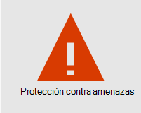
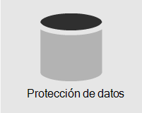
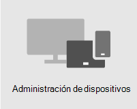

# Información general sobre la seguridadOverview of security

> [!VIDEO https://www.microsoft.com/videoplayer/embed/RE4mzxI?autoplay=false]

Microsoft 365 Empresa Premium proporciona características de protección contra amenazas, protección de datos y administración de dispositivos para ayudarle a proteger su empresa de las amenazas en línea y el acceso no autorizado, así como proteger y administrar los datos de la empresa en sus teléfonos, tabletas y equipos.Microsoft 365 Business Premium provides threat protection, data protection, and device management features to help you protect your company from online threats and unauthorized access, as well as protect and manage company data on your phones, tablets, and computers.

| [Protección contra amenazasThreat protection](#threat-protection)|  [Protección de datosData protection](#data-protection) |   [Administración de dispositivosDevice management](#device-management) |
|--|--|--|

## Protección contra amenazasThreat protection

Microsoft 365 Empresa Premium incluye Office 365 protección contra amenazas [avanzada (ATP),](safe-links.md)un servicio de filtrado de correo electrónico basado en la nube que le protege contra malware, ransomware, vínculos dañinos y mucho más.Microsoft 365 Business Premium includes [Office 365 Advanced Threat Protection (ATP)](safe-links.md), a cloud-based email filtering service that protects you from malware, ransomware, harmful links, and more. Atp Caja fuerte links le protege de direcciones URL malintencionadas en el correo electrónico o Office documentos.ATP Safe Links protects you from malicious URLs in email or Office documents. Atp Caja fuerte datos adjuntos le protege de malware y virus adjuntos a mensajes o documentos.ATP Safe Attachments protects you from malware and viruses attached to messages or documents.

[La autenticación multifactor (MFA)](turn-on-mfa.md)o la comprobación en dos pasos requiere que presente una segunda forma de autenticación, como un código de verificación, para confirmar su identidad antes de poder acceder a los recursos.[Multi-factor authentication (MFA)](turn-on-mfa.md), or two-step verification, requires you to present a second form of authentication, such as a verification code, to confirm your identity before you can access resources.

[Windows Defender](/windows/security/threat-protection/overview-of-threat-mitigations-in-windows-10) proporciona protección completa para el sistema, los archivos y las actividades en línea contra virus, malware, spyware y otras amenazas.[Windows Defender](/windows/security/threat-protection/overview-of-threat-mitigations-in-windows-10) provides comprehensive protection for your system, files, and online activities from viruses, malware, spyware, and other threats.

## Protección de datosData protection

Las características de protección de Microsoft 365 Empresa Premium ayudan a garantizar que los datos importantes se mantienen seguros y solo las personas autorizadas tienen acceso a ella.Data protection features in Microsoft 365 Business Premium help ensure that important data stays secure and only authorized people have access to it.

Puede usar directivas de prevención de pérdida de datos [(DLP)](set-up-dlp.md) para identificar y administrar información confidencial, como números de tarjeta de crédito o seguridad social, para que no se comparta por error.You can use [data loss prevention (DLP)](set-up-dlp.md) policies to identify and manage sensitive information, such as Social Security or credit card numbers, so that it isn't mistakenly shared.

[Cifrado de mensajes de Office 365](/microsoft-365/compliance/ome) capacidades de cifrado y derechos de acceso para garantizar que solo los destinatarios previstos puedan ver el contenido del mensaje.[Office 365 Message Encryption](/microsoft-365/compliance/ome) combines encryption and access rights capabilities to help ensure that only intended recipients can view message content. Cifrado de mensajes de Office 365 funciona con Outlook.com, Yahoo!, Gmail y otros servicios de correo electrónico.Office 365 Message Encryption works with Outlook.com, Yahoo!, and Gmail, and other email services.

[Archivado de Exchange Online](/office365/servicedescriptions/exchange-online-archiving-service-description/exchange-online-archiving-service-description) es una solución de archivado basada en la nube que funciona con Microsoft Exchange o Exchange Online para proporcionar capacidades avanzadas de archivado, incluidas las retenciones y la redundancia de datos.[Exchange Online Archiving](/office365/servicedescriptions/exchange-online-archiving-service-description/exchange-online-archiving-service-description) is a cloud-based archiving solution that works with Microsoft Exchange or Exchange Online to provide advanced archiving capabilities, including holds and data redundancy. Puede usar directivas de retención para ayudar a su organización a reducir las responsabilidades asociadas con el correo electrónico y otras comunicaciones.You can use retention policies to help your organization reduce the liabilities associated with email and other communications. Si su empresa tiene que conservar las comunicaciones relacionadas con litigios, puede usar las In-Place y las retenciones por juicio para conservar el correo electrónico relacionado.If your company is required to retain communications related to litigation, you can use In-Place Holds and Litigation Holds to preserve related email.

## Administración de dispositivosDevice management

Microsoft 365 Empresa Premium avanzadas de administración de dispositivos te permiten supervisar y controlar lo que los usuarios pueden hacer con los dispositivos inscritos.Microsoft 365 Business Premium advanced device management features let you monitor and control what users can do with enrolled devices. Estas características incluyen acceso condicional, Administración de dispositivos móviles [(MDM),](/microsoft-365/admin/basic-mobility-security/manage-enrolled-devices)BitLocker y actualizaciones automáticas.These features include conditional access, [Mobile Device Management (MDM)](/microsoft-365/admin/basic-mobility-security/manage-enrolled-devices), BitLocker, and automatic updates.

Puede usar directivas de acceso condicional para requerir medidas de seguridad adicionales para determinados usuarios y tareas.You can use conditional access policies to require additional security measures for certain users and tasks. Por ejemplo, puede requerir autenticación multifactor (MFA) o bloquear clientes que no admitan el acceso condicional.For example, you can require multi-factor authentication (MFA) or block clients that don't support conditional access.

Con MDM, puedes proteger y administrar los dispositivos móviles de tus usuarios, como iPhones, iPads, Androides y Windows teléfonos móviles.With MDM, you can help secure and manage your users' mobile devices like iPhones, iPads, Androids, and Windows phones. Puedes crear y administrar directivas de seguridad de dispositivos, borrar de forma remota un dispositivo para quitar todos los datos de la empresa, restablecer un dispositivo a la configuración de fábrica y ver informes de dispositivos detallados.You can create and manage device security policies, remotely wipe a device to remove all company data, reset a device to factory settings, and view detailed device reports.

Puedes habilitar el cifrado BitLocker para ayudar a proteger los datos en caso de que se pierda o robe un dispositivo, y habilitar Windows Exploit Guard para proporcionar protección avanzada contra ransomware.You can enable BitLocker encryption to help protect data in case a device is lost or stolen, and enable Windows Exploit Guard to provide advanced protection against ransomware.

Puedes configurar las actualizaciones automáticas para que las últimas características y actualizaciones de seguridad se apliquen a todos los dispositivos de usuario.You can configure automatic updates so that the latest security features and updates are applied to all user devices.

## Instrucciones de seguridad recomendadasRecommended security guidance

Si tiene Microsoft Empresa Premium, la forma más rápida de configurar la seguridad y empezar a colaborar de forma segura es seguir las instrucciones de esta biblioteca: [Microsoft 365 para empresas y campañas pequeñas](../campaigns/index.md).If you have Microsoft Business Premium, the quickest way to setup security and begin collaborating safely is to follow the guidance in this library: [Microsoft 365 for smaller businesses and campaigns](../campaigns/index.md). Esta guía fue desarrollada en asociación con el equipo de Microsoft Defending Democracy para proteger a todos los clientes de empresas pequeñas de las amenazas cibernéticas por parte de hackers sofisticados.This guidance was developed in partnership with the Microsoft Defending Democracy team to protect all small business customers against cyber threats launched by sophisticated hackers.
