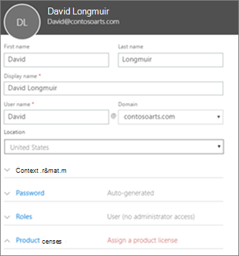
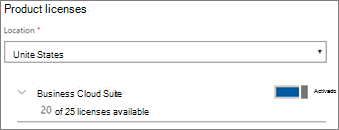

# Agregar más usuarios

## Agregar nuevos usuarios

Vea un breve vídeo sobre cómo agregar un usuario.   

> [!VIDEO https://www.microsoft.com/videoplayer/embed/RE1FOfN] 

Si este vídeo le ha sido de ayuda, consulte la [serie completa de aprendizaje para las pequeñas empresas y las novedades de Microsoft 365](https://support.office.com/article/6ab4bbcd-79cf-4000-a0bd-d42ce4d12816).

Para agregar un usuario:

1. Vaya al Centro de administración en <a href="https://go.microsoft.com/fwlink/p/?linkid=837890" target="_blank">https://admin.microsoft.com</a>. 
2. En el panel de navegación izquierdo, **Elija** \> usuarios **activos**.
3. En la página **usuarios activos** , elija **Agregar un usuario**.
4. En el panel **nuevo usuario** , escriba la información necesaria. 
  
    Puede escribir más información en **información de contacto**, elegir cómo establecer la contraseña en configuración de **contraseña** y asignar roles en **roles**.
      
    
      
    En la sección licencias de producto, establezca la configuración de licencia del producto **Microsoft 365 Business Premium** como **activada**.
      
    
  
Para obtener más información sobre cómo agregar usuarios, consulte [Agregar usuarios individualmente o de forma masiva](https://docs.microsoft.com/office365/admin/add-users/add-users).
  
