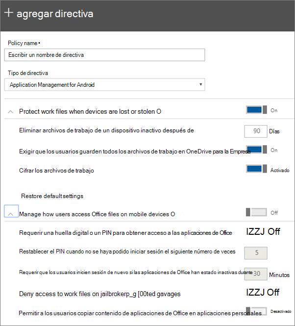

# Establecer la configuración de protección de aplicaciones para dispositivos Android o iOSSet app protection settings for Android or iOS devices

Este artículo se aplica a Microsoft 365 Empresa Premium.This article applies to Microsoft 365 Business Premium.

## Crear una directiva de administración de aplicacionesCreate an app management policy

1. Vaya al Centro de administración en <a href="https://go.microsoft.com/fwlink/p/?linkid=837890" target="_blank">https://admin.microsoft.com</a>.Go to the admin center at <a href="https://go.microsoft.com/fwlink/p/?linkid=837890" target="_blank">https://admin.microsoft.com</a>. 
    
2. En la navegación izquierda, elija **Directivas de** \>  \> **dispositivos Agregar**.In the left nav, choose **Devices** \> **Policies** \> **Add**.
  
3. En el panel **Agregar directiva**, escriba un nombre único para esta directiva.On the **Add policy** pane, enter a unique name for this policy. 
    
4. En **Tipo de directiva,** elija **Administración de aplicaciones** para Android o Administración de aplicaciones para **iOS,** en función del conjunto de directivas que desee crear.Under **Policy type**, choose **Application Management for Android** or **Application Management for iOS**, depending on which set of policies you want to create. 
    
5. Expande **Proteger archivos de trabajo cuando se pierden o** roban dispositivos y Administrar cómo los usuarios acceden Office archivos en **dispositivos móviles.**Expand **Protect work files when devices are lost or stolen** and **Manage how users access Office files on mobile devices**. Configure las opciones de configuración que le gustarían.Configure the settings how you would like. **Administrar cómo los usuarios acceden Office archivos** en dispositivos móviles está  desactivado de forma predeterminada, pero se recomienda activarlo y aceptar los valores predeterminados. **Manage how users access Office files on mobile devices** is **Off** by default, but we recommend that you turn it **On** and accept the default values. Para obtener más información, vea [Configuración disponible](#available-settings).For more information, see [Available settings](#available-settings). 
    
    Siempre puede usar el vínculo **Restablecer la configuración predeterminada** para volver a la configuración predeterminada.You can always use the **Reset default settings** link to return to the default setting. 
    
    
  
6. Después, decida **a qué usuarios se aplica esta configuración**.Next decide **Who will get these settings?** Si no desea usar el  grupo de seguridad predeterminado Todos los usuarios, elija Cambiar **,** elija los grupos de seguridad que obtienen esta configuración \> **Seleccione**.If you don't want to use the default **All Users** security group, choose **Change**, choose the security groups that get these settings \> **Select**.
    
7. Por último, elija **Listo** para guardar la directiva y asignarla a los dispositivos.Finally, choose **Done** to save the policy, and assign it to devices. 
    
## Editar una directiva de administración de aplicacionesEdit an app management policy

1. En la **tarjeta Directivas,** elija **Editar directiva**.On the **Policies** card, choose **Edit policy**.
    
2. En el panel **Editar directiva**, seleccione la directiva que quiere cambiar.On the **Edit policy** pane, choose the policy you want to change 
    
3. Elija **Editar** junto a cada configuración para cambiar los valores de la directiva.Choose **Edit** next to each setting to change the values in the policy. Al cambiar un valor, se guarda automáticamente en la directiva.When you change a value, it's automatically saved in the policy.
    
4. Cuando haya terminado, cierre el **panel Editar directiva.**When you're finished, close the **Edit policy** pane. 
    
## Eliminar una directiva de administración de aplicacionesDelete an app management policy

1. En la **página Directivas,** elija una directiva y, a continuación, **Elimine**.On the **Policies** page, choose a policy and then **Delete**.
    
2. En el **panel Eliminar directiva,** elija **Confirmar** para eliminar la directiva o directivas que eligió.On the **Delete policy** pane, choose **Confirm** to delete the policy or policies you chose. 
    
## Configuración disponibleAvailable settings

En las tablas siguientes se proporciona información detallada acerca de la configuración disponible para proteger los archivos de trabajo en dispositivos y la configuración que controla la forma en que los usuarios acceden Office archivos desde sus dispositivos móviles.The following tables give detailed information about settings available to protect work files on devices and the settings that control how users access Office files from their mobile devices.
  
 Para obtener más información, [vea How do protection features in Microsoft 365 Empresa Premium map to Intune settings](map-protection-features-to-intune-settings.md).For more information, see [How do protection features in Microsoft 365 Business Premium map to Intune settings](map-protection-features-to-intune-settings.md). 
  
### Opciones de configuración que protegen los archivos de trabajoSettings that protect work files

Las siguientes opciones de configuración permiten proteger archivos de trabajo en caso de pérdida o robo del dispositivo de un usuario:The following settings are available to protect work files if a user's device is lost or stolen:
  
|||
|:-----|:-----|
|ConfiguraciónSetting    |DescripciónDescription    |
|Eliminar archivos de trabajo de un dispositivo inactivo después de este número de díasDelete work files from an inactive device after this many days    |Si un dispositivo no se usa durante el número de días que especifiques aquí, los archivos de trabajo almacenados en el dispositivo se eliminarán automáticamente.If a device isn't used for the number of days that you specify here, any work files stored on the device will be deleted automatically.    |
|Exigir que los usuarios guarden todos los archivos de trabajo en OneDrive para la EmpresaForce users to save all work files to OneDrive for Business    |Si esta configuración es **On**, la única ubicación de guardado disponible para los archivos de trabajo es OneDrive para la Empresa.If this setting is **On**, the only available save location for work files is OneDrive for Business.    |
|Cifrar los archivos de trabajoEncrypt work files    |Mantenga **activada** esta opción para proteger con cifrado los archivos de trabajo.Keep this setting **On** so that work files are protected by encryption. Incluso si el dispositivo se pierde o se roba, nadie puede leer los datos de la empresa.Even if the device is lost or stolen, no one can read your company data.    |
   
### Configuración que controla cómo obtienen acceso los usuarios a los archivos de Office desde dispositivos móvilesSettings that control how users access Office files on mobile devices

Las siguientes opciones de configuración permiten administrar la forma en que los usuarios obtienen acceso a los archivos de trabajo de Office:The following settings are available to manage how users access Office work files:
  
|||
|:-----|:-----|
|ConfiguraciónSetting    |DescripciónDescription    |
|Requerir una huella digital o un PIN para obtener acceso a las aplicaciones de OfficeRequire a PIN or fingerprint to access Office apps    |Si esta configuración es **On,** los usuarios deben proporcionar otra forma de autenticación, además de su nombre de usuario y contraseña, para poder usar Office aplicaciones en sus dispositivos móviles.If this setting is **On** users must provide another form of authentication, in addition to their username and password, before they can use Office apps on their mobile devices.  |
|Restablecer el PIN cuando no se haya podido iniciar sesión el siguiente número de vecesReset PIN when login fails this many times    |Para impedir que un usuario no autorizado adivine aleatoriamente un PIN, este se restablecerá después de que se escriba de forma errónea el número de veces que especifique.To prevent an unauthorized user from randomly guessing a PIN, the PIN will reset after the number of wrong entries that you specify.    |
|Requerir que los usuarios inicien sesión de nuevo si las aplicaciones de Office han estado inactivas duranteRequire users to sign in again after Office apps have been idle for    |Esta configuración determina cuánto tiempo puede estar inactivo un usuario antes de que se le pida que inicie sesión de nuevo.This setting determines how long a user can be idle before they're prompted to sign in again.    |
|Denegar el acceso a los archivos de trabajo en dispositivos con jailbreak o rootingDeny access to work files on jailbroken or rooted devices    |Puede que algunos usuarios habilidosos tengan un dispositivo con jailbreak o rooting. Esto quiere decir que el usuario puede modificar el sistema operativo, lo que podría hacer que el dispositivo sea más vulnerable ante ataques de malware. Estos dispositivos se bloquean cuando esta configuración está **activada**.  Clever users may have a device that is jailbroken or rooted. This means that the user can modify the operating system, which can make the device more subject to malware. These devices are blocked when this setting is **On**.    |
|No permitir que los usuarios copien contenido de aplicaciones Office en aplicaciones personalesDon't allow users to copy content from Office apps into personal apps    |Se permite de manera predeterminada, pero si la configuración está **activada**, el usuario podría copiar información de un archivo de trabajo en uno personal.We do allow this by default, but if the setting is **On**, the user could copy information in a work file to a personal file. Si la configuración está **desactivada**, el usuario no podrá copiar información de una cuenta de trabajo a una aplicación o cuenta personales.If the setting is **Off**, the user will be unable to copy information from a work account into a personal app or personal account.    |
