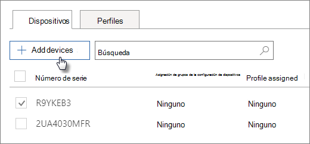

# Crear y editar dispositivos de AutopilotCreate and edit AutoPilot devices

## Cargar una lista de dispositivosUpload a list of devices

Puede usar la [Guía paso a paso](add-autopilot-devices-and-profile.md) para cargar dispositivos, pero también puede cargar dispositivos en la pestaña **dispositivos** .You can use the [Step-by-step guide](add-autopilot-devices-and-profile.md) to upload devices, but you can also upload devices in the **Devices** tab. 
  
Los dispositivos deben cumplir estos requisitos:Devices must meet these requirements:
  
- Windows 10, versión 1703 o posteriorWindows 10, version 1703 or later
    
- Nuevos dispositivos que no han estado a la vista rápida de WindowsNew devices that haven't been through Windows out-of-box experience

1. En el centro de administración de Microsoft 365, elija **dispositivos** \> **AutoPilot**.In the Microsoft 365 admin center, choose **Devices** \> **AutoPilot**.
  
2. En la **Página AutoPilot** , elija la **Devices** pestaña \> dispositivos y **agregue dispositivos**.On the **AutoPilot** page, choose the **Devices** tab \> **Add devices**.
    
    
  
3. En el **Panel agregar dispositivos** , vaya a un [archivo CSV](https://docs.microsoft.com/microsoft-365/admin/misc/device-list) de la lista de dispositivos \> que haya preparado para **Guardar** \> el **cierre**.On the **Add devices** panel, browse to a [Device list CSV file](https://docs.microsoft.com/microsoft-365/admin/misc/device-list) that you prepared \> **Save** \> **Close**.
    
    Puede obtener esta información de su proveedor de hardware o puede usar el script de [PowerShell Get-WindowsAutoPilotInfo](https://www.powershellgallery.com/packages/Get-WindowsAutoPilotInfo) para generar un archivo CSV.You can get this information from your hardware vendor, or you can use the [Get-WindowsAutoPilotInfo PowerShell script](https://www.powershellgallery.com/packages/Get-WindowsAutoPilotInfo) to generate a CSV file. 
    
## Asignar un perfil a un dispositivo o un grupo de dispositivosAssign a profile to a device or a group of devices

1. En la página **preparar Windows** , elija la pestaña **dispositivos** y active la casilla junto a uno o más dispositivos.On the **Prepare Windows** page, choose the **Devices** tab, and select the check box next to one or more devices. 
    
2. En el panel **Dispositivo**, seleccione del desplegable **Perfil asignado**.On the **Device** panel, select a profile from the **Assigned profile** drop-down. 
    
    Si aún no tiene ningún perfil, vea [Crear y editar perfiles de AutoPilot](create-and-edit-autopilot-profiles.md) para obtener instrucciones.If you don't have any profiles yet, see [Create and edit AutoPilot profiles](create-and-edit-autopilot-profiles.md) for instructions. 
    
