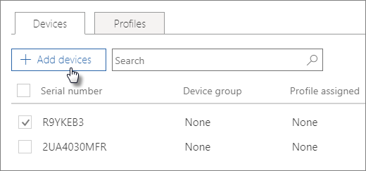

# Crear y editar dispositivos de Autopilot

## Cargar una lista de dispositivos

Puede usar la [Guía paso a paso](add-autopilot-devices-and-profile.md) para cargar dispositivos, pero también puede cargar dispositivos en la pestaña **dispositivos** . 
  
Los dispositivos deben cumplir estos requisitos:
  
- Windows 10, versión 1703 o posterior
    
- Nuevos dispositivos que no han estado a la vista rápida de Windows

1. En el centro de administración de Microsoft 365, elija **dispositivos** \> **AutoPilot**.
  
2. En la **Página AutoPilot** , elija la **Devices** pestaña \> dispositivos y **agregue dispositivos**.
    
    
  
3. En el **Panel agregar dispositivos** , vaya a un [archivo CSV](https://docs.microsoft.com/microsoft-365/admin/misc/device-list) de la lista de dispositivos \> que haya preparado para **Guardar** \> el **cierre**.
    
    Puede obtener esta información de su proveedor de hardware o puede usar el script de [PowerShell Get-WindowsAutoPilotInfo](https://www.powershellgallery.com/packages/Get-WindowsAutoPilotInfo) para generar un archivo CSV. 
    
## Asignar un perfil a un dispositivo o un grupo de dispositivos

1. En la página **preparar Windows** , elija la pestaña **dispositivos** y active la casilla junto a uno o más dispositivos. 
    
2. En el panel **Dispositivo**, seleccione del desplegable **Perfil asignado**. 
    
    Si aún no tiene ningún perfil, vea [Crear y editar perfiles de AutoPilot](create-and-edit-autopilot-profiles.md) para obtener instrucciones. 
    
