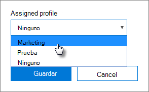

# Crear y editar perfiles de Autopilot

## Crear un perfil

Un perfil se aplica a un dispositivo o a un grupo de dispositivos.
  
1. En el centro de administración de Microsoft 365 Business, elija **dispositivos** \> **AutoPilot**.
  
2. En la **Página AutoPilot** , elija la **** pestaña \> perfiles **crear perfil**.
    
3. En la página **crear perfil** , escriba un nombre para el perfil que le ayude a identificarlo, por ejemplo marketing. Active la configuración que desee y, a continuación, elija **Guardar**. Para obtener más información acerca de la configuración de perfiles de AutoPilot, consulte [acerca de la configuración de perfiles de AutoPilot](autopilot-profile-settings.md).
    
    
  
### Aplicar el perfil a un dispositivo

Después de crear un perfil, puede aplicarlo a un dispositivo o a un grupo de dispositivos. Puede elegir un perfil existente en la [Guía paso a paso](add-autopilot-devices-and-profile.md) y aplicarlo a nuevos dispositivos o reemplazar un perfil existente para un dispositivo o un grupo de dispositivos. 
  
1. En la página **Preparar Windows**, elija la pestaña **Dispositivos**. 
    
2. Active la casilla de verificación situada junto al nombre del dispositivo y, en el panel **dispositivo** , elija un perfil de la lista \> desplegable **perfil asignado** para **Guardar**.
    
    
  
## Editar, eliminar o quitar un perfil

Después de asignar un perfil a un dispositivo, puede actualizarlo, aunque ya le haya asignado el dispositivo a un usuario. Cuando el dispositivo se conecta a Internet, descarga la última versión del perfil durante el proceso de configuración. Si el usuario restaura la configuración predeterminada de fábrica de su dispositivo, el dispositivo descargará de nuevo las actualizaciones más recientes para el perfil. 
  
### Editar un perfil

1. En la página **Preparar Windows**, elija la pestaña **Perfiles**. 
    
2. Active la casilla de verificación situada junto al nombre del dispositivo y, en el panel **perfil** , actualice cualquiera de las \> opciones de configuración disponibles **Guardar**.
    
    Si hace esto antes de que un usuario conecte el dispositivo a Internet, el perfil se aplica en el proceso de instalación.
    
### Eliminar un perfil

1. En la página **Preparar Windows**, elija la pestaña **Perfiles**. 
    
2. Active la casilla de verificación situada junto al nombre del dispositivo y, en el panel **perfil** , seleccione **eliminar perfil** \> **Guardar**.
    
    Al eliminar un perfil, se elimina de un dispositivo o un grupo de dispositivos al que se ha asignado.
    
### Quitar un perfil

1. En la página **Preparar Windows**, elija la pestaña **Dispositivos**. 
    
2. Active la casilla de verificación situada junto al nombre del dispositivo y, en el panel **dispositivo** , elija **ninguno** en la lista \> desplegable **perfil asignado** para **Guardar**.
    
