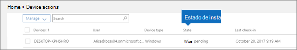

# Estados de dispositivoDevice states

Este artículo se aplica a Microsoft 365 empresa Premium.This article applies to Microsoft 365 Business Premium.

Los dispositivos de la lista **Acciones de dispositivo** (página principal del administrador \> **Acciones de dispositivo**) pueden tener los estados siguientes.Devices in the **Device actions** list (Admin home \> **Device actions**) can have the following states.
  

  
|**Estado****Status**|**Descripción****Description**|
|:-----|:-----|
|Administrado por IntuneManaged by Intune    |Administrado por Microsoft 365 empresa Premium.Managed by Microsoft 365 Business Premium.    |
|Pendiente de retiradaRetire pending    |Microsoft 365 empresa Premium está preparándose para quitar datos de la compañía del dispositivo.Microsoft 365 Business Premium is getting ready to remove company data from the device.    |
|Retirada en cursoRetire in progress    |Microsoft 365 empresa Premium está quitando actualmente los datos de la compañía del dispositivo.Microsoft 365 Business Premium is currently removing company data from the device.    |
|Error de retiradaRetire failed    | No se pudo completar la acción para quitar los datos de la compañía.Remove company data action failed.    |
|Retirada canceladaRetire canceled    |Se canceló la acción de retirada.Retire action was canceled.    |
|Borrado pendienteWipe pending    |Esperando a que se inicie el restablecimiento de fábrica.Waiting for factory reset to start.    |
|Borrado en cursoWipe in progress    |Se emitió el restablecimiento de fábrica.Factory reset has been issued.    |
|No se pudo completar el borradoWipe failed    |No se pudo restablecer la fábrica.Couldn't do factory reset.    |
|Borrado canceladoWipe canceled    |Se canceló el borrado de la fábrica.Factory wipe was canceled.    |
|IncorrectoUnhealthy    |Una acción está pendiente (o en curso), pero el dispositivo no se ha protegido durante más de 30 días.An action is pending (or in progress), but the device hasn't checked in for 30+ days.    |
|Pendiente de eliminaciónDelete pending    |La acción de eliminación está pendiente.Delete action is pending.    |
|DetectadoDiscovered    |Microsoft 365 empresa Premium ha detectado el dispositivo.Microsoft 365 Business Premium has detected the device.    |
   
