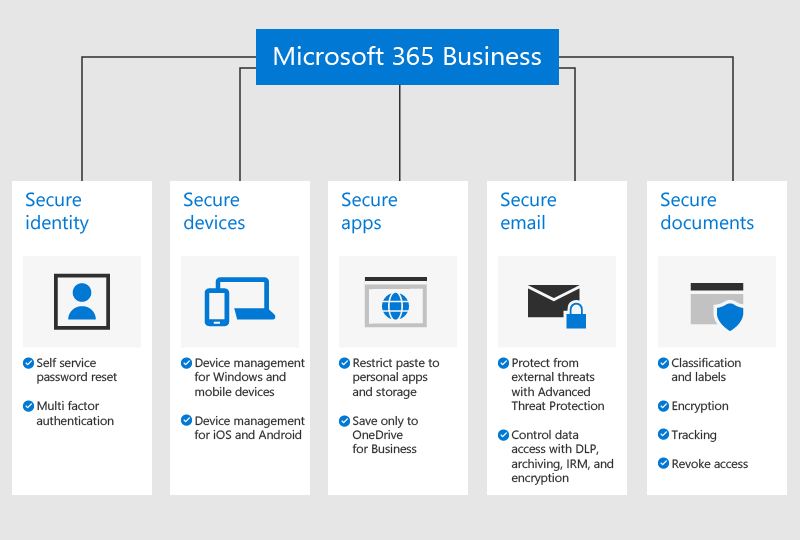

# Información general sobre Microsoft 365 Empresa Premium

## ¿Qué es Microsoft 365 Empresa Premium?

Microsoft 365 Empresa Premium (anteriormente Microsoft 365 Empresa) es un servicio completo de suscripción para empresas de menos de 300 empleados. Incluye los servicios y las aplicaciones de productividad de Office, herramientas de colaboración como Microsoft Teams y funcionalidades avanzadas de administración de dispositivos y seguridad.

Vea este vídeo para obtener información general sobre Microsoft 365 Empresa Premium.  

> [!VIDEO https://www.microsoft.com/videoplayer/embed/RE2mhaA] 
  
Si este vídeo le ha sido de ayuda, consulte la [serie completa de aprendizaje para las pequeñas empresas y para conocer Microsoft 365](https://support.microsoft.com/office/6ab4bbcd-79cf-4000-a0bd-d42ce4d12816). 

Microsoft 365 Empresa Premium está diseñado para un máximo de 300 licencias. Si necesita más licencias, consulte la documentación de [Microsoft 365 Enterprise](../enterprise/index.yml) para obtener más información.

Para ver la lista completa de características, consulte la [descripción del servicio de Microsoft 365 Empresa Premium](/office365/servicedescriptions/microsoft-365-service-descriptions/microsoft-365-business-service-description).
  
## Necesidades de seguridad de las pequeñas empresas

Los datos de las empresas se pueden ver comprometidos de muchas maneras. Usted y sus usuarios pueden poner en riesgo la seguridad de su organización si inician sesión con credenciales vulnerables o si acceden a los datos de la organización desde diferentes dispositivos y aplicaciones. Más concretamente, estos son los factores de riesgo para su organización:

- Credenciales de inicio de sesión poco seguras o vulnerables.
- Dispositivos vulnerables con un PIN poco seguro o dispositivos propiedad de los usuarios.
- Usuarios que pueden copiar, pegar o guardar los datos de su organización en aplicaciones personales.
- Usuarios que instalan y usan aplicaciones de terceros cuya seguridad es deficiente.
- Vulnerabilidades de correo electrónico como, entre otras, el uso compartido de datos confidenciales, los intentos de phishing o el malware.
- Acceso a documentos confidenciales por parte de personas que no deberían tener acceso.

Microsoft 365 Empresa Premium le ayuda a proteger los datos en cada uno de estos casos. En la ilustración siguiente se detallan las características de seguridad que protegen los datos de su empresa.

## Protección de datos y dispositivos

Microsoft 365 Empresa Premium aplica varias medidas que ayudan a **protegerse contra las amenazas**:

- Examinar vínculos en correos electrónicos y documentos en tiempo real para bloquear sitios web no seguros (vínculos seguros).

- Realizar análisis avanzado de datos adjuntos de correo electrónico en un entorno de espacio aislado para detectar malware recién desarrollado (datos adjuntos seguros). 

- Habilitar directivas contra suplantación de identidad que usan modelos de aprendizaje automático y detección de suplantación para proporcionar protección contra ataques avanzados (anti phishing en la inteligencia de Defender para Office 365). 

- Directivas avanzadas que deshabilitan el acceso desde ubicaciones en las que no se confía o que omiten la autenticación multifactor en sitios de confianza como la red de su oficina (Azure MFA, incluido IP de confianza y Acceso condicional). 

- Protección contra malware en todos los dispositivos Windows 10 de la organización y protección de archivos en las carpetas clave del sistema para evitar cambios realizados por ransomware (Windows Defender).

Los datos de su **empresa están protegidos** por las siguientes medidas:

- Detección automática que evita que la información confidencial, como números de la seguridad social o de tarjetas de crédito, se filtre fuera de su empresa (Prevención de pérdida de datos). 

- Cifrado de correos electrónicos confidenciales para que la comunicación con clientes u otras personas ajenas a su organización pueda realizarse de forma segura. Esto garantiza que solo el destinatario deseado pueda leer el mensaje (Cifrado de mensajes de Office 365).

- Control sobre quién tiene acceso a la información de la empresa mediante la aplicación de restricciones como **No copiar** y **No reenviar** al correo electrónico y a los documentos (Azure Information Protection, Plan 1).

- Archivado ilimitado en la nube para que pueda conservar todo el correo electrónico de su organización, incluidos los buzones de empleados antiguos (Archivado de Exchange Online).

Los dispositivos **están protegidos** por las siguientes medidas:

- Control sobre qué dispositivos y usuarios pueden acceder a sus datos de Microsoft, con opciones para impedir que los usuarios inicien sesión desde equipos domésticos, aplicaciones no aprobadas o fuera de la oficina laboral (Acceso condicional).

- Aplicación de directivas de seguridad para proteger los datos empresariales en dispositivos iOS y Android. Por ejemplo, puede pedir a los usuarios que proporcionen un PIN o su huella dactilar para tener acceso a los datos de la empresa y cifrar los datos en los dispositivos móviles (Protección de aplicaciones móviles de Office).

- Mantenimiento de documentos, correos electrónicos y otros datos empresariales en las aplicaciones móviles de Office aprobadas y prohibición de que los empleados puedan guardarlos en aplicaciones y ubicaciones no autorizadas (Protección de aplicaciones móviles de Office).

- Eliminación remota de los datos de la empresa en dispositivos perdidos o robados sin que afecte a la información personal (borrado selectivo de Intune).

- Controles simplificados para administrar directivas en todos los equipos con Windows 10 de su empresa, aplicación de cifrado de BitLocker e instalación automáticamente de actualizaciones críticas de Windows (aplicación de directivas de actualización de Windows).

Para ver la lista completa de las características de seguridad, consulte [Características de seguridad de Microsoft 365 Empresa Premium](security-features.md). Una vez que haya [configurado Microsoft 365 Empresa Premium](set-up.md), vea cómo [aumentar la protección contra amenazas](increase-threat-protection.md) y cómo [configurar las características de cumplimiento](set-up-compliance.md) para empezar a usar las características de seguridad que no se incluyen como parte de la configuración guiada. Lea también las [10 formas principales de proteger los planes de Office 365 y Microsoft 365 Empresa Premium](/office365/admin/security-and-compliance/secure-your-business-data) para obtener información sobre cómo configurar la protección contra hackers y delincuentes cibernéticos.

## Obtención de Microsoft 365 Empresa Premium

- Si tiene un partner, ese partner obtendrá Microsoft 365 Empresa Premium: [Obtener Microsoft 365 Empresa Premium desde el Centro de partners de Microsoft](get-microsoft-365-business.md).

- Si no tiene un partner y quiere obtener Microsoft 365 Empresa Premium, puede [comprarlo aquí](https://www.microsoft.com/microsoft-365/business) y seguir las instrucciones de [registro](sign-up.md).

## Vea también

[Vídeos de aprendizaje de Microsoft 365 Empresa Premium](https://support.microsoft.com/office/6ab4bbcd-79cf-4000-a0bd-d42ce4d12816)