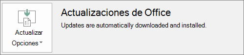

# Preparar la implementación de cliente de Office por Microsoft 365 para empresasPrepare for Office client deployment by Microsoft 365 for business

Este artículo se aplica a Microsoft 365 Empresa Premium.This article applies to Microsoft 365 Business Premium.

## Prepararse para instalar automáticamente las aplicaciones de Office en los equipos clientePrepare to automatically install Office apps to client computers

Puedes usar Microsoft 365 Empresa Premium para instalar automáticamente las aplicaciones de Office de 32 bits en equipos con Windows 10 y mantenerlas actualizadas con actualizaciones.You can use Microsoft 365 Business Premium to automatically install the 32-bit Office apps on Windows 10 computers and keep them current with updates.
  
La instalación automática funciona mejor si el equipo del usuario final está en Windows 10 Empresa y:Automatic installation works best if the end user's computer is on Windows 10 Business and:
  
- No tiene aplicaciones de escritorio de Office (Word, Excel, PowerPoint, Outlook, OneNote, Publisher, Access y OneDrive).Doesn't have existing Office desktop apps (Word, Excel, PowerPoint, Outlook, OneNote, Publisher, Access, and OneDrive).
    
    oor
    
- Tiene instalada una versión existente de Office de Hacer clic y ejecutar.Has an existing version of Click-to-Run Office installed.
    
Para determinar si tiene la versión de Hacer clic y ejecutar de Office, en cualquier aplicación de Office, vaya a **Archivo** \> **Cuenta** ( **Cuenta de Office** en Outlook).To determine if you have the Click-to-Run version of Office, in any Office app go to **File** \> **Account** ( **Office Account** in Outlook). Si ve Actualizaciones **de Office** como se muestra en la siguiente figura, la instalación se ha realizado con Hacer clic y ejecutar.If you see **Office Updates** as shown in the following figure, then the installation was done by using Click-to-Run. 
  

  
 **Quién se beneficia de tener esta característica****Who benefits from having this feature**
  
El usuario final cuyo PC:The end user whose PC:
  
- **Tiene**  una licencia de usuario de Windows 10 Empresa, una licencia activa de Microsoft 365 para empresas, Windows 10 Creators Update y se une a Azure Active Directory.**Has**  a Windows 10 Business user license, an active Microsoft 365 for business license, Windows 10 Creators Update, and is joined to Azure Active Directory. 
    
- **No tiene aplicaciones de** Office de 64 bits (por ejemplo: Word, Excel, PowerPoint).**Doesn't have** 64-bit Office apps (example: Word, Excel, PowerPoint). Si se requieren aplicaciones de Office de 64 bits, esta característica no es adecuada porque no hay compatibilidad para desencadenar una versión de 64 bits de 2016 Hacer clic y ejecutar de Office desde la consola de administración de Microsoft 365 para empresas.If 64-bit Office apps are required, then this feature isn't a good fit because there's no support for triggering a 64-bit 2016 Click-to-Run version of Office from the Microsoft 365 for business admin console. 
    
- **No tenga** ninguna aplicación independiente de Windows Installer (MSI) 2016 (por ejemplo, Visio o Project).**Doesn't have** any 2016 Windows Installer (MSI) standalone apps (for example, Visio or Project). Microsoft 365 para empresas actualiza Office a la versión hacer clic y ejecutar de Office 2016 y eso no funciona con aplicaciones independientes msi de Office 2016.Microsoft 365 for business upgrades Office to the Click-to-Run version of Office 2016 and that doesn't work with Office 2016 MSI standalone apps. 
    
En la tabla siguiente se muestra qué acción pueden necesitar los usuarios finales o administradores, según su estado inicial, para tener una versión correcta de hacer clic y ejecutar de 32 bits de la implementación de Office desde la consola de administración de Microsoft 365 para empresas.The following table shows what action the end users/admins may need to take, depending on their beginning state, to have a successful 32-bit Click-to-Run version of Office deployment from the Microsoft 365 for business admin console.
  
|**Estado inicial de instalación de Office****Starting Office install status**|**Acción que se debe realizar antes de la instalación de Microsoft 365 para empresas de Office****Action to take before Microsoft 365 for business Office install**|**Estado final****End state**|
|:-----|:-----|:-----|
|Ningún conjunto de aplicaciones de Office instaladoNo Office suite installed    |NingunoNone    |Office 2016 de 32 bits se instala con Hacer clic y ejecutarOffice 2016 32-bit is installed by using Click-to-Run    |
|Versión existente de Hacer clic y ejecutar de 32 bits de Office (2016 o versiones anteriores) y ninguna aplicación independienteExisting Click-to-Run 32-bit version of Office (2016 or earlier) and no standalone apps    |NingunoNone    |Actualizado a la versión más reciente de 32 bits de Hacer clic y ejecutar de Office 2016, según sea necesario **\***Upgraded to the latest 32-bit Click-to-Run version of Office 2016, as needed **\***   |
|Versión existente de Hacer clic y ejecutar de 32 bits de Office y Hacer clic y ejecutar aplicaciones de Office independientes de 32 bits o 64 bits (por ejemplo, Visio, Project)Existing Click-to-Run 32-bit version of Office and Click-to-Run 32-bit or 64-bit standalone Office apps (for example, Visio, Project)    |NingunoNone    |Las aplicaciones independientes no se ven afectadas.Standalone apps aren't affected. El conjunto de aplicaciones se actualiza a la versión de Hacer clic y ejecutar de 32 bits de Office 2016.Suite is upgraded to Click-to-Run 32-bit version of Office 2016    |
|Versión existente de Hacer clic y ejecutar de 32 bits de Office y cualquier aplicación independiente MSI de Office de 32 o 64 bits (excepto 2016)Existing Click-to-Run 32-bit version of Office and any 32-bit or 64-bit (except 2016) MSI standalone Office apps    |NingunoNone    |Las aplicaciones independientes no se ven afectadas.Standalone apps aren't affected. El conjunto de aplicaciones se actualiza a la versión de Hacer clic y ejecutar de 32 bits de Office 2016.Suite is upgraded to Click-to-Run 32-bit version of Office 2016    ||||
|Cualquier versión de Hacer clic y ejecutar de 64 bits de OfficeAny existing Click-to-Run 64-bit version of Office    |Desinstale las aplicaciones de Office de 64 bits, si está bien reemplazarlas por aplicaciones de Office de 32 bitsUninstall the 64-bit Office apps, if it's OK to replace them with 32-bit Office apps    |Si se eliminan las aplicaciones de Office de 64 bits, se instalará la versión de Hacer clic y ejecutar de 32 bits de Office 2016.If Office 64-bit apps are removed, the Click-to-Run 32-bit version of Office 2016 is installed    |
|Una instalación de MSI existente de Office 2016 con o sin aplicaciones independientesAn existing MSI install of Office 2016 with or without standalone apps    |Desinstalar MSI Office 2016.Uninstall MSI Office 2016.    |La versión de Hacer clic y ejecutar de 32 bits de Office 2016 está instalada. Sin cambios en las aplicaciones independientesClick-to-Run 32-bit version of Office 2016 is installed. No change to standalone apps    |
|Instalación de MSI existente de Office 2013 (o una versión anterior) o aplicaciones independientes de OfficeExisting MSI install of Office 2013 (or earlier) and/or standalone Office apps    |NingunoNone    |La versión de Hacer clic y ejecutar de 32 bits de Office 2016 con la instalación de MSI Office ya existente (y aplicaciones independientes) existe en paraleloClick-to-Run 32-bit version of Office 2016 with the pre-existing MSI Office install (and standalone apps) exist side-by-side    |
||||
   
 **(\*) Nota:** No actualice a la versión de Hacer clic y ejecutar de 32 bits de Office 2016 debido a un error conocido.**(\*) Note:** Does not upgrade to Click-to-Run 32-bit version of Office 2016 due to a known bug. Hay una corrección en curso.A fix is in progress. 
  
