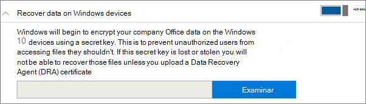

# Establecer o editar la configuración de protección de aplicaciones para dispositivos Windows 10Set or edit application protection settings for Windows 10 devices

Este artículo se aplica a Microsoft 365 Empresa Premium.This article applies to Microsoft 365 Business Premium.

## Editar una directiva de administración de aplicaciones para Windows 10Edit an app management policy for Windows 10

1. Vaya al Centro de administración en <a href="https://go.microsoft.com/fwlink/p/?linkid=837890" target="_blank">https://admin.microsoft.com</a>.Go to the admin center at <a href="https://go.microsoft.com/fwlink/p/?linkid=837890" target="_blank">https://admin.microsoft.com</a>.     
2. En el panel de navegación izquierdo, elija **Directivas de** \> **dispositivos** .On the left nav, choose **Devices** \> **Policies** .
1. Elija una directiva de aplicación de Windows existente y, a **continuación, Edit**.Choose an existing Windows app policy and then **Edit**.
1. Elija **Editar** junto a una configuración que desea cambiar y, a continuación, **Guardar**.Choose **Edit** next to a setting you want to change and then **Save**.

## Crear una directiva de administración de aplicaciones para Windows 10Create an app management policy for Windows 10

Si los usuarios tienen dispositivos de Windows 10 personales en los que realizan tareas de trabajo, también puede proteger los datos en ellos.If your users have personal Windows 10 devices on which they perform work tasks, you can protect your data on those devices as well.
  
1. Vaya al Centro de administración en <a href="https://go.microsoft.com/fwlink/p/?linkid=837890" target="_blank">https://admin.microsoft.com</a>.Go to the admin center at <a href="https://go.microsoft.com/fwlink/p/?linkid=837890" target="_blank">https://admin.microsoft.com</a>. 
2. En la navegación izquierda, elija **Directivas** \> **de** \> **dispositivos Agregar**.On the left nav, choose **Devices** \> **Policies** \> **Add**.
3. En el panel **Agregar directiva**, escriba un nombre único para esta directiva.On the **Add policy** pane, enter a unique name for this policy. 
4. En **Tipo de directiva**, elija **Administración de aplicaciones para Windows 10**.Under **Policy type**, choose **Application Management for Windows 10**.
5. En **Tipo de dispositivo**, elija **Personal** o Propiedad de **la empresa**.Under **Device type**, choose either **Personal** or **Company Owned**.
6. La opción **Cifrar archivos de trabajo** se activa automáticamente.The **Encrypt work files** is turned on automatically. 
7. Establezca la opción **Impedir que los usuarios copien datos de la empresa en archivos personales y obligarlos a guardar los archivos de trabajo en OneDrive para la Empresa** en **Activado** si no quiere que los usuarios guarden archivos de trabajo en su equipo.Set **Prevent users from copying company data to personal files and force them to save work files to OneDrive for Business** to **On** if you don't want the users to save work files on their PC. 
9. Expande **Recuperar datos en dispositivos Windows**.Expand **Recover data on Windows devices**. Se recomienda **activarlo**.We recommend that you turn it **On**.
    Para poder examinar la ubicación del certificado de Agente de recuperación de datos, primero debe crear uno.Before you can browse to the location of the Data Recovery Agent certificate, you have to first create one. Para obtener instrucciones, vea [Create and verify an Encrypting File System (EFS) Data Recovery Agent (DRA) certificate](/windows/security/information-protection/windows-information-protection/create-and-verify-an-efs-dra-certificate).For instructions, see [Create and verify an Encrypting File System (EFS) Data Recovery Agent (DRA) certificate](/windows/security/information-protection/windows-information-protection/create-and-verify-an-efs-dra-certificate).
    
    De forma predeterminada, los archivos de trabajo están cifrados con una clave secreta que se almacena en el dispositivo y está asociada con el perfil de usuario.By default, work files are encrypted using a secret key that is stored on the device and associated with the user's profile. Solo el usuario puede abrir y descifrar el archivo.Only the user can open and decrypt the file. Sin embargo, si un dispositivo se pierde o se elimina un usuario, un archivo puede permanecer es estado cifrado.However, if a device is lost or a user is removed, a file can be stuck in an encrypted state. Un administrador puede usar el certificado agente de recuperación de datos (DRA) para descifrar el archivo.An admin can use the Data Recovery Agent (DRA) certificate to decrypt the file.
    
    
  
10. Expanda **Proteger ubicaciones de red** y nube adicionales si desea agregar dominios adicionales o ubicaciones de SharePoint Online para asegurarse de que los archivos de todas las aplicaciones enumeradas están protegidos.Expand **Protect additional network and cloud locations** if you want to add additional domains or SharePoint Online locations to make sure that files in all the listed apps are protected. Si necesita especificar más de un elemento en cualquiera de los campos, use un punto y coma (;) entre los elementos.If you need to enter more than one item for either field, use a semicolon (;) between the items.
    
    
  
11. Después, decida **a qué usuarios se aplica esta configuración**. Si no quiere usar el grupo de seguridad predeterminado **Todos los usuarios**, elija **Cambiar**, elija los grupos de seguridad que recibirán esta configuración \> **Seleccionar**.Next decide **Who will get these settings?** If you don't want to use the default **All Users** security group, choose **Change**, choose the security groups who will get these settings \> **Select**.
12. Por último, elija **Agregar** para guardar la directiva y asignarla a los dispositivos.Finally, choose **Add** to save the policy, and assign it to devices.