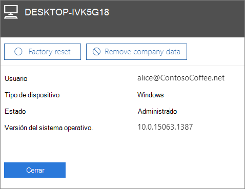

# Eliminar datos de la empresa de dispositivosRemove company data from devices

## Quitar datos de la compañíaRemove company data

Puede usar Microsoft 365 Business para eliminar los datos de la empresa que los usuarios tienen en sus [dispositivos](app-protection-settings-for-android-and-ios.md) o [PC Windows](protection-settings-for-windows-10-devices.md) protegidos por Microsoft 365. **Si elimina los datos de la empresa de un dispositivo, no los podrá restaurar más adelante**.You can use Microsoft 365 Business to remove company data that your users have on their [devices](app-protection-settings-for-android-and-ios.md) or [Windows PCs](protection-settings-for-windows-10-devices.md) that are protected by Microsoft 365. **If you remove company data from a device, you cannot restore it later**. 
  
1. Vaya al centro de administración en <a href="https://go.microsoft.com/fwlink/p/?linkid=837890" target="_blank">https://admin.microsoft.com</a>.Go to the admin center at <a href="https://go.microsoft.com/fwlink/p/?linkid=837890" target="_blank">https://admin.microsoft.com</a>.
    
2. En el panel de navegación izquierdo, elija **dispositivos** \> **administrar**.  On the left nav, choose **Devices**  \> **Manage**.
  
3. En la página **administrar** , seleccione o busque un usuario que tenga los datos que desea quitar y elija el nombre.On the **Manage** page, choose or search for a user who's data you want to remove, and choose the name. 
    
4. En el panel siguiente, seleccione el dispositivo o dispositivos en la lista **dispositivos** .On the next pane, select the device or devices from the **Devices** list. En el panel de dispositivos que se abre, puede elegir restablecer el dispositivo a la configuración de fábrica o quitar datos de la empresa, según el tipo de dispositivo.On the device pane that opens, you can choose to reset the device to factory settings or remove company data, depending on the device type. 
    
    
  
5. En el panel de confirmación, elija **confirmar** \> **cierre**.On the confirmation pane, choose **Confirm** \> **Close**.
    

