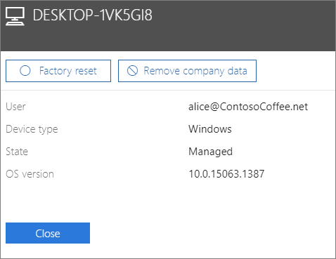

# Eliminar datos de la empresa de dispositivosRemove company data from devices

Este artículo se aplica a Microsoft 365 Empresa Premium.This article applies to Microsoft 365 Business Premium.

## Quitar datos de la empresaRemove company data

Puede usar Microsoft 365 para empresas para quitar los datos de  la  empresa que los usuarios tienen en sus dispositivos o equipos Windows que están protegidos por Microsoft 365.You can use Microsoft 365 for business to remove company data that your users have on their [devices](app-protection-settings-for-android-and-ios.md) or [Windows PCs](protection-settings-for-windows-10-devices.md) that are protected by Microsoft 365. **Si elimina los datos de la empresa de un dispositivo, no los podrá restaurar más adelante**.**If you remove company data from a device, you cannot restore it later**. 
  
1. Vaya al Centro de administración en <a href="https://go.microsoft.com/fwlink/p/?linkid=837890" target="_blank">https://admin.microsoft.com</a>.Go to the admin center at <a href="https://go.microsoft.com/fwlink/p/?linkid=837890" target="_blank">https://admin.microsoft.com</a>.
    
2. En la navegación izquierda, elija **Dispositivos** \> **administrar**.  On the left nav, choose **Devices**  \> **Manage**.
  
3. En la **página** Administrar, elija o busque un usuario que desee quitar los datos y elija el nombre.On the **Manage** page, choose or search for a user who's data you want to remove, and choose the name. 
    
4. En el siguiente panel, selecciona el dispositivo o los dispositivos de la **lista Dispositivos.**On the next pane, select the device or devices from the **Devices** list. En el panel del dispositivo que se abre, puedes elegir restablecer el dispositivo a la configuración de fábrica o quitar datos de la compañía, según el tipo de dispositivo.On the device pane that opens, you can choose to reset the device to factory settings or remove company data, depending on the device type. 
    
    
  
5. En el panel de confirmación, elija **Confirmar** \> **cerrar**.On the confirmation pane, choose **Confirm** \> **Close**.
    

