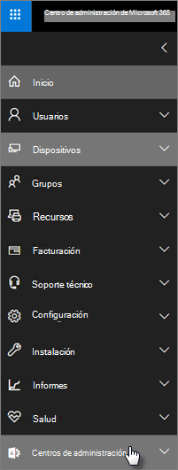

# Características de seguridad y cumplimiento de Microsoft 365 Empresa Premium

Microsoft 365 Empresa Premium ofrece características de seguridad simplificadas para ayudar a proteger los datos en equipos, teléfonos y tabletas.
    
## Características de seguridad del Centro de administración de Microsoft 365

Puede administrar muchas de las características de seguridad de Microsoft 365 Empresa Premium en el centro de administración, lo que le ofrece una forma simplificada de activar o desactivar estas características. En el centro de administración, puede hacer lo siguiente:
  
- [Establecer la configuración de administración de aplicaciones para dispositivos Android o iOS.](app-protection-settings-for-android-and-ios.md) 
    
    Estas opciones incluyen la eliminación de archivos de un dispositivo inactivo después de un período establecido, el cifrado de archivos de trabajo, la necesidad de que los usuarios establezcan un PIN, entre otros.
    
- [Establecer la configuración de protección de aplicaciones para dispositivos Con Windows 10.](protection-settings-for-windows-10-devices.md) 
    
    Esta configuración se puede aplicar a los datos de la empresa tanto en dispositivos de la empresa como de propiedad personal.
    
- [Establecer la configuración de protección de dispositivos para dispositivos Con Windows 10.](protection-settings-for-windows-10-pcs.md) 
    
    Puedes habilitar el cifrado [de BitLocker](https://go.microsoft.com/fwlink/p/?linkid=871405) para ayudar a proteger los datos en caso de pérdida o robo de un dispositivo, y habilitar [Windows Exploit Guard](https://docs.microsoft.com/windows/security/threat-protection/microsoft-defender-atp/enable-exploit-protection) para proporcionar protección avanzada contra ransomware. 
    
- [Eliminar datos de la empresa de dispositivos](remove-company-data.md)
    
    Puedes borrar de forma remota los datos de la empresa si se pierde un dispositivo, si se lo roban o si un empleado deja la empresa.
    
- Restablezca la configuración de fábrica de los [dispositivos Windows 10.](reset-devices-to-factory-settings.md) 
    
    Puedes restablecer cualquier dispositivo windows 10 que tenga aplicada la configuración de protección de dispositivos.
    
## Características de seguridad adicionales 

Las características avanzadas de Microsoft 365 Empresa Premium están disponibles para ayudarle a proteger su empresa frente a amenazas cibernéticos y proteger la información confidencial.
  
- **[Microsoft Defender para Office 365](https://docs.microsoft.com/microsoft-365/security/office-365-security/office-365-atp)**
    
    Microsoft Defender para Office 365 ayuda a proteger su empresa contra sofisticados ataques de phishing y ransomware diseñados para poner en peligro la información de los empleados o clientes. Entre las características se incluyen:
    
  - Análisis sofisticado de datos adjuntos y análisis con tecnología de IA para detectar y descartar mensajes peligrosos.
    
  - Comprobaciones automáticas de vínculos en el correo electrónico para evaluar si forman parte de un esquema de suplantación de identidad. Esto le impide acceder a sitios web no seguros.

- **[Capacidades completas de Intune en Azure Portal](https://go.microsoft.com/fwlink/p/?linkid=871403)**
    
    El acceso al Centro de administración de Intune en Azure Portal le permite configurar características de seguridad adicionales, como la administración de dispositivos MacOS, iPhone y Android, junto con la administración avanzada de dispositivos para Windows, que no están disponibles a través del Centro de administración de Microsoft 365.
- **Mismo [acceso condicional que](https://docs.microsoft.com/azure/active-directory/conditional-access/overview) el plan de Azure AD Premium P1**

    El acceso condicional puede ayudar a proteger su organización contra el riesgo de inicio de sesión, los intentos de acceso desde una red o configuración regional inesperada, los intentos de acceso de tipos de dispositivos de riesgo, y así sucesivamente. Las directivas de acceso condicional se aplican después de completar la primera autenticación y usa señales del primer evento de autenticación para determinar si el acceso intentado debe aprobarse, denegarse o si se necesita más prueba (como una segunda forma de identificación).

    Las características de acceso condicional incluidas son:

    - Acceso basado en nombre de usuario, grupo y rol
    - Acceso [basado en una aplicación](https://docs.microsoft.com/azure/active-directory/conditional-access/app-based-conditional-access) 
    - [Acceso basado en la ubicación;](https://docs.microsoft.com/azure/active-directory/authentication/howto-registration-mfa-sspr-combined#conditional-access-policies-for-combined-registration)  solo permitir el acceso desde rangos IP de confianza o países específicos 
    - Requerir MFA para el acceso
    - Bloquear el acceso a las aplicaciones que usan [la autenticación heredada](https://docs.microsoft.com/azure/active-directory/conditional-access/block-legacy-authentication)
    - Requerir que las aplicaciones usen [la protección de aplicaciones de Intune](https://docs.microsoft.com/azure/active-directory/conditional-access/app-protection-based-conditional-access)
    - Autenticación personalizada como MFA con proveedores de terceros, por ejemplo DUO.
   
    Otras características:
    - [Autoservicio de restablecimiento de contraseña](https://docs.microsoft.com/azure/active-directory/authentication/concept-sspr-customization) para Azure AD híbrido
    
## Características de cumplimiento

Su suscripción a Microsoft 365 Empresa Premium incluye características que le ayudarán a mantener el cumplimiento normativo y los estándares normativos.

- **[Información general sobre las directivas de prevención de pérdida de](https://docs.microsoft.com/microsoft-365/compliance/data-loss-prevention-policies)** datos (DLP). 
    
    Puede configurar DLP para detectar automáticamente información confidencial, como números de tarjeta de crédito, números de la seguridad social, entre otros, para evitar su uso compartido involuntario fuera de su empresa.
    
- **[Archivado de Exchange Online](https://products.office.com/exchange/microsoft-exchange-online-archiving-email)**
    
    Archivado de Exchange Online licencia permite que los mensajes se archiven fácilmente con una copia de seguridad continua de datos. Almacena todos los correos electrónicos de un usuario, incluidos los elementos eliminados, en caso de que se necesiten más adelante para la detección o restauración. Además, puede usar diferentes directivas de retención para conservar los datos de correo electrónico para las retenciones por juicio, la exhibición de documentos electrónicos o para cumplir los requisitos de cumplimiento.
    
- **[Etiquetas de confidencialidad](https://docs.microsoft.com/microsoft-365/compliance/sensitivity-labels)**

   Microsoft 365 Empresa Premium incluye todas las características del [Plan 1 de Azure Information Protection.](https://go.microsoft.com/fwlink/p/?linkid=871407) Con este plan,  puede crear etiquetas de confidencialidad que le permitan controlar el acceso a información confidencial en el correo electrónico y los documentos, con controles como "No reenviar" y "No copiar". También puede clasificar la información confidencial como "Confidencial" y especificar cómo se puede compartir la información clasificada fuera y dentro de la empresa. El cifrado de nivel empresarial es fácil de aplicar al correo electrónico y a los documentos para mantener la información privada. También puede instalar el complemento de cliente de Azure Information Protection para aplicaciones de Office. Para obtener más información, vea el cliente de etiquetado unificado [de Azure Information Protection.](https://docs.microsoft.com/azure/information-protection/rms-client/unifiedlabelingclient-version-release-history) Para las etiquetas de **confidencialidad, instaleAzInfoProtection_UL.exe**.

Puede administrar estas características en el Centro de cumplimiento de seguridad y &amp; el Centro de administración de Intune. Con el tiempo, los controles simplificados se agregarán al Centro de administración de Microsoft 365.
  
    
## Preguntas más frecuentes

 ### ¿Están disponibles estas características de seguridad en todos los mercados?
  
Sí, estas características están disponibles en todos los mercados donde se vende Microsoft 365 Empresa Premium.
  
### ¿Cómo puedo encontrar el Centro de &amp; cumplimiento de seguridad?
  
1. [Inicie sesión en Microsoft 365 Empresa Premium](https://portal.microsoft.com/) con sus credenciales de administrador. 
    
2. En el panel de navegación izquierdo, busque **centros de administración** y expándalo. 
    
    
  
3. Elija **Cumplimiento &amp; de seguridad** para ir al Centro de cumplimiento de &amp; seguridad.
