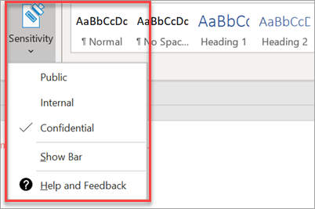

# Configurar las características de cumplimiento

Microsoft 365 Empresa Premium incluye características para proteger sus datos y dispositivos, y le ayudará a proteger la información confidencial de sus clientes y sus clientes.

## Configurar las características de DLP

Consulte [Crear una directiva DLP a](https://docs.microsoft.com/microsoft-365/compliance/create-a-dlp-policy-from-a-template) partir de una plantilla para obtener un ejemplo sobre cómo configurar una directiva para proteger contra la pérdida de datos personales. 
  
DLP incluye muchas plantillas de directiva listas para usar para muchas configuraciones regionales diferentes. Por ejemplo, Datos financieros de Australia, Ley de información personal de Canadá, Datos financieros de Estados Unidos, entre otros. Vea [qué incluyen las plantillas de directiva DLP](https://docs.microsoft.com/microsoft-365/compliance/what-the-dlp-policy-templates-include) para obtener una lista completa. Todas estas plantillas se pueden habilitar de forma similar al ejemplo de plantilla de PII. 
  
## Configurar la retención de correo electrónico con Archivado de Exchange Online

 **Archivado de Exchange Online** características de licencia ayudan a mantener los estándares normativos y de cumplimiento al conservar el contenido de correo electrónico para la exhibición de documentos electrónicos. También ayuda a reducir el riesgo si hay un proceso judicial y proporciona una forma de recuperar datos después de una infracción de seguridad o cuando necesite recuperar elementos eliminados. Puede usar la retención por juicio para conservar todo el contenido de un usuario o usar directivas de retención para personalizar lo que desea conservar.
  
**Retención por juicio:** Puede conservar todo el contenido del buzón, incluidos los elementos eliminados, si pone todo el buzón de un usuario en retención por juicio. 
    
Para poner un buzón en retención por juicio, en el Centro de administración:
    
1. En el panel de navegación izquierdo, vaya a **Usuarios** \> **activos.**
    
2. Seleccione un usuario cuyo buzón desea colocar en retención por juicio. En el panel de usuario, expanda **Configuración de correo** y, junto a Más **opciones,** **elija Editar propiedades de Exchange**.
    
3. On the mailbox page for the user, choose ** mailbox features ** on the left nav, and then choose the **Enable** link under **Litigation hold**.
    
4. En el cuadro **de diálogo retención** por juicio, puede especificar la duración de retención por juicio en el campo **Duración de retención por** juicio. Deje el campo vacío si desea colocar una retención infinita. También puede agregar notas y dirigir al propietario del buzón a un sitio web en el que podría tener que explicar más sobre la retención por juicio. \>**Guardar**.
    
**Retención:** Puede habilitar directivas de retención personalizadas, por ejemplo, para conservar durante un período de tiempo específico o eliminar el contenido de forma permanente al final del período de retención. Para obtener más información, vea [Información general sobre las directivas de retención.](https://docs.microsoft.com/microsoft-365/compliance/retention-policies)

## Configurar etiquetas de confidencialidad

Las etiquetas de confidencialidad vienen con el Plan 1 de Azure Information Protection (AIP) y le ayudan a clasificar y, opcionalmente, proteger los documentos y correos electrónicos mediante la aplicación de etiquetas. Los administradores que definen reglas y condiciones pueden aplicar automáticamente las etiquetas, manualmente los usuarios o mediante una combinación en la que se dan recomendaciones a los usuarios.

Para configurar etiquetas de confidencialidad, vea el vídeo [de creación y administración de etiquetas de confidencialidad.](https://support.microsoft.com/office/2fb96b54-7dd2-4f0c-ac8d-170790d4b8b9)

### Instalar el cliente de Azure Information Protection manualmente

Para instalar manualmente el cliente AIP:

1. Descargue **AzinfoProtection_UL.exe** del Centro [de descarga de Microsoft.](https://www.microsoft.com/download/details.aspx?id=53018)
 
2. Para comprobar que la instalación ha funcionado, vea  un documento de Word y asegúrese de que la opción Confidencialidad está disponible en la **pestaña** Inicio.
 

Para obtener más información, vea [Instalar el cliente.](https://docs.microsoft.com/azure/information-protection/infoprotect-tutorial-step3)
