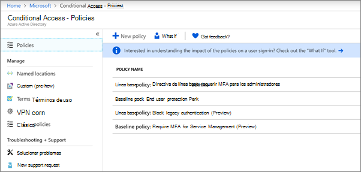

# Configurar directivas de acceso condicionalSet up conditional access policies

Las directivas de [acceso condicional](https://docs.microsoft.com/azure/active-directory/conditional-access/overview) agregan una seguridad adicional importante.[Conditional access](https://docs.microsoft.com/azure/active-directory/conditional-access/overview) policies add substantial additional security. Microsoft proporciona un conjunto de directivas de acceso condicional de línea base que se recomiendan para todos los clientes.Microsoft provides a set of baseline conditional access policies that are recommended for all customers. Las directivas de línea base son un conjunto de directivas predefinidas que ayudan a proteger a las organizaciones frente a muchos ataques comunes.Baseline policies are a set of predefined policies that help protect organizations against many common attacks. Estos ataques comunes pueden incluir aerosol, reproducción y suplantación de identidad.These common attacks can include password spray, replay, and phishing.

Estas directivas requieren que los administradores y los usuarios escriban una segunda forma de autenticación (denominada autenticación multifactor o MFA) cuando se cumplan ciertas condiciones.These policies require admins and users to enter a second form of authentication (called multifactor authentication, or MFA) when certain conditions are met. Por ejemplo, si un usuario inicia sesión desde un país diferente, el inicio de sesión puede considerarse arriesgado y el usuario debe proporcionar una forma de autenticación adicional.For example, if a user is signing in from a different country, the sign-in might be considered risky and the user must provide an additional form of authentication. 

Actualmente, las directivas de línea base son las siguientes:Currently, baseline policies include the following:
- **Requerir MFA para los administradores** &ndash; Requiere multi-factor Authentication para los roles de administrador con mayor privilegios, incluido el administrador global.**Require MFA for admins** &ndash; Requires multi-factor authentication for the most privileged administrator roles, including global administrator.
- Protección del usuario **final** &ndash; Requiere la autenticación multifactor para los usuarios solo cuando un inicio de sesión es arriesgado.**End user protection** &ndash; Requires multi-factor authentication for users only when a sign-in is risky. 
- **Bloquear la autenticación** &ndash; heredada Las aplicaciones cliente más antiguas y algunas aplicaciones nuevas no usan protocolos de autenticación más recientes, más seguros.**Block legacy authentication** &ndash; Older client apps and some new apps don't use newer, more secure, authentication protocols. Estas aplicaciones antiguas pueden omitir las directivas de acceso condicional y obtener acceso no autorizado a su entorno.These older apps can bypass conditional access policies and gain unauthorized access to your environment. Esta directiva bloquea el acceso de los clientes que no admiten el acceso condicional.This policy blocks access from clients that don't support conditional access. 
- **Requerir MFA para la administración** &ndash; de servicios Requiere multi-factor Authentication para el acceso a las herramientas de administración, incluido Azure portal (donde se configuran las directivas de línea base).**Require MFA for Service Management** &ndash; Requires multi-factor authentication for access to management tools, including Azure portal (where you configure baseline policies). 

Microsoft recomienda habilitar todas estas directivas de línea base.Microsoft recommends you enable all of these baseline policies. Una vez habilitadas estas directivas, se pedirá a los administradores y a los usuarios que se registren para la autenticación de varios factores de Azure.After these policies are enabled, admins and users will be prompted to register for Azure Multii-Factor authentication.

Para obtener más información acerca de estas directivas, vea [¿Qué son las directivas de línea base](https://docs.microsoft.com/azure/active-directory/conditional-access/concept-baseline-protection)?For more information about these policies, see [What are baseline policies](https://docs.microsoft.com/azure/active-directory/conditional-access/concept-baseline-protection)?

## Configurar directivas de línea baseSet up baseline policies

1. Vaya a [Azure portal](https://portal.azure.com)y navegue a **Azure Active Directory** \> **Conditional Access**.Go to [Azure portal](https://portal.azure.com), and then navigate to **Azure Active Directory** \> **Conditional Access**.
    
    Las directivas de línea base se enumeran en la página.The baseline policies are listed on the page.    
    
1. Consulte las siguientes instrucciones específicas para cada directiva:See the following specific instructions for each policy:

  - [Requerir MFA para los administradoresRequire MFA for admins](https://docs.microsoft.com/azure/active-directory/conditional-access/howto-baseline-protect-administrators)
- [Requerir MFA para los usuariosRequire MFA for users](https://docs.microsoft.com/azure/active-directory/conditional-access/howto-baseline-protect-end-users)  
 - [Bloquear la autenticación heredadaBlock legacy authentication](https://docs.microsoft.com/azure/active-directory/conditional-access/howto-baseline-protect-legacy-auth)
  - [Requerir MFA para la administración de serviciosRequire MFA for service management](https://docs.microsoft.com/azure/active-directory/conditional-access/howto-baseline-protect-azure)

Puede configurar muchas directivas adicionales, como requerir aplicaciones cliente aprobadas.You can set up many additional policies, such as requiring approved client apps. Para obtener más información, consulte la [documentación de acceso condicional](https://docs.microsoft.com/azure/active-directory/conditional-access/).For more information, see the [Conditional Access Documentation](https://docs.microsoft.com/azure/active-directory/conditional-access/).
