# Configurar dispositivos móviles para usuarios de Microsoft 365 para empresas

Siga las instrucciones en las pestañas para instalar Office en un iPhone o un teléfono Android. Después de seguir estos pasos, los archivos de trabajo creados en aplicaciones de Office estarán protegidos por Microsoft 365 para empresas.

Este ejemplo se aplica a Outlook, pero también a cualquier otra aplicación de Office que quiera instalar.
  
## Configurar dispositivos móviles

## [iPhone](#tab/iPhone)
  
Vea un breve vídeo sobre cómo configurar aplicaciones de Office en dispositivos iOS con Microsoft 365 para empresas.  

> [!VIDEO https://www.microsoft.com/videoplayer/embed/RWee2n] 

Si este vídeo le ha sido de ayuda, vea la [serie completa de aprendizaje para las pequeñas empresas y las novedades de Microsoft 365](https://support.microsoft.com/office/6ab4bbcd-79cf-4000-a0bd-d42ce4d12816).

Vaya al **App Store** y, en el campo de búsqueda, escriba Microsoft Outlook.
  
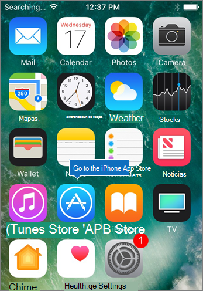
  
Pulse el icono de nube para instalar Outlook.
  
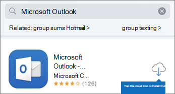
  
Cuando haya terminado la instalación, pulse el botón **Abrir** para abrir Outlook y, después, pulse **Introducción**.
  
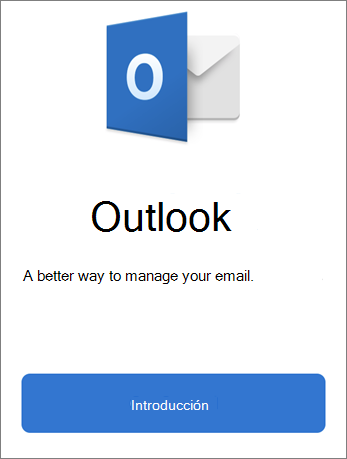
  
Escriba su dirección de  correo electrónico de trabajo en la pantalla Agregar cuenta de correo electrónico y, a continuación, escriba sus credenciales de \> Microsoft 365 para \> **empresas Inicie sesión**.
  
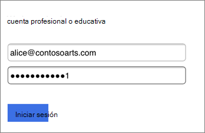
  
Si tu organización protege archivos en aplicaciones, verás un cuadro de diálogo que indica que tu organización protege los datos de la aplicación y debes reiniciar la aplicación para seguir usarla. Pulse **Aceptar** y cierre Outlook. 
  
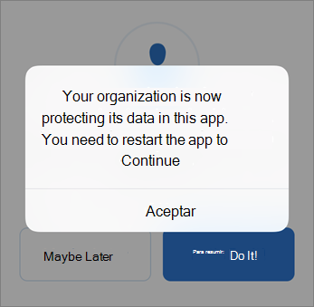
  
Busque Outlook en el iPhone y reinícielo. Cuando se le pida, escriba un PIN y compruebelo. Ya puede usar su Outlook para iPhone.
  
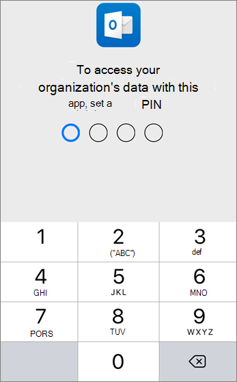
  
## [Android](#tab/Android)
  
Vea un vídeo sobre la instalación de Outlook y Office en dispositivos Android.  

> [!VIDEO https://www.microsoft.com/videoplayer/embed/ecc2e9c0-bc7e-4f26-8b14-91d84dbcfef0] 

Si este vídeo le ha sido de ayuda, vea la [serie completa de aprendizaje para las pequeñas empresas y las novedades de Microsoft 365](https://support.microsoft.com/office/6ab4bbcd-79cf-4000-a0bd-d42ce4d12816).

Para comenzar la configuración en tu teléfono Android, ve a la Play Store.
  
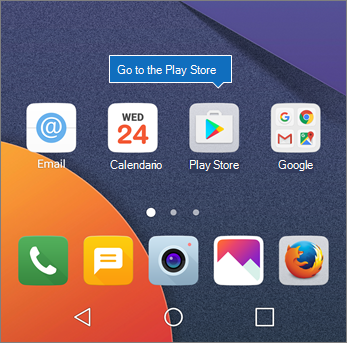
  
Escribe Microsoft Outlook en el cuadro de búsqueda de Google Play y pulsa **Instalar**. Una vez que Outlook haya terminado de instalar, pulse **Abrir**.
  
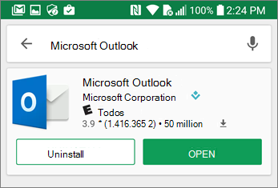
  
En la aplicación outlook, **pulsa** Introducción y, a continuación, agrega tu cuenta de correo electrónico de Microsoft 365 para empresas Continuar e inicia sesión con las credenciales de \> la organización.
  

  
En el cuadro de diálogo que indica que debe instalar la aplicación Portal de empresa de Intune, pulse **Ir a la tienda**.
  
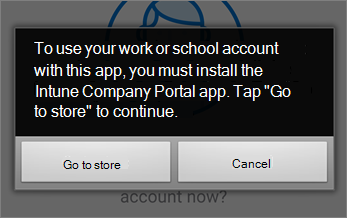
  
En Play Store, instala Intune Company Portal.
  
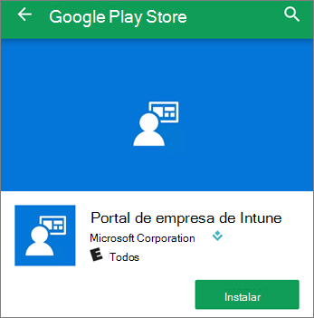
  
Vuelva a abrir Outlook e introduzca y confirme un PIN. La aplicación de Outlook ya está lista para que la use.
  
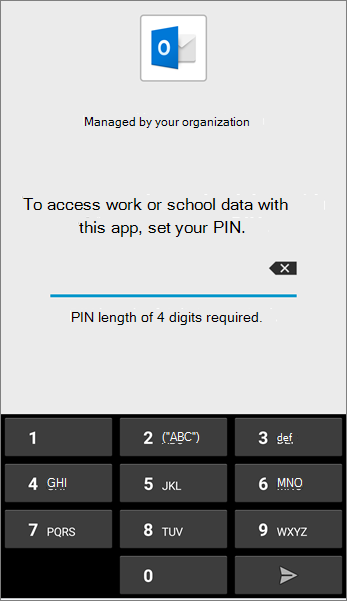

## Vea también

[Vídeos de aprendizaje de Microsoft 365 para empresas](https://support.microsoft.com/office/6ab4bbcd-79cf-4000-a0bd-d42ce4d12816)

---
