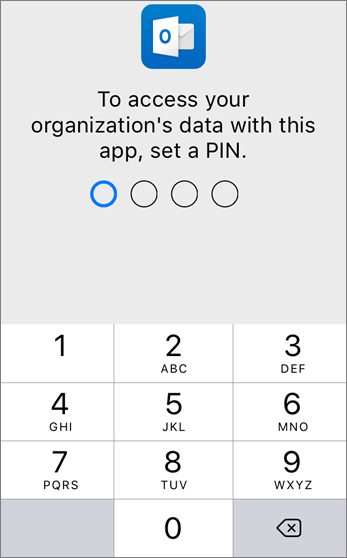
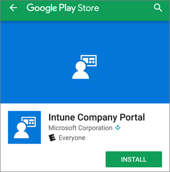

# Configurar dispositivos móviles para Microsoft 365 usuarios empresariales

Siga las instrucciones en las pestañas para instalar Office en un iPhone o un teléfono Android. Después de seguir estos pasos, los archivos de trabajo creados en Office aplicaciones estarán protegidos por Microsoft 365 para empresas.

Este ejemplo se aplica a Outlook, pero también a cualquier otra aplicación de Office que quiera instalar.
  
## Configurar dispositivos móviles

## [iPhone](#tab/iPhone)
  
Vea un breve vídeo sobre cómo configurar Office aplicaciones en dispositivos iOS con Microsoft 365 para empresas.  

> [!VIDEO https://www.microsoft.com/videoplayer/embed/RWee2n] 

Si este vídeo le ha sido de ayuda, vea la [serie completa de aprendizaje para las pequeñas empresas y las novedades de Microsoft 365](../business-video/index.yml).

Vaya al **App Store** y, en el campo de búsqueda, escriba Microsoft Outlook.
  

  
Pulse el icono de nube para instalar Outlook.
  

  
Cuando haya terminado la instalación, pulse el botón **Abrir** para abrir Outlook y, después, pulse **Introducción**.
  

  
Escriba su dirección de  correo electrónico de trabajo en la pantalla Agregar cuenta de correo electrónico y, a continuación, escriba su Microsoft 365 credenciales de inicio de sesión para \>  \> **empresas.**
  

  
Si tu organización protege archivos en aplicaciones, verás un cuadro de diálogo que indica que tu organización protege los datos de la aplicación y debes reiniciar la aplicación para seguir usarla. Pulse **Aceptar** y cierre Outlook. 
  

  
Busque Outlook en el iPhone y reinícielo. Cuando se le pida, escriba un PIN y compruebelo. Ya puede usar su Outlook para iPhone.
  

  
## [Android](#tab/Android)
  
Vea un vídeo sobre cómo instalar Outlook y Office dispositivos Android.  

> [!VIDEO https://www.microsoft.com/videoplayer/embed/ecc2e9c0-bc7e-4f26-8b14-91d84dbcfef0] 

Si este vídeo le ha sido de ayuda, vea la [serie completa de aprendizaje para las pequeñas empresas y las novedades de Microsoft 365](../business-video/index.yml).

Para comenzar la configuración en tu teléfono Android, ve a la Play Store.
  

  
Escribe Microsoft Outlook en el cuadro de búsqueda de Google Play y pulsa **Instalar**. Una Outlook haya terminado de instalar, pulse **Abrir**.
  

  
En la Outlook, pulsa **Introducción**, luego agrega tu cuenta de correo electrónico de Microsoft 365 para empresas Continuar e inicia sesión con las credenciales \> de la organización.
  

  
En el cuadro de diálogo que indica que debe instalar la aplicación Portal de empresa de Intune, pulse **Ir a la tienda**.
  

  
En Play Store, instala Portal de empresa de Intune.
  

  
Vuelva a abrir Outlook e introduzca y confirme un PIN. La aplicación de Outlook ya está lista para que la use.
  

## Vea también

[Vídeos de aprendizaje de Microsoft 365 para empresas](../business-video/index.yml)

---
