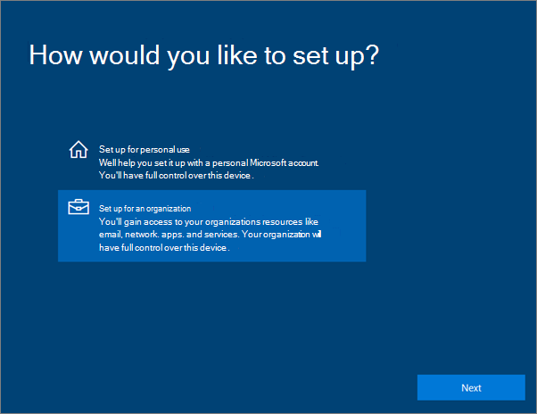
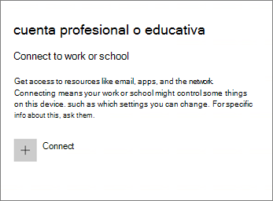
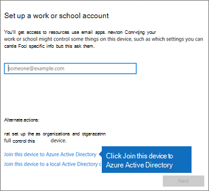
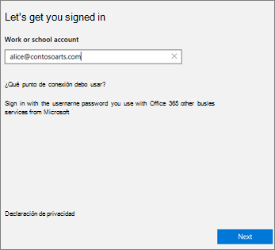
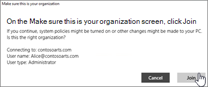
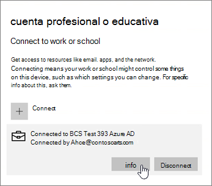

# Configurar dispositivos Windows para usuarios de Microsoft 365 empresa PremiumSet up Windows devices for Microsoft 365 Business Premium users

## Requisitos previos para configurar dispositivos Windows para usuarios de Microsoft 365 empresa PremiumPrerequisites for setting up Windows devices for Microsoft 365 Business Premium users

Antes de poder configurar dispositivos Windows para los usuarios de Microsoft 365 empresa Premium, asegúrese de que todos los dispositivos Windows ejecutan Windows 10 Pro, versión 1703 (Creators Update).Before you can set up Windows devices for Microsoft 365 Business Premium users, make sure all the Windows devices are running Windows 10 Pro, version 1703 (Creators Update). Windows 10 Pro es un requisito previo para la implementación de Windows 10 Business, que es un conjunto de servicios en la nube y capacidades de administración de dispositivos que complementan Windows 10 Pro y habilitan los controles de seguridad y administración centralizados de Microsoft 365 empresa Premium.Windows 10 Pro is a prerequisite for deploying Windows 10 Business, which is a set of cloud services and device management capabilities that complement Windows 10 Pro and enable the centralized management and security controls of Microsoft 365 Business Premium.
  
Si tiene dispositivos Windows que ejecutan Windows 7 Pro, Windows 8 Pro o Windows 8,1 Pro, su suscripción a Microsoft 365 Business Premium le da derecho a una actualización de Windows 10.If you have Windows devices running Windows 7 Pro, Windows 8 Pro, or Windows 8.1 Pro, your Microsoft 365 Business Premium subscription entitles you to a Windows 10 upgrade.
  
Para obtener más información sobre cómo actualizar los dispositivos Windows a Windows 10 Pro Creators Update, siga los pasos indicados en este tema: [Actualizar dispositivos Windows a Windows Pro Creators Update](upgrade-to-windows-pro-creators-update.md)For more information on how to upgrade Windows devices to Windows 10 Pro Creators Update, follow the steps in this topic: [Upgrade Windows devices to Windows Pro Creators Update](upgrade-to-windows-pro-creators-update.md).
  
Consulte [comprobar que el dispositivo está conectado a Azure ad](#verify-the-device-is-connected-to-azure-ad) para comprobar que tiene la actualización o para asegurarse de que la actualización ha funcionado.See [Verify the device is connected to Azure AD](#verify-the-device-is-connected-to-azure-ad) to verify you have the upgrade, or to make sure the upgrade worked.

Vea un breve vídeo sobre cómo conectar Windows a Microsoft 365.Watch a short video about connecting Windows to Microsoft 365.  

> [!VIDEO https://www.microsoft.com/videoplayer/embed/RE3yXh3] 

Si este vídeo le ha sido de ayuda, consulte la [serie completa de aprendizaje para las pequeñas empresas y las novedades de Microsoft 365](https://support.microsoft.com/office/6ab4bbcd-79cf-4000-a0bd-d42ce4d12816).If you found this video helpful, check out the [complete training series for small businesses and those new to Microsoft 365](https://support.microsoft.com/office/6ab4bbcd-79cf-4000-a0bd-d42ce4d12816).
  
## Unir dispositivos Windows 10 en la cuenta de Azure AD de una organizaciónJoin Windows 10 devices to your organization's Azure AD

Cuando todos los dispositivos Windows de su organización se hayan actualizado a Windows 10 Pro Creators Update o ya ejecuten la actualización de Windows 10 Pro Creators, puede unir estos dispositivos al Azure Active Directory de la organización.When all Windows devices in your organization have either been upgraded to Windows 10 Pro Creators Update or are already running Windows 10 Pro Creators Update, you can join these devices to your organization's Azure Active Directory. Una vez que se hayan unido los dispositivos, se actualizarán automáticamente a Windows 10 Business, que forma parte de su suscripción de Microsoft 365 empresa Premium.Once the devices are joined, they'll be automatically upgraded to Windows 10 Business, which is part of your Microsoft 365 Business Premium subscription.
  
### Dispositivos Windows 10 Pro nuevos o actualizados recientementeFor a brand new, or newly upgraded, Windows 10 Pro device

En el caso de los dispositivos nuevos que ejecuten Windows 10 Pro Creators Update, o en el de los dispositivos que se hayan actualizado a dicho producto pero no hayan pasado por el proceso de configuración de dispositivos Windows 10, siga estos pasos.For a brand new device running Windows 10 Pro Creators Update, or for a device that was upgraded to Windows 10 Pro Creators Update but has not gone through Windows 10 device setup, follow these steps.
  
1. Siga el proceso de configuración de dispositivos Windows 10 hasta que llegue a la página **¿Cómo quiere realizar la configuración?**.Go through Windows 10 device setup until you get to the **How would you like to set up?** page. 
    
    
  
2. Elija **configurar para una organización** y, después, escriba el nombre de usuario y la contraseña de Microsoft 365 empresa Premium.Here, choose **Set up for an organization** and then enter your username and password for Microsoft 365 Business Premium. 
    
3. Finalice la configuración del dispositivo Windows 10.Finish Windows 10 device setup.
    
   Once you're done, the user will be connected to your organization's Azure AD.Once you're done, the user will be connected to your organization's Azure AD. See [Verify the device is connected to Azure AD](#verify-the-device-is-connected-to-azure-ad) to make sure.See [Verify the device is connected to Azure AD](#verify-the-device-is-connected-to-azure-ad) to make sure. 
  
### Dispositivos ya configurados con Windows 10 ProFor a device already set up and running Windows 10 Pro

 **Conectar usuarios a Azure AD:****Connect users to Azure AD:**
  
1. En el equipo Windows del usuario, que está ejecutando Windows 10 Pro, versión 1703 (Creators Update) (vea [Requisitos previos](pre-requisites-for-data-protection.md)), haga clic en el logotipo de Windows y, después, en el icono Configuración.In your user's Windows PC, that is running Windows 10 Pro, version 1703 (Creators Update) (see [pre-requisites](pre-requisites-for-data-protection.md)), click the Windows logo, and then the Settings icon.
  
   
  
2. En **Configuración**, vaya a **Cuentas**.In **Settings**, go to **Accounts**.
  
   
  
3. En la página **Tu información**, haga clic en **Obtener acceso a trabajo o escuela** \> **Conectar**.On **Your info** page, click **Access work or school** \> **Connect**.
  
   
  
4. En el cuadro de diálogo **Configurar una cuenta de trabajo o escuela**, en **Acciones alternativas**, elija **Unir este dispositivo a Azure Active Directory**.On the **Set up a work or school account** dialog, under **Alternate actions**, choose **Join this device to Azure Active Directory**.
  
   
  
5. En la página **Vamos a iniciar sesión**, escriba su cuenta profesional o educativa \> **Siguiente**.On the **Let's get you signed in** page, enter your work or school account \> **Next**.
  
   En la página **Escribir contraseña**, escriba la contraseña \> **Iniciar sesión**.On the **Enter password** page, enter your password \> **Sign in**.
  
   
  
6. En la página Asegúrese de que **es su organización** , compruebe que la información es correcta y haga clic en **unirse**.On the **Make sure this is your organization** page, verify that the information is correct, and click **Join**.
  
   On the **You're all set!**On the **You're all set!** page, click **Done**.page, click **Done**.
  
   
  
Si ha cargado archivos a OneDrive para la Empresa, vuelva a sincronizarlos.If you uploaded files to OneDrive for Business, sync them back down. Si ha usado una herramienta de terceros para migrar perfiles y archivos, sincronice también los archivos con el nuevo perfil.If you used a third-party tool to migrate profile and files, also sync those to the new profile.
  
## Comprobar que un dispositivo está conectado a Azure ADVerify the device is connected to Azure AD

Para comprobar el estado de la sincronización, en la página **tener acceso a la escuela o el trabajo** en **configuración**, haga clic en el área **conectado a** _ \<organization name\> _ para mostrar la **información** de los botones y **desconectar**.To verify your sync status, on the **Access work or school** page in **Settings**, click in the **Connected to** _ \<organization name\> _ area to expose the buttons **Info** and **Disconnect**. Haga clic en **Información** para obtener el estado de sincronización.Click on **Info** to get your synchronization status. 
  
En la página Estado de sincronización, haga clic en Sincronizar para recibir las directivas de administración de dispositivos móviles más recientes en el equipo.On the Sync status page, click Sync to get the latest mobile device management policies onto the PC.
  
Para empezar a usar la cuenta de Microsoft 365 Business Premium, vaya al botón **Inicio** de Windows, haga clic con el botón secundario en la imagen de cuenta actual y, a continuación, **cambie de cuenta**.To start using the Microsoft 365 Business Premium account, go to the Windows **Start** button, right-click your current account picture, and then **Switch account**. Inicie sesión con el correo electrónico y la contraseña de la organización.Sign in by using your organization email and password.
  

  
## Comprobar que un dispositivo está actualizado a Windows 10 BusinessVerify the device is upgraded to Windows 10 Business

Compruebe que los dispositivos Windows 10 Unidos a Azure AD se han actualizado a Windows 10 Business como parte de su suscripción a Microsoft 365 empresa Premium.Verify that your Azure AD joined Windows 10 devices were upgraded to Windows 10 Business as part of your Microsoft 365 Business Premium subscription.
  
1. Vaya a **Configuración** \> **Sistema** \> **Acerca de**.Go to **Settings** \> **System** \> **About**.
    
2. Confirme que la **Edición** es **Windows 10 Business**.Confirm that the **Edition** shows **Windows 10 Business**.
    
    
  
## Siguientes pasosNext steps

Para configurar los dispositivos móviles, consulte [configurar dispositivos móviles para los usuarios de microsoft 365 empresa Premium](set-up-mobile-devices.md), para establecer directivas de protección de dispositivos o de protección de aplicaciones, consulte [Manage Microsoft 365 for Business](manage.md).To set up your mobile devices, see [Set up mobile devices for Microsoft 365 Business Premium users](set-up-mobile-devices.md), To set device protection or app protection policies, see [Manage Microsoft 365 for business](manage.md).
  
## Para obtener más información sobre la configuración y el uso de Microsoft 365 empresa PremiumFor more on setting up and using Microsoft 365 Business Premium

[Vídeos de aprendizaje de Microsoft 365 para empresasMicrosoft 365 for business training videos](https://support.microsoft.com/office/6ab4bbcd-79cf-4000-a0bd-d42ce4d12816)
