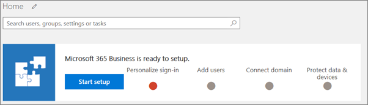

# Configurar Microsoft 365 Business mediante el Asistente para configuración

Complete los pasos 1 a 4 que aparece a continuación.
  
### Configurar Microsoft 365 Business

Vea un vídeo sobre cómo configurar Microsoft 365 Business cuando no dispone de un local de Active Directory:
  
> [!VIDEO https://www.microsoft.com/videoplayer/embed/0705c337-f3e8-4d28-bb6c-530cd28e99f2?autoplay=false]
  
Los pasos de configuración incluyen información de configuraciones que incluya Active Directory local. Si desea seguir teniendo acceso a dispositivos unido a un dominio, lea los siguientes artículos para dos forma distinta de la habilitación y completar los pasos antes de ejecutar al Asistente para instalación:
  
- [Habilitar dispositivos de Windows 10 unido a un dominio administrado por Microsoft 365 empresarial](manage-windows-devices.md)
    
    -Este es el método recomendado.
    
- [Acceso a recursos desde un dispositivo unido a AD Azure en Microsoft 365 Business local](access-resources.md)
    
### Paso 1: Personalizar Inicio de sesión

1. Inicie sesión en [Microsoft 365 Business](https://portal.microsoft.com) usando las credenciales de administrador global. Elija el icono **Administrador** para ir al centro de administración. 
    
2. Elija **Iniciar instalación** (según su estado, es posible que vea **Continuar instalación** en su lugar) en el centro de administración para iniciar el asistente. 
    
3. Escriba el nombre de dominio que desea utilizar (por ejemplo, contoso.com).
    
    Vamos a escribir su dominio aunque haya comprobado durante el uso de Azure AD conectar, por ejemplo. Los dos pasos siguientes no se aplican a usted si usa Azure Connect de AD para comprobar su dominio.
    
4. Siga los pasos del Asistente para [crear registros DNS en cualquier proveedor de hospedaje de DNS para Office 365](https://support.office.com/article/7b7b075d-79f9-4e37-8a9e-fb60c1d95166) que comprueba el que propietario del dominio. 
    
    Puede ver un vídeo de ejemplo de [vídeo: el programa de instalación de Office 365 en el centro de administración nuevo](https://support.office.com/article/a8c2002a-34bc-4ab3-93d8-9b5156c48bf8). Tenga en cuenta que en este vídeo no incluye los pasos de protección de datos de negocio de Microsoft 365.
    
    
  
### Paso 2: Agregar usuarios y asignar licencias

1. Puede agregar usuarios aquí, o puede [agregar usuarios más adelante](add-users-m365b.md) en el centro de administración. 
    
    Todos los usuarios que agregue tendrán una licencia de Microsoft 365 Business asignada automáticamente.
    
2. Si su suscripción a Microsoft 365 Business tiene usuarios existentes (por ejemplo, si usó Azure AD Connect), verá una opción para asignarles licencias ahora. Siga y agrégueles licencias también.
    
3. También verá una opción para compartir las credenciales con los nuevos usuarios que ha agregado. Puede elegir imprimirlas, enviarlas por correo electrónico o descargarlas.
    
4. Omita la migración de mensajes de correo electrónico y elija **Siguiente** en la página **Migrar los mensajes de correo electrónico**. 
    
    Si está migrando desde otro proveedor de correo electrónico y desea copiar los datos más adelante, se puede [migrar correo y contactos a Office 365](https://support.office.com/article/a3e3bddb-582e-4133-8670-e61b9f58627e).
    
    
  
### Paso 3: Conectar su dominio

> [!NOTE]
> Si decidió usar el dominio .onmicrosoft, o utiliza Azure Connect de AD, no verá este paso. 
  
Para configurar servicios, es necesario actualizar algunos registros en su registrador de dominio o host DNS.
  
1. Normalmente, el Asistente para la instalación detecta a su registrador de y le proporciona un vínculo a instrucciones paso a paso para actualizar sus registros NS en el sitio Web de registrador. Si no es así, [servidores de cambio de nombres para configurar Office 365 con cualquier registrador de dominios](https://support.office.com/article/a8b487a9-2a45-4581-9dc4-5d28a47010a2).
    
2. Se configurarán automáticamente el correo electrónico y otros servicios
    
### Paso 4: Administración de dispositivos y archivos de trabajo

1. En el de **proteger los archivos de trabajo en los dispositivos móviles de** página establezca **proteger los archivos de trabajo cuando los dispositivos están perdidos o robados** y **cómo los usuarios tener acceso a los archivos de Office en dispositivos móviles de administrar** la configuración de **activado**. También puede tener acceso a cada configuración subcaracterísticas haciendo clic en las comillas angulares junto a cada opción.
  
  Todos los archivos de trabajo de los usuarios con licencia de ahora están protegidos en iOS y dispositivos Android, tan pronto como [instalar aplicaciones de Office](set-up-mobile-devices.md) (y autenticarse con sus credenciales de Microsoft 365 empresarial). 
  
  
  
2. En la página **configuración de dispositivo de establecer 10 de Windows** , establecer configuración de **Dispositivos de 10 Windows seguro** **activado**.
  
   También puede tener acceso a cada configuración subcaracterísticas haciendo clic en el botón de contenido adicional junto a ella.
  
3. Establecer la configuración de **Instalar Office en Windows 10 dispositivos** en **Sí** si todos los usuarios tienen equipos Windows 10, y no de Office instala o instalaciones de Office de click-to-run. Si no es el caso, configure esta opción en **No**. Una vez preparados los equipos de usuario se puede [instalar automáticamente Office](auto-install-or-uninstall-office.md) más adelante desde el centro de administración. Para obtener instrucciones, vea [preparación de la instalación de cliente de Office](prepare-for-office-client-deployment.md).
  
    Archivos de trabajo de los usuarios con licencia en los dispositivos de Windows 10 se deben proyectarse tan pronto como [unirse a su dispositivo Windows 10](set-up-windows-devices.md) a un dominio de negocio 365 Microsoft Azure AD o [instalar 10 de Windows en un equipo nuevo](https://support.office.com/article/c654bd23-d256-4ac7-8fba-0c993bf5a771.aspx) mientras participa en el Microsoft 365 simultáneamente Dominio de negocio Azure AD. 
  
4. Haga clic en **Siguiente** y ya ha terminado la configuración. 
  
    Envíenos comentarios en este paso para ayudarnos a mejorar la experiencia.
  
    
  
## Opciones de configuración de seguridad adicionales

Además de la seguridad y la configuración de cumplimiento en el Asistente para la instalación, puede configurar también la siguiente configuración adicional:
  
- Configurar la protección frente a los datos adjuntos no seguros. **Una protección avanzada** (ATP) identifica contenido malintencionado y, a continuación, bloquea la entrega de los datos adjuntos no seguros, ayudar a proteger el equipo contra esquemas de suplantación de identidad y ransomware infección. Para activar la protección de datos adjuntos, vea [configurar las directivas de Office 365 ATP los datos adjuntos seguros](https://support.office.com/article/078eb946-819a-4e13-8673-fe0c0ad3a775#setpolicy).
    
- Proteja el entorno cuando los usuarios, haga clic en vínculos malintencionados. ATP examina los vínculos en el correo electrónico en el momento en que un usuario hace clic en ellos. Si un vínculo no es seguro, el usuario se le advierte no para visitar el sitio o informado de que el sitio se ha bloqueado. Esto ayuda a proteger contra esquemas de suplantación de identidad. [Configurar las directivas de Office 365 ATP seguros vínculos](https://support.office.com/article/bdd5372d-775e-4442-9c1b-609627b94b5d#reveddefaultscc) o [configurar las directivas de Office 365 ATP seguros vínculos](https://support.office.com/article/bdd5372d-775e-4442-9c1b-609627b94b5d#addemailpolscc).
    
- Puede conservar todo el contenido buzón incluyendo los elementos eliminados colocando todo el buzón de un usuario en **suspensión de litigio**. Para obtener instrucciones, vea 
- [Configurar la retención de correo electrónico con Exchange Online Archiving](security-features.md#set-up-email-retention-with-exchange-online-archiving).
    
- Configurar personalizadas de **las directivas de retención**, por ejemplo, para conservar para un período de tiempo específico o eliminar permanentemente el contenido al final del período de retención. Puede habilitar las directivas de retención personalizada en el centro de cumplimiento, vaya a la **gobernanza de datos** y valores \> **retención**y, a continuación, siga los pasos descritos en el asistente. Para obtener más información, vea [información general de las directivas de retención](https://support.office.com/article/5e377752-700d-4870-9b6d-12bfc12d2423).
    
## Pasos siguientes

En el caso de los usuarios que tienen licencia, el siguiente paso es configurar los dispositivos.  Consulte [Configurar dispositivos Windows para los usuarios de Microsoft 365 Business](set-up-windows-devices.md) y [Configurar dispositivos móviles para los usuarios de Microsoft 365 Business](set-up-mobile-devices.md).  Consulte [Administrar Microsoft 365 Business](manage.md) para ver vínculos relacionados con los temas sobre cómo configurar directivas de protección de aplicaciones y dispositivos y cómo eliminar datos de dispositivos de usuario. 
  

