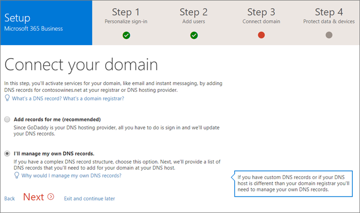

# Configurar Microsoft 365 empresa en el Asistente de configuración

## Agregar el dominio, usuarios y configurar directivas

Al adquirir Microsoft 365 Business, tiene la opción de usar un dominio de su propiedad o comprar uno durante el [registro](sign-up.md).

- Si compró un dominio nuevo cuando se registró, su dominio está todo configurado y puede moverse a [Agregar usuarios y asignar licencias](#add-users-and-assign-licenses).

### Agregar su dominio para personalizar el inicio de sesión

1. Inicie sesión en el [centro de administración de Microsoft 365](https://admin.microsoft.com) con sus credenciales de administrador global. 

2. Elija **Agregar un dominio** o **Agregar usuarios** para iniciar el asistente.
    > [!IMPORTANT]
    > Si compró un dominio durante el registro, no verá aquí **el paso agregar un dominio** . Vaya a [Agregar usuarios](#add-users-and-assign-licenses) en su lugar.

    
    
3. En el asistente, escriba el nombre de dominio que desea usar (como contoso.com).

    

    
4. Siga los pasos del Asistente para [crear registros DNS en cualquier proveedor de hospedaje DNS para Office 365](https://docs.microsoft.com/office365/admin/get-help-with-domains/create-dns-records-at-any-dns-hosting-provider) que compruebe que es el propietario del dominio. Si conoce el host del dominio, consulte también las [instrucciones específicas del host](https://docs.microsoft.com/office365/admin/get-help-with-domains/set-up-your-domain-host-specific-instructions).

    Si su proveedor de hospedaje es GoDaddy u otro host habilitado con [conexión de dominio](https://docs.microsoft.com/office365/admin/get-help-with-domains/domain-connect), el proceso es sencillo y se le pedirá automáticamente que inicie sesión y deje que Microsoft se autentique en su nombre.

    

### Agregar usuarios y asignar licencias

Puede Agregar usuarios en el asistente, pero también puede [Agregar usuarios más adelante](add-users-m365b.md) en el centro de administración. Además, si tiene un controlador de dominio local, puede Agregar usuarios con [Azure ad Connect](https://docs.microsoft.com/azure/active-directory/hybrid/how-to-connect-install-express).

#### Agregar usuarios en el asistente

Cualquier usuario que agregue en el asistente obtiene automáticamente una licencia de Microsoft 365 Business.

1. Si su suscripción de Microsoft 365 Business tiene usuarios existentes (por ejemplo, si ha usado Azure AD Connect), tendrá una opción para asignar licencias a ellos en este momento. Siga y agrégueles licencias también.

2. Una vez que haya agregado los usuarios, también obtendrá una opción para compartir las credenciales con los nuevos usuarios que ha agregado. Puede elegir imprimirlas, enviarlas por correo electrónico o descargarlas.

3. En crear Microsoft Teams para su organización, puede elegir agregar Microsoft Teams y agregar usuarios a ellos. También puede hacerlo más adelante. Para obtener más información, vea [crear un equipo de toda la empresa](https://support.office.com/article/037bb27a-bcc9-48fe-8d72-44d9482420a3).

4. Omita la migración de mensajes de correo electrónico y elija **Siguiente** en la página **Migrar los mensajes de correo electrónico**. 

    Si va a cambiar de otro proveedor de correo electrónico y desea copiar los datos más adelante, puede [migrar el correo electrónico y los contactos a Office 365](https://support.office.com/article/a3e3bddb-582e-4133-8670-e61b9f58627e).

### Conectar el dominio

> [!NOTE]
> Si eligió usar el dominio. en Microsoft o ha usado Azure AD Connect para configurar a los usuarios, no verá este paso.
  
Para configurar servicios, es necesario actualizar algunos registros en su registrador de dominio o host DNS.
  
1. Normalmente, el asistente para configuración detecta el registrador y le proporciona un vínculo con instrucciones paso a paso para actualizar los registros NS en el sitio web del registrador. Si no es así, [cambie los servidores DNS para configurar Office 365 con cualquier registrador de dominios](https://support.office.com/article/a8b487a9-2a45-4581-9dc4-5d28a47010a2). 

    - Si tiene registros DNS existentes, por ejemplo, un sitio web existente, pero el host DNS está habilitado para la [conexión de dominio](https://docs.microsoft.com/office365/admin/get-help-with-domains/domain-connect), elija **agregar registros**. En la página **elegir los servicios en línea** , acepte los valores predeterminados y elija **siguiente**y elija **autorizar** en la página del host DNS.
    - Si tiene registros DNS con otros hosts DNS (no habilitados para la conexión de dominio), querrá administrar sus propios registros DNS para asegurarse de que los servicios existentes permanecen conectados. Consulte [conceptos básicos de dominio](https://docs.microsoft.com/office365/admin/get-help-with-domains/dns-basics) para obtener más información.

        

2. Siga los pasos del asistente y el correo electrónico y otros servicios se configurarán para usted.

### Proteger datos y dispositivos 

Las directivas que configure en el asistente se aplican automáticamente a un [grupo de seguridad](https://docs.microsoft.com/office365/admin/create-groups/compare-groups#security-groups) denominado *todos los usuarios*. También puede crear grupos adicionales para asignar directivas en el centro de administración.

1. En los **archivos de protección de su trabajo en dispositivos móviles**, la opción **proteger los archivos de trabajo cuando se pierdan o se roben dispositivos** se selecciona de forma predeterminada. Tiene una opción para activar **administrar la forma en que los usuarios obtienen acceso a los archivos de Office en dispositivos móviles**y se recomienda hacerlo.

    

     - Expanda **proteger archivos de trabajo cuando se pierdan o se roben dispositivos** para mostrar los [valores predeterminados](protect-work-files-on-lost-or-stolen-device.md):

        

    - Seleccione **administrar la forma en que los usuarios obtienen acceso a los archivos de Office en dispositivos móviles** y expándalo para mostrar los [valores predeterminados](manage-user-access-on-mobile-devices.md). Le recomendamos que acepte los valores predeterminados durante la configuración para crear directivas de aplicación para Android, iOS y Windows 10 que se aplican a todos los usuarios. Podrá crear más directivas cuando se complete la configuración.

        

2. El último paso sobre la protección de datos y dispositivos le permite configurar directivas para proteger los dispositivos Windows 10. Esta configuración se aplica automáticamente cuando Windows 10 de un usuario se conecta a su organización. Puede ampliar la **seguridad de los dispositivos Windows 10** para ver y modificar los [valores predeterminados](secure-windows-10-devices.md).
3. También puede optar por [instalar automáticamente Office](install-office-on-windows-10-during-setup.md) en dispositivos Windows 10.

    

## Implementación de aplicaciones cliente de Office 365

Si eligió instalar automáticamente las aplicaciones de Office durante la configuración, las aplicaciones se instalarán en los dispositivos con Windows 10 una vez que los usuarios hayan iniciado sesión en Azure AD desde sus dispositivos Windows, usando sus credenciales de trabajo.

Para instalar Office en dispositivos móviles iOS o Android, consulte [configurar dispositivos móviles para usuarios profesionales de Microsoft 365](set-up-mobile-devices.md).

También puede instalar Office de forma individual. Consulte [instalar Office en un equipo PC o Mac](https://support.office.com/article/4414eaaf-0478-48be-9c42-23adc4716658) para obtener instrucciones.
