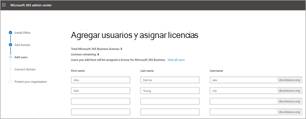
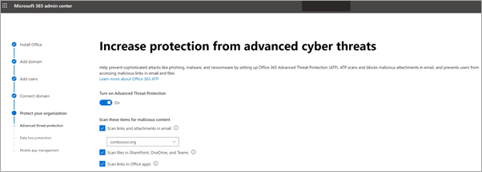

# Configurar Microsoft 365 empresa en el Asistente de configuraciónSet up Microsoft 365 Business in the setup wizard

Vea este vídeo para obtener información general sobre la configuración de Microsoft 365 Business.Watch this video for an overview of Microsoft 365 Business setup.  

> [!VIDEO https://www.microsoft.com/videoplayer/embed/RE1FYSM] 

Si este vídeo le ha sido de ayuda, consulte la [serie completa de aprendizaje para las pequeñas empresas y las novedades de Microsoft 365](https://support.office.com/article/6ab4bbcd-79cf-4000-a0bd-d42ce4d12816).If you found this video helpful, check out the [complete training series for small businesses and those new to Microsoft 365](https://support.office.com/article/6ab4bbcd-79cf-4000-a0bd-d42ce4d12816).

## Agregar el dominio, usuarios y configurar directivasAdd your domain, users, and set up policies

Al adquirir Microsoft 365 Business, tiene la opción de usar un dominio de su propiedad o comprar uno durante el [registro](sign-up.md).When you purchase Microsoft 365 Business, you have the option of using a domain you own, or buying one during the [sign-up](sign-up.md).

- Si compró un dominio nuevo cuando se registró, su dominio está todo configurado y puede moverse a [Agregar usuarios y asignar licencias](#add-users-and-assign-licenses).If you purchased a new domain when you signed up, your domain is all set up and you can move to [Add users and assign licenses](#add-users-and-assign-licenses).

### Agregar su dominio para personalizar el inicio de sesiónAdd your domain to personalize sign-in

1. Inicie sesión en el [centro de administración de Microsoft 365](https://admin.microsoft.com) con sus credenciales de administrador global.Sign in to [Microsoft 365 admin center](https://admin.microsoft.com) by using your global admin credentials. 

2. Elija **ir a la configuración** para iniciar el asistente.Choose **Go to setup** to start the wizard.

    

3. En la página **instalar las aplicaciones de Office** , puede instalar de forma opcional las aplicaciones en su propio equipo.On the **Install your Office apps** page, you can optionally install the apps on your own computer.
    
4. En el paso **Agregar dominio** , escriba el nombre de dominio que desea usar (como contoso.com).In the **Add domain** step, enter the domain name you want to use (like contoso.com).

    > [!IMPORTANT]
    > Si compró un dominio durante el registro, no verá aquí **el paso agregar un dominio** .If you purchased a domain during the sign-up, you will not see **Add a domain** step here. Vaya a [Agregar usuarios](#add-users-and-assign-licenses) en su lugar.Go to [Add users ](#add-users-and-assign-licenses) instead.

    

    
4. Siga los pasos del Asistente para [crear registros DNS en cualquier proveedor de hospedaje DNS para Office 365](https://docs.microsoft.com/office365/admin/get-help-with-domains/create-dns-records-at-any-dns-hosting-provider) que compruebe que es el propietario del dominio.Follow the steps in the wizard to [Create DNS records at any DNS hosting provider for Office 365](https://docs.microsoft.com/office365/admin/get-help-with-domains/create-dns-records-at-any-dns-hosting-provider) that verifies you own the domain. Si conoce el host del dominio, consulte también las [instrucciones específicas del host](https://docs.microsoft.com/office365/admin/get-help-with-domains/set-up-your-domain-host-specific-instructions).If you know your domain host, see also the [host specific instructions](https://docs.microsoft.com/office365/admin/get-help-with-domains/set-up-your-domain-host-specific-instructions).

    Si su proveedor de hospedaje es GoDaddy u otro host habilitado con [conexión de dominio](https://docs.microsoft.com/office365/admin/get-help-with-domains/domain-connect), el proceso es sencillo y se le pedirá automáticamente que inicie sesión y deje que Microsoft se autentique en su nombre.If your hosting provider is GoDaddy or another host enabled with [domain connect](https://docs.microsoft.com/office365/admin/get-help-with-domains/domain-connect), the process is easy and you'll be automatically asked to sign in and let Microsoft authenticate on your behalf.

    

### Agregar usuarios y asignar licenciasAdd users and assign licenses

Puede Agregar usuarios en el asistente, pero también puede [Agregar usuarios más adelante](add-users-m365b.md) en el centro de administración.You can add users in the wizard, but you can also [add users later](add-users-m365b.md) in the admin center. Además, si tiene un controlador de dominio local, puede Agregar usuarios con [Azure ad Connect](https://docs.microsoft.com/azure/active-directory/hybrid/how-to-connect-install-express).Additionally, if you have a local domain controller, you can add users with [Azure AD Connect](https://docs.microsoft.com/azure/active-directory/hybrid/how-to-connect-install-express).

#### Agregar usuarios en el asistenteAdd users in the wizard

Cualquier usuario que agregue en el asistente obtiene automáticamente una licencia de Microsoft 365 Business.Any users you add in the wizard get automatically assigned a Microsoft 365 Business license.

1. Si su suscripción de Microsoft 365 Business tiene usuarios existentes (por ejemplo, si ha usado Azure AD Connect), tendrá una opción para asignar licencias a ellos en este momento.If your Microsoft 365 Business subscription has existing users (for example, if you used Azure AD Connect), you get an option to assign licenses to them now. Siga y agrégueles licencias también.Go ahead and add licenses to them as well.

2. Una vez que haya agregado los usuarios, también obtendrá una opción para compartir las credenciales con los nuevos usuarios que ha agregado.After you've added the users, you'll also get an option to share credentials with the new users you added. Puede elegir imprimirlas, enviarlas por correo electrónico o descargarlas.You can choose to print them out, email them, or download them.

### Conectar el dominioConnect your domain

> [!NOTE]
> Si eligió usar el dominio. en Microsoft o ha usado Azure AD Connect para configurar a los usuarios, no verá este paso.If you chose to use the .onmicrosoft domain, or used Azure AD Connect to set up users, you will not see this step.
  
Para configurar servicios, es necesario actualizar algunos registros en su registrador de dominio o host DNS.To set up services, you have to update some records at your DNS host or domain registrar.
  
1. Normalmente, el asistente para configuración detecta el registrador y le proporciona un vínculo con instrucciones paso a paso para actualizar los registros NS en el sitio web del registrador.The setup wizard typically detects your registrar and gives you a link to step-by-step instructions for updating your NS records at the registrar website. Si no es así, [cambie los servidores DNS para configurar Office 365 con cualquier registrador de dominios](https://support.office.com/article/a8b487a9-2a45-4581-9dc4-5d28a47010a2).If it doesn't, [Change nameservers to set up Office 365 with any domain registrar](https://support.office.com/article/a8b487a9-2a45-4581-9dc4-5d28a47010a2). 

    - Si tiene registros DNS existentes, por ejemplo, un sitio web existente, pero el host DNS está habilitado para la [conexión de dominio](https://docs.microsoft.com/office365/admin/get-help-with-domains/domain-connect), elija **agregar registros**.If you have existing DNS records, for example an existing web site, but your DNS host is enabled for [domain connect](https://docs.microsoft.com/office365/admin/get-help-with-domains/domain-connect), choose **Add records for me**. En la página **elegir los servicios en línea** , acepte los valores predeterminados y elija **siguiente**y elija **autorizar** en la página del host DNS.On the **Choose your online services** page, accept all the defaults, and choose **Next**, and choose **Authorize** on your DNS host's page.
    - Si tiene registros DNS con otros hosts DNS (no habilitados para la conexión de dominio), querrá administrar sus propios registros DNS para asegurarse de que los servicios existentes permanecen conectados.If you have existing DNS records with other DNS hosts (not enabled for domain connect), you'll want to manage your own DNS records to make sure the existing services stay connected. Consulte [conceptos básicos de dominio](https://docs.microsoft.com/office365/admin/get-help-with-domains/dns-basics) para obtener más información.See [domain basics](https://docs.microsoft.com/office365/admin/get-help-with-domains/dns-basics) for more info.

        

2. Siga los pasos del asistente y el correo electrónico y otros servicios se configurarán para usted.Follow the steps in the wizard and email and other services will be set up for you.

### Proteger la organizaciónProtect your organization 

Las directivas que configure en el asistente se aplican automáticamente a un [grupo de seguridad](https://docs.microsoft.com/office365/admin/create-groups/compare-groups#security-groups) denominado *todos los usuarios*.The policies you set up in the wizard are applied automatically to a [Security group](https://docs.microsoft.com/office365/admin/create-groups/compare-groups#security-groups) called *All Users*. También puede crear grupos adicionales para asignar directivas en el centro de administración.You can also create additional groups to assign policies to in the admin center.

1. En el **aumento de la protección frente a las amenazas avanzadas de Cyber**, se recomienda que acepte los valores predeterminados para permitir que la [protección contra amenazas avanzada de Office 365](https://docs.microsoft.com/microsoft-365/security/office-365-security/office-365-atp) examine los archivos y vínculos de las aplicaciones de Office.On the **Increase protection from advanced cyber threats**, it is recommended that you accept the defaults to let [Office 365 Advance Threat Protection](https://docs.microsoft.com/microsoft-365/security/office-365-security/office-365-atp) scan files and links in Office apps.

    

2. En la página **evitar pérdidas de datos confidenciales** , acepte los valores predeterminados para activar la prevención de pérdida de datos (DLP) de Office 365 para realizar un seguimiento de los datos confidenciales de las aplicaciones de Office y evitar el uso compartido accidental de estos fuera de la organización.On the **Prevent leaks of sensitive data** page, accept the defaults to turn on Office 365 Data Loss Prevention (DLP) to track sensitive data in Office apps and prevent the accidental sharing of these outside your organization.

3. En la página **proteger datos en Office para móviles** , deje administración de aplicaciones móviles en, expanda la configuración y revise y, a continuación, seleccione **crear Directiva de administración de aplicaciones móviles**.On the **Protect data in Office for mobile** page, leave mobile app management on, expand the settings and review them, and then select **Create mobile app management policy**.

    

## Proteger equipos con Windows 10Secure Windows 10 PCs

En el panel de navegación izquierdo, seleccione **configuración** y, a continuación, en **Complementos y seguridad**, elija **proteger los equipos con Windows 10**.On the left nav, select **Setup** and then, under **Sing-in and security**, choose **Secure your Windows 10 computers**. Elija **Ver** para empezar.Choose **View** to get started. Consulte [proteger los equipos con Windows 10](secure-win-10-pcs.md) para obtener instrucciones completas.See [secure your Windows 10 computers](secure-win-10-pcs.md) for complete instructions.

## Implementación de aplicaciones cliente de Office 365Deploy Office 365 client apps

Si eligió instalar automáticamente las aplicaciones de Office durante la configuración, las aplicaciones se instalarán en los dispositivos con Windows 10 una vez que los usuarios hayan iniciado sesión en Azure AD desde sus dispositivos Windows, usando sus credenciales de trabajo.If you chose to automatically install Office apps during setup, the apps will install on the Windows 10 devices once the users have signed in to Azure AD from their Windows devices, using their work credentials.

Para instalar Office en dispositivos móviles iOS o Android, consulte [configurar dispositivos móviles para usuarios profesionales de Microsoft 365](set-up-mobile-devices.md).To install Office on mobile iOS or Android devices, see [Set up mobile devices for Microsoft 365 Business users](set-up-mobile-devices.md).

También puede instalar Office de forma individual.You can also install Office individually. Consulte [instalar Office en un equipo PC o Mac](https://support.office.com/article/4414eaaf-0478-48be-9c42-23adc4716658) para obtener instrucciones.See [install Office on a PC or Mac](https://support.office.com/article/4414eaaf-0478-48be-9c42-23adc4716658) for instructions.

## Vea tambiénSee also

[Vídeos de aprendizaje de Microsoft 365 EmpresaMicrosoft 365 Business training videos](https://support.office.com/article/6ab4bbcd-79cf-4000-a0bd-d42ce4d12816)
