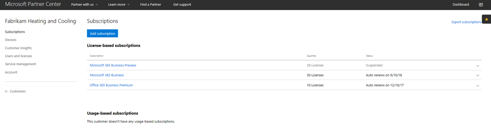

# Transición a una suscripción de CSP de Microsoft 365 Empresa

Si tienes una suscripción de CSP de versión preliminar de Microsoft 365 sigue esta guía para averiguar cómo puedes hacer la transición de tu suscripción de versión preliminar existente a Microsoft 365 Empresa GA (disponibilidad general).

**Cómo realizar la transición de una suscripción de versión preliminar a GA**

1. Inicie sesión en el <a href="https://partnercenter.microsoft.com" target="_blank">Centro de partners</a>.
2. En el panel, selecciona **Clientes** y, a continuación, busca y selecciona el nombre de la compañía.

    Se mostrarán las suscripciones de la compañía.

    
    
3. En la página Suscripciones de **la** empresa, seleccione **Agregar suscripción.**
4. En la **página Nueva suscripción,** seleccione **Pequeña Empresa** y, a continuación, seleccione **Microsoft 365 Empresa** en la lista.
5. Añade el número de licencias y, a continuación, selecciona **Siguiente: Revisión** para revisar la suscripción y, a continuación, selecciona **Enviar**.

    

    Las **suscripciones basadas en licencia** mostrará **Versión preliminar de Microsoft 365 Empresa** y **Microsoft 365 Empresa**. A continuación, suspenderá la suscripción de versión preliminar.

6. Selecciona **Versión preliminar de Microsoft 365 Empresa**.
7. En la **página Vista previa de Microsoft 365 Empresa,** seleccione **Suspendido** para suspender la suscripción de vista previa.

    

8. Selecciona **Enviar** para confirmar.

    En la **página Suscripciones,** confirme que el estado de **Microsoft 365 Business Preview** muestra **Suspendido.**

    

9. Opcionalmente, también puedes validar el contrato de licencia. Para ello, sigue estos pasos:
    1. Selecciona **Usuarios y licencias** desde la página **Suscripciones** de la compañía.
    2. En la **página Usuarios y licencias,** seleccione un usuario.
    3. En la página del usuario, compruebe la sección Asignar licencias y confirme que muestra **Microsoft 365 Empresa.** 

        

## Impacto en clientes y usuarios durante y después de la transición

No hay ningún impacto en los clientes y usuarios durante la transición y después de la transición.

## Impacto en los clientes que no realizan la transición

En la siguiente tabla se resume el impacto para los clientes que no realizan la transición desde una suscripción de versión preliminar de Microsoft 365 Empresa a una suscripción de Microsoft 365 Empresa.

|       | T-0 a T+30     | T+30 a T+60 | T+60 a T+120 | Más allá de T+120  |
|-------|-----------------|--------------|---------------|---------------|
| **Estado** | En periodo de gracia | Expirada      | Deshabilitada      | Desaprovisionada |
| **Impactos del servicio**                                                        |
| **Portal de administración de Microsoft 365 Empresa** | Sin impacto en la funcionalidad | Sin impacto en la funcionalidad | Puede agregar o eliminar usuarios, comprar suscripciones.  No se pueden asignar o revocar licencias. | Se elimina la suscripción del cliente y todos los datos. El administrador puede administrar otras suscripciones de pago. |
| **Aplicaciones de Office**                         | Ningún impacto en el usuario final | Ningún impacto en el usuario final | Office entra en modo de funcionalidad reducida.  Los usuarios solo pueden ver los archivos. | Office entra en modo de funcionalidad reducida.  Los usuarios solo pueden ver los archivos. |
| **Servicios en la nube (SharePoint Online, Exchange Online, Skype, Teams, etc.)** | Ningún impacto en el usuario final | Ningún impacto en el usuario final | Los usuarios finales y administradores no tienen acceso a datos en la nube. | Se elimina la suscripción del cliente y todos los datos. |
| **Componentes EM+S** | Ningún impacto en el administrador  Ningún impacto en el usuario final | Ningún impacto en el administrador  Ningún impacto en el usuario final | La funcionalidad ya no se aplica.  Consulta [Impactos del dispositivo móvil en la expiración de la suscripción](#mobile-device-impacts-upon-subscription-expiration) y [Equipo con Windows 10 tras la expiración de la suscripción](#windows-10-pc-impacts-upon-subscription-expiration) para obtener más información. | La funcionalidad ya no se aplica.  Consulta [Impactos del dispositivo móvil en la expiración de la suscripción](#mobile-device-impacts-upon-subscription-expiration) y [Equipo con Windows 10 tras la expiración de la suscripción](#windows-10-pc-impacts-upon-subscription-expiration) para obtener más información. |
| **Windows 10 Empresa** | Ningún impacto en el administrador  Ningún impacto en el usuario final | Ningún impacto en el administrador  Ningún impacto en el usuario final | La funcionalidad ya no se aplica.  Consulta [Impactos del dispositivo móvil en la expiración de la suscripción](#mobile-device-impacts-upon-subscription-expiration) y [Equipo con Windows 10 tras la expiración de la suscripción](#windows-10-pc-impacts-upon-subscription-expiration) para obtener más información. | La funcionalidad ya no se aplica.  Consulta [Impactos del dispositivo móvil en la expiración de la suscripción](#mobile-device-impacts-upon-subscription-expiration) y [Equipo con Windows 10 tras la expiración de la suscripción](#windows-10-pc-impacts-upon-subscription-expiration) para obtener más información. |
| **Inicio de sesión de Azure AD en un equipo de Windows 10** | Ningún impacto en el administrador  Ningún impacto en el usuario final | Ningún impacto en el administrador  Ningún impacto en el usuario final | Ningún impacto en el administrador  Ningún impacto en el usuario final | Una vez eliminado el inquilino, un usuario puede iniciar sesión solo con credenciales locales. Vuelva a crear la imagen del dispositivo si no hay credenciales locales. |

## Impactos del dispositivo móvil tras la expiración de la suscripción

En la tabla siguiente se resume el impacto en las directivas de administración de aplicaciones en dispositivos móviles.

|                            | Experiencia con licencia completa                      | T+60 días tras expiración          |
|----------------------------|------------------------------------------------|------------------------------------|
| **Eliminar archivos de trabajo de un dispositivo inactivo** | Los archivos de trabajo se eliminan después de los días seleccionados | Los archivos de trabajo permanecen en los dispositivos personales del usuario |
| **Obligar a los usuarios a guardar todos los archivos de trabajo en OneDrive para la Empresa** | Los archivos de trabajo solo se pueden guardar en OneDrive para la Empresa | Los archivos de trabajo se pueden guardar en cualquier lugar |
| **Cifrar archivos de trabajo** | Los archivos de trabajo se cifran | Los archivos de trabajo ya no se cifran.  Se eliminan las directivas de seguridad y se eliminan los datos de Office sobre aplicaciones. |
| **Exigir un PIN o huella dactilar para tener acceso a aplicaciones de Office** | Acceso restringido a aplicaciones | Ninguna restricción de acceso en nivel de aplicaciones |
| **Restablecer PIN cuando se produce un error de inicio de sesión** | Acceso restringido a aplicaciones | Ninguna restricción de acceso en nivel de aplicaciones |
| **Requerir que los usuarios vuelvan a iniciar sesión después de que las aplicaciones de Office hayan estado inactivas** | Inicio de sesión requerido | No se requiere inicio de sesión |
| **Denegar acceso a archivos de trabajo en dispositivos desbloqueados o modificados** | No se puede acceder a los archivos de trabajo en dispositivos liberados o con raíz | Es posible acceder a archivos de trabajo en dispositivos desbloqueados o modificados |
| **Permitir a los usuarios copiar el contenido de aplicaciones de Office en aplicaciones personales** | Copiar y pegar restringidos a las aplicaciones disponibles como parte de la suscripción a Microsoft 365 | Copiar/pegar disponible en todas las aplicaciones |

## Impactos de equipos con Windows 10 tras la expiración de la suscripción

La siguiente tabla resume el impacto en las directivas de configuración de dispositivos con Windows 10.

|                            | Experiencia con licencia completa                      | T+60 días tras expiración          |
|----------------------------|------------------------------------------------|------------------------------------|
| **Ayudar a proteger los equipos de amenazas con Windows Defender** | Activar/desactivar fuera de control de usuario | El usuario puede activar o desactivar Windows Defender en el equipo con Windows 10 |
| **Ayudar a proteger los equipos de amenazas basadas en web en Microsoft Edge** | Protección para PC en Microsoft Edge | El usuario puede activar o desactivar la protección del equipo en Microsoft Edge |
| **Apagar pantalla del dispositivo cuando está inactivo** | El administrador define la directiva de intervalo de tiempo de espera de pantalla | El tiempo de espera de pantalla lo puede configurar el usuario final |
| **Permitir que los usuarios descarguen aplicaciones desde Microsoft Store** | El administrador define si un usuario puede descargar aplicaciones de Microsoft Store | El usuario puede descargar aplicaciones de Microsoft Store en cualquier momento |
| **Permitir que los usuarios accedan a Cortana** | El administrador define la directiva sobre acceso de usuarios a Cortana | Dispositivos de usuario para activar/desactivar Cortana |
| **Permitir que los usuarios reciban sugerencias y anuncios de Microsoft** | El administrador define la directiva sobre la recepción de los usuarios de sugerencias y anuncios de Microsoft | El usuario puede activar/desactivar sugerencias y anuncios de Microsoft |
| **Permitir a los usuarios copiar contenido de aplicaciones de Office en aplicaciones personales** | El administrador define la directiva para mantener actualizados los dispositivos con Windows 10 | Los usuarios pueden decidir cuándo actualizar Windows |
