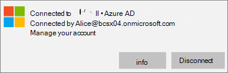
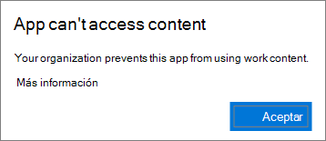
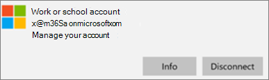

# Validar la configuración de protección de aplicaciones en PC con Windows 10Validate app protection settings on Windows 10 PCs

## Compruebe que los usuarios no pueden copiar los datos de empresa a los archivos personales en dispositivos corporativos.Verify that users cannot copy company data to personal files on corporate devices

Después de [configurar directivas de protección de la aplicación](protection-settings-for-windows-10-devices.md), puede tardar unas pocas horas en tener efecto la directiva en los dispositivos de los usuarios.After you [set up app protection policies](protection-settings-for-windows-10-devices.md), it may take up to a few hours for the policy to take effect on users' devices. Si ha  activado la opción Impedir que los usuarios copien datos de la empresa en archivos personales y obligarles a guardar los archivos de trabajo en la configuración de **OneDrive** para la Empresa para dispositivos propiedad de la empresa, puede comprobarlo en el dispositivo del usuario después de conectarse a Azure AD e haber iniciado sesión.If you turned **On** the **Prevent users from copying company data to personal files and force them to save work files to OneDrive for Business** setting for company owned devices, you can check this on the user's device after they've connected to Azure AD and signed in. 
  
 **Comprobar la configuración de conexión****Verify connection settings**
  
1. Después de iniciar sesión con las credenciales de Microsoft 365 Empresa Premium y conectarse a Azure AD, tal como se describe en Configurar dispositivos Windows para usuarios de [Microsoft 365 Empresa Premium,](set-up-windows-devices.md)vaya a la escuela o trabajo de Configuración de **Windows.** \>  \> After you sign in with Microsoft 365 Business Premium credentials and connect to Azure AD as described in [Set up Windows devices for Microsoft 365 Business Premium users](set-up-windows-devices.md), go to **Windows Settings** \> **Accounts** \> **Access work or school**. Elija **Conectado a Azure \<tenant name\> AD** y, a continuación, elija **Información.**Choose **Connected to \<tenant name\> Azure AD**, and then choose **Info**.
    
    
  
2. En la **página Administrado por,** puedes ver la información de conexión que incluye una dirección del servidor de administración como la que se muestra \<tenant name\> en la ilustración  siguiente. On the **Managed by** \<tenant name\> page, you can see the **Connection info** that includes a **Management Server Address** like the one shown in the following figure. 
    
    
  
 **Comprobar que no se pueden pegar datos de la empresa en una aplicación no administrada****Verify that you cannot paste company data in a non-managed app**
  
1. Abra Outlook 2016 instalado por Microsoft 365 Empresa Premium.Open Outlook 2016 that was installed by Microsoft 365 Business Premium.
    
2. Abra un correo electrónico y copie parte del contenido de él.Open an email and copy some content from it.
    
    Abra el Bloc de notas e intente pegar el contenido.Open Notepad and attempt to paste the content in.
    
    Recibirás un error que indica que la aplicación no puede acceder al contenido.You'll receive an error that states the app can't access content.
    
    
  
    Sin embargo, puede pegar el mismo contenido en Word 2016.You can, however, paste the same content into Word 2016.
    
## Compruebe que los usuarios no pueden copiar los datos de empresa a los archivos personales en dispositivos personales.Verify that users cannot copy company data to personal files on personal devices

 **Comprobar la configuración de conexión****Verify connection settings**
  
1. En el dispositivo personal de Windows 10 en el que has iniciado sesión  como usuario local, ve a Configuración de **Windows** y haz clic o pulsa En el acceso a cuentas trabajo \> **o escuela.**On your Windows 10 personal device where you're logged in as a local user, go to **Windows Settings**, and click or tap **Accounts** \> **Access work or school**.
    
2. En **Acceso profesional o educativo**, elija **Conectar**.Under the **Access work or school**, choose **Connect**.
    
3. Escribe tu credencial de Microsoft 365 Empresa Premium en el cuadro de diálogo Configurar una cuenta de trabajo o  \> **escuela.**Enter your Microsoft 365 Business Premium credential into the **Set up a work or school account dialog** \> **Sign in**.
    
4. En la página **Acceso profesional o educativo**, elija **Cuenta profesional o educativa** y, a continuación, elija **Información**.On the **Access work or school** page, choose the **Work or school account**, and then choose **Info**.
    
    
  
5. En la página trabajo o escuela  de **Access,**  puedes ver la información de conexión que incluye una dirección del servidor de administración como la que se muestra en la figura siguiente e incluye las palabras *wip* y *mam.*On the **Access work or school** page, you can see the **Connection info** that includes a **Management Server Address** like the one shown in the following figure, and includes the words  *wip*  and  *mam*  within. 
    
    
  
 **Comprobar que no se pueden pegar datos de la empresa en una aplicación no administrada****Verify that you cannot paste company data in a non-managed app**
  
1. Abra Outlook 2016 y agregue su cuenta de Microsoft 365 Empresa Premium si es necesario e inicie sesión con sus credenciales de Microsoft 365 Empresa Premium.Open Outlook 2016 and add your Microsoft 365 Business Premium account if necessary and sign in with your Microsoft 365 Business Premium credentials.
    
2. Abra un correo electrónico y copie parte del contenido de él.Open an email and copy some content from it.
    
    Abra el Bloc de notas e intente pegar el contenido.Open Notepad and attempt to paste the content in.
    
    Recibirá un error que indica que la aplicación no puede acceder al contenido.You'll receive an error that states App can't access content.
    
    
  
    Sin embargo, puede pegar el mismo contenido en Word 2016.You can, however, paste the same content into Word 2016.
    

