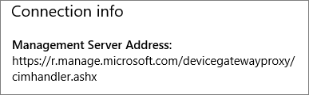

# Validar la configuración de protección de aplicaciones en PC con Windows 10Validate app protection settings on Windows 10 PCs

## Compruebe que los usuarios no pueden copiar los datos de empresa a los archivos personales en dispositivos corporativos.Verify that users cannot copy company data to personal files on corporate devices

Después de [configurar directivas de protección de la aplicación](protection-settings-for-windows-10-devices.md), puede tardar unas pocas horas en tener efecto la directiva en los dispositivos de los usuarios. Si ha **activado** la configuración **Impedir que los usuarios copien los datos de la compañía en los archivos personales y forzarlos a guardar los archivos de trabajo en OneDrive para la Empresa** para los dispositivos que son propiedad de la empresa, puede comprobarlo en el dispositivo del usuario después de que se hayan conectado a Azure AD e iniciado sesión.After you [set up app protection policies](protection-settings-for-windows-10-devices.md), it may take up to a few hours for the policy to take effect on users' devices. If you turned **On** the **Prevent users from copying company data to personal files and force them to save work files to OneDrive for Business** setting for company owned devices, you can check this on the user's device after they have connected to Azure AD and signed in. 
  
 **Comprobar la configuración de conexión****Verify connection settings**
  
1. After you sign in with Microsoft 365 Business credentials and connect to Azure AD as described in [Set up Windows devices for Microsoft 365 Business users](set-up-windows-devices.md), go to **Windows Settings** \> **Accounts** \> **Access work or school**. Choose **Connected to \<tenant name\> Azure AD**, and then choose **Info**.After you sign in with Microsoft 365 Business credentials and connect to Azure AD as described in [Set up Windows devices for Microsoft 365 Business users](set-up-windows-devices.md), go to **Windows Settings** \> **Accounts** \> **Access work or school**. Choose **Connected to \<tenant name\> Azure AD**, and then choose **Info**.
    
    
  
2. En la página **Administrado por** \< nombre del inquilino \> puede ver la **información de conexión** que incluye una **dirección del servidor de administración** como la que se muestra en la siguiente ilustración.On the **Managed by** \<tenant name\> page you can see the **Connection info** that includes a **Management Server Address** like the one shown in the following figure. 
    
    
  
 **Compruebe que no puede pegar datos de la compañía a una aplicación no administrada****Verify that you cannot paste company data to a non-managed app**
  
1. Abra Outlook 2016 que fue instalada por Microsoft 365 Business.Open Outlook 2016 that was installed by Microsoft 365 Business.
    
2. Abra un correo electrónico y copie parte del contenido de él.Open an email and copy some content from it.
    
    Abra el Bloc de notas e intente pegar el contenido.Open Notepad and attempt to paste the content in.
    
    Recibirá un error que indica que la aplicación no puede obtener acceso al contenido.You will receive an error that states App can't access content.
    
    
  
    Sin embargo, puede pegar el mismo contenido en Word 2016.You can, however, paste the same content into Word 2016.
    
## Compruebe que los usuarios no pueden copiar los datos de empresa a los archivos personales en dispositivos personales.Verify that users cannot copy company data to personal files on personal devices

 **Comprobar la configuración de conexión****Verify connection settings**
  
1. En el dispositivo personal de Windows 10 donde está conectado como un usuario local, vaya a **Configuración de Windows** y haga clic o pulse **Cuentas** \> **Acceso profesional o educativo**.On your Windows 10 personal device where you are logged in as a local user, go to **Windows Settings** and click or tap **Accounts** \> **Access work or school**.
    
2. En **Acceso profesional o educativo**, elija **Conectar**.Under the **Access work or school**, choose **Connect**.
    
3. Escriba sus Microsoft 365 Business credenciales en el **diálogo Configurar una cuenta profesional o educativa** \> **Inicio de sesión**.Enter your Microsoft 365 Business credential into the **Set up a work or school account dialog** \> **Sign in**.
    
4. En la página **Acceso profesional o educativo**, elija **Cuenta profesional o educativa** y, a continuación, elija **Información**.On the **Access work or school** page, choose the **Work or school account**, and then choose **Info**.
    
    
  
5. En la página **Acceso profesional o educativo** puede ver **Información de conexión** que incluye una **dirección de servidor de administración** como la que se muestra en la siguiente imagen e incluye las palabras  *wip*  y  *mam*  .On the **Access work or school** page you can see the **Connection info** that includes a **Management Server Address** like the one shown in the following figure, and includes the words  *wip*  and  *mam*  within. 
    
    
  
 **Compruebe que no puede pegar datos de la compañía a una aplicación no administrada****Verify that you cannot paste company data to a non-managed app**
  
1. Abra Outlook 2016 y agregue su Microsoft 365 Business cuenta si es necesario e inicie sesión con sus Microsoft 365 Business credenciales.Open Outlook 2016 and add your Microsoft 365 Business account if necessary and sign in with your Microsoft 365 Business credentials.
    
2. Abra un correo electrónico y copie parte del contenido de él.Open an email and copy some content from it.
    
    Abra el Bloc de notas e intente pegar el contenido.Open Notepad and attempt to paste the content in.
    
    Recibirá un error que indica que la aplicación no puede obtener acceso al contenido.You will receive an error that states App can't access content.
    
    
  
    Sin embargo, puede pegar el mismo contenido en Word 2016.You can, however, paste the same content into Word 2016.
    

