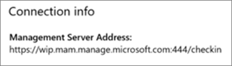

# Validar la configuración de protección de aplicaciones en PC con Windows 10

## Compruebe que los usuarios no pueden copiar los datos de empresa a los archivos personales en dispositivos corporativos.

Después de [configurar directivas de protección de la aplicación](protection-settings-for-windows-10-devices.md), puede tardar unas pocas horas en tener efecto la directiva en los dispositivos de los usuarios. Si **activó la** opción evitar que **los usuarios copien los datos de la compañía en archivos personales y forzar que se guarden los archivos de trabajo en OneDrive para** la empresa para los dispositivos que son propiedad de la empresa, puede comprobarlo en el dispositivo del usuario después de que se hayan conectado a Azure ad y hayan iniciado sesión. 
  
 **Comprobar la configuración de conexión**
  
1. Después de iniciar sesión con las credenciales de Microsoft 365 Business Premium y conectarse a Azure ad tal y como se describe en [configurar dispositivos Windows para Microsoft 365 empresa Premium](set-up-windows-devices.md), vaya a **configuración de Windows** \> : **cuentas** de \> **acceso profesional o educativo**. Elija **conectado a \<tenant name\> Azure ad**y, a continuación, elija **información**.
    
    
  
2. En la página **administrado por** \<tenant name\> , puede ver la **información de conexión** que incluye una **dirección del servidor de administración** como la que se muestra en la siguiente ilustración. 
    
    
  
 **Comprobar que no se pueden pegar datos de la empresa en una aplicación no administrada**
  
1. Abra Outlook 2016 que instaló Microsoft 365 empresa Premium.
    
2. Abra un correo electrónico y copie parte del contenido de él.
    
    Abra el Bloc de notas e intente pegar el contenido.
    
    Recibirá un error que indica que la aplicación no puede acceder al contenido.
    
    
  
    Sin embargo, puede pegar el mismo contenido en Word 2016.
    
## Compruebe que los usuarios no pueden copiar los datos de empresa a los archivos personales en dispositivos personales.

 **Comprobar la configuración de conexión**
  
1. En el dispositivo de Windows 10 personal en el que haya iniciado sesión como usuario local, vaya a **configuración de Windows**y haga clic o pulse **cuentas** de \> **acceso profesional o educativa**.
    
2. En **Acceso profesional o educativo**, elija **Conectar**.
    
3. Escriba su credencial de Microsoft 365 Business Premium en el **cuadro de diálogo Configurar una cuenta de trabajo o escuela** \> **para iniciar sesión**.
    
4. En la página **Acceso profesional o educativo**, elija **Cuenta profesional o educativa** y, a continuación, elija **Información**.
    
    
  
5. En la página **tener acceso a la escuela o el trabajo** , puede ver la **información de conexión** que incluye una dirección del servidor de **Administración** como la que se muestra en la figura siguiente, e incluye las palabras *WIP* y *MAM* en. 
    
    
  
 **Comprobar que no se pueden pegar datos de la empresa en una aplicación no administrada**
  
1. Abra Outlook 2016 y agregue su cuenta de Microsoft 365 empresa Premium, si es necesario, e inicie sesión con sus credenciales de Microsoft 365 Business Premium.
    
2. Abra un correo electrónico y copie parte del contenido de él.
    
    Abra el Bloc de notas e intente pegar el contenido.
    
    Recibirá un error que indica que la aplicación no puede obtener acceso al contenido.
    
    
  
    Sin embargo, puede pegar el mismo contenido en Word 2016.
    

