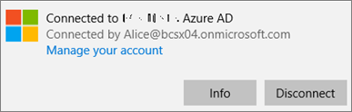

# Validar la configuración de protección de aplicaciones en PC con Windows 10

## Compruebe que los usuarios no pueden copiar los datos de empresa a los archivos personales en dispositivos corporativos.

Después de [configurar directivas de protección de la aplicación](protection-settings-for-windows-10-devices.md), puede tardar unas pocas horas en tener efecto la directiva en los dispositivos de los usuarios. Si ha  activado la opción Impedir que los usuarios copien datos de la compañía en archivos personales y forzarlos a guardar archivos de trabajo en **oneDrive** para la Empresa para dispositivos de propiedad de la empresa, puede comprobarlo en el dispositivo del usuario después de conectarse a Azure AD y haber iniciado sesión. 
  
 **Comprobar la configuración de conexión**
  
1. Después de iniciar sesión con las credenciales de Microsoft 365 Empresa Premium y conectarse a Azure AD, tal como se describe en Configurar dispositivos Windows para usuarios de [Microsoft 365 Empresa Premium,](set-up-windows-devices.md)vaya a Configuración de **Windows** Cuentas Access trabajo o \>  \> escuela. Elija **Conectado a Azure \<tenant name\> AD** y, a continuación, elija **Información**.
    
    
  
2. En la **página Administrado por,** puedes ver la información de conexión que incluye una dirección del servidor de administración como la que \<tenant name\> se muestra en la figura siguiente.   
    
    
  
 **Comprobar que no se pueden pegar datos de la empresa en una aplicación no administrada**
  
1. Abra Outlook 2016 que instaló Microsoft 365 Empresa Premium.
    
2. Abra un correo electrónico y copie parte del contenido de él.
    
    Abra el Bloc de notas e intente pegar el contenido.
    
    Recibirás un error que indica que la aplicación no puede acceder al contenido.
    
    
  
    Sin embargo, puede pegar el mismo contenido en Word 2016.
    
## Compruebe que los usuarios no pueden copiar los datos de empresa a los archivos personales en dispositivos personales.

 **Comprobar la configuración de conexión**
  
1. En el dispositivo personal de Windows 10 en el que has iniciado sesión  como usuario local, ve a Configuración de **Windows** y haz clic o pulsa Acceso a cuentas laborales \> **o educativas.**
    
2. En **Acceso profesional o educativo**, elija **Conectar**.
    
3. Escriba su credencial de Microsoft 365 Empresa Premium en el cuadro de diálogo Configurar una cuenta laboral o **educativa** \> **Inicie sesión**.
    
4. En la página **Acceso profesional o educativo**, elija **Cuenta profesional o educativa** y, a continuación, elija **Información**.
    
    
  
5. En la página Trabajo o escuela  de **Access,**  puedes ver la información de conexión que incluye una dirección del servidor de administración como la que se muestra en la siguiente figura, e incluye las palabras *wip* y *mam* within. 
    
    
  
 **Comprobar que no se pueden pegar datos de la empresa en una aplicación no administrada**
  
1. Abra Outlook 2016 y agregue su cuenta de Microsoft 365 Empresa Premium si es necesario e inicie sesión con sus credenciales de Microsoft 365 Empresa Premium.
    
2. Abra un correo electrónico y copie parte del contenido de él.
    
    Abra el Bloc de notas e intente pegar el contenido.
    
    Recibirás un error que indica que la aplicación no puede acceder al contenido.
    
    
  
    Sin embargo, puede pegar el mismo contenido en Word 2016.
    

