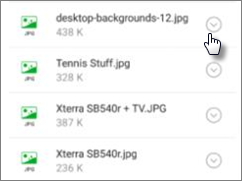

# Validar la configuración de protección de aplicación en dispositivos Android o iOSValidate app protection settings on Android or iOS devices

Siga las instrucciones que aparecen en las fichas para validar la configuración de la protección de aplicación en dispositivos Android o iOS.Follow the instructions in the tabs to validate app protection settings on Android or iOS devices.
  
## [AndroidAndroid](#tab/)
  
### Comprobar que la configuración de protección de aplicaciones funciona en dispositivos de usuarioCheck that the App protection settings are working on user devices

Después de [establecer las configuraciones de la aplicación para dispositivos Android](app-protection-settings-for-android-and-ios.md) para proteger las aplicaciones, puede seguir estos pasos para validar que la configuración que ha elegido funciona.After you [set app configurations for Android devices](app-protection-settings-for-android-and-ios.md) to protect the apps, you can follow these steps to validate that the settings you chose work. 
  
En primer lugar, asegúrese de que la directiva se aplica a la aplicación en la que se va a validar.First, make sure that the policy applies to the app in which you are going to validate it.
  
1. En el [centro de administración](https://portal.office.com) de Microsoft 365 Business, vaya a **Directivas** \> **Editar directiva**.In the Microsoft 365 Business [admin center](https://portal.office.com) go to **Policies** \> **Edit policy**.
    
2. Elija la **Directiva de aplicación para Android** de la configuración que ha creado en la configuración o cualquier otra directiva que haya creado y compruebe que se exige en Outlook, por ejemplo.Choose **Application policy for Android** for the settings you created at setup, or another policy you created, and verify that it is enforced for Outlook for example. 
    
    
  
### Validar la opción Requerir una huella digital o un PIN para obtener acceso a las aplicaciones de OfficeValidate Require a PIN or a fingerprint to access Office apps

En el panel **Editar directiva**, elija **Editar** junto a **Control de acceso a documentos de Office**, expanda **Administrar la forma en la que los usuarios obtienen acceso a los archivos de Office desde dispositivos móviles** y asegúrese de que **Requerir una huella digital o un PIN para obtener acceso a las aplicaciones de Office** esté establecido en **Activado**.In the **Edit policy** pane, choose **Edit** next to **Office documents access control**, expand **Manage how users access Office files on mobile devices**, and make sure that **Require a PIN or fingerprint to access Office apps** is set to **On**.
  

  
1. En el dispositivo Android del usuario, abra Outlook e inicie sesión con las credenciales de Microsoft 365 Business del usuario.In the user's Android device, open Outlook and sign in with the user's Microsoft 365 Business credentials.
    
2. También se le pedirá que especifique un PIN o use una huella digital.You will also be prompted to enter a PIN or use a fingerprint.
    
    
  
### Validar la opción Restablecer el PIN después del número de intentos fallidos indicadoValidate Reset PIN after number of failed attempts

En el panel **Editar directiva**, elija **Editar** junto a **Control de acceso a documentos de Office**, expanda **Administrar la forma en la que los usuarios obtienen acceso a los archivos de Office desde dispositivos móviles** y asegúrese de que **Restablecer el PIN después del número de intentos fallidos indicado** esté establecido en algún número (el valor predeterminado es 5).In the **Edit policy** pane, choose **Edit** next to **Office documents access control**, expand **Manage how users access Office files on mobile devices**, and make sure that **Reset PIN after number of failed attempts** is set to some number - this is 5 by default. 
  
1. En el dispositivo Android del usuario, abra Outlook e inicie sesión con las credenciales de Microsoft 365 Business del usuario.In the user's Android device, open Outlook and sign in with the user's Microsoft 365 Business credentials.
    
2. Escriba un PIN incorrecto tantas veces como haya especificado en la directiva. Verá un mensaje que dice **Se ha alcanzado el límite de intentos de PIN** para restablecer el PIN.Enter an incorrect PIN as many times as specified by the policy. You will see a prompt that states **PIN Attempt Limit Reached** to reset the PIN. 
    
    
  
3. Pulse **Restablecer PIN**. Se le pedirá que inicie sesión con las credenciales de Microsoft 365 Business del usuario y, después, se le requerirá que establezca un nuevo PIN.Press **Reset PIN**. You will be prompted to sign in with the user's Microsoft 365 Business credentials, and then required to set a new PIN.
    
### Validar la opción Forzar el almacenamiento por parte de los usuarios de todos los archivos de trabajo en OneDrive para la EmpresaValidate Force users to save all work files to OneDrive for Business

En el panel **Editar directiva**, elija **Editar** junto a **Protección ante la pérdida o el robo del dispositivo**, expanda **Proteger los archivos de trabajo cuando los dispositivos se extravían por pérdida o robo** y asegúrese de que **Forzar el almacenamiento por parte de los usuarios de todos los archivos de trabajo en OneDrive para la Empresa** esté establecido en **Activado**.In the **Edit policy** pane, choose **Edit** next to **Protection against lost or stolen devices**, expand **Protect work files when devices are lost or stolen**, and make sure that **Force users to save all work files to OneDrive for Business** is set to **On**.
  

  
1. En el dispositivo Android del usuario, abra Outlook, inicie sesión con las credenciales de Microsoft 365 Business del usuario e introduzca el PIN si se le pide.In the user's Android device, open Outlook and sign in with the user's Microsoft 365 Business credentials, and enter a PIN if requested.
    
2. Abra un correo electrónico que contenga un archivo adjunto y pulse el icono de flecha abajo situado junto a la información del archivo adjunto.Open an email that contains an attachment and tap the down arrow icon next to the attachment's information.
    
    
  
    Verá **No puede guardar en el dispositivo** en la parte inferior de la pantalla.You will see **Cannot save to device** on the bottom of the screen. 
    
    
  
    > [!NOTE]
    > Guardar en OneDrive para la Empresa no está habilitado para Android en este momento, por lo que solo puede ver que la opción de guardar de forma local está bloqueada.Saving to OneDrive for Business is not enabled for Android at this time, so you can only see that saving locally is blocked. 
  
### Validar la opción Requerir que un usuario inicie sesión de nuevo si las aplicaciones de Office han estado inactivas durante un período de tiempo especificadoValidate Require user to sign in again if Office apps have been idle for a specified time

En el panel **Editar directiva**, elija **Editar** junto a **Control de acceso a documentos de Office**, expanda **Administrar la forma en la que los usuarios obtienen acceso a los archivos de Office desde dispositivos móviles** y asegúrese de que **Requerir que los usuarios inicien sesión de nuevo si las aplicaciones de Office han estado inactivas durante** esté establecido en algún número de minutos (el valor predeterminado es 30 minutos).In the **Edit policy** pane, choose **Edit** next to **Office documents access control**, expand **Manage how users access Office files on mobile devices**, and make sure that **Require users to sign in again after Office apps have been idle for** is set to some number of minutes - this is 30 minutes by default. 
  
1. En el dispositivo Android del usuario, abra Outlook, inicie sesión con las credenciales de Microsoft 365 Business del usuario e introduzca el PIN si se le pide.In the user's Android device, open Outlook and sign in with the user's Microsoft 365 Business credentials, and enter a PIN if requested.
    
2. Ahora debería ver la Bandeja de entrada de Outlook. No toque el dispositivo Android durante al menos 30 minutos (o algún otro período de tiempo, más de lo que ha especificado en la directiva). Es probable que se atenúe el dispositivo.You should now see Outlook's inbox. Let the Android device idle untouched for at least 30 minutes (or some other amount of time, longer than what you specified in the policy). The device will likely dim.
    
3. Vuelva a obtener acceso a Outlook en el dispositivo Android.Re-access Outlook on the Android device.
    
4. Se le pedirá que introduzca el PIN para que pueda volver a obtener acceso a Outlook.You will be prompted to enter your PIN before you can access Outlook again.
    
### Validar la opción Proteger los archivos de trabajo mediante cifradoValidate Protect work files with encryption

En el panel **Editar directiva**, elija **Editar** junto a **Protección ante la pérdida o el robo del dispositivo**, expanda **Proteger los archivos de trabajo cuando los dispositivos se extravían por pérdida o robo** y asegúrese de que **Proteger los archivos de trabajo mediante cifrado** esté establecido en **Activado** y **Forzar el almacenamiento por parte de los usuarios de todos los archivos de trabajo en OneDrive para la Empresa** esté establecido en **Desactivado**.In the **Edit policy** pane, choose **Edit** next to **Protection against lost or stolen devices**, expand **Protect work files when devices are lost or stolen**, and make sure that **Protect work files with encryption** is set to **On**, and **Force users to save all work files to OneDrive for Business** is set to **Off**.
  
1. En el dispositivo Android del usuario, abra Outlook, inicie sesión con las credenciales de Microsoft 365 Business del usuario e introduzca el PIN si se le pide.In the user's Android device, open Outlook and sign in with the user's Microsoft 365 Business credentials, and enter a PIN if requested.
    
2. Abra un correo electrónico que contenga algunas imágenes adjuntas.Open an email which contains a few image file attachments.
    
3. Pulse el icono de flecha abajo situado junto a la información del archivo adjunto para guardarlo.Tap the down arrow icon next to the attachment's info to save it.
    
    
  
4. Es posible que se le pida que permita a Outlook obtener acceso a fotos, multimedia y archivos del dispositivo. Pulse **Permitir**.You may be prompted to allow Outlook to access photos, media, and files on your device. Tap **Allow**.
    
5. En la parte inferior de la pantalla, elija a **Guardar en el dispositivo** y abra la aplicación **Galería**.At the bottom of the screen, choose to **Save to Device** and then open the **Gallery** app. 
    
6. Debería ver una foto cifrada (o más, si guardó varias imágenes adjuntas) en la lista. Puede aparecer en la lista Imágenes como un cuadrado gris con un signo de exclamación blanco dentro de un círculo blanco en el centro del cuadrado gris.You should see an encrypted photo (or more, if you saved multiple image file attachments) in the list. It may appear in the Pictures list as a gray square with a white exclamation point within a white circle in the center of the gray square.
    
    
  
## [iOSiOS](#tab/)
  
### Comprobar que la configuración de protección de aplicaciones funciona en dispositivos de usuarioCheck that the App protection settings are working on user devices

Después de [establecer las configuraciones de la aplicación para dispositivos iOS](app-protection-settings-for-android-and-ios.md) para proteger aplicaciones, puede seguir estos pasos para validar que la configuración que ha elegido funciona.After you [set app configurations for iOS devices](app-protection-settings-for-android-and-ios.md) to protect apps, you can follow these steps to validate that the settings you chose work. 
  
En primer lugar, asegúrese de que la directiva se aplica a la aplicación en la que se va a validar.First, make sure that the policy applies to the app in which you are going to validate it.
  
1. En el [centro de administración](https://portal.office.com) de Microsoft 365 Business, vaya a **Directivas** \> **Editar directiva**.In the Microsoft 365 Business [admin center](https://portal.office.com), go to **Policies** \> **Edit policy**.
    
2. Elija la **Directiva de aplicación para iOS** de la configuración que ha creado en la configuración o cualquier otra directiva que haya creado y compruebe que se exige en Outlook, por ejemplo.Choose **Application policy for iOS** for the settings you created at setup, or another policy you created, and verify that it is enforced for Outlook for example. 
    
    
  
### Validar la opción Requerir un PIN para obtener acceso a las aplicaciones de OfficeValidate Require a PIN to access Office apps

En el panel **Editar directiva**, elija **Editar** junto a **Control de acceso a documentos de Office**, expanda **Administrar la forma en la que los usuarios obtienen acceso a los archivos de Office desde dispositivos móviles** y asegúrese de que **Requerir una huella digital o un PIN para obtener acceso a las aplicaciones de Office** esté establecido en **Activado**.In the **Edit policy** pane, choose **Edit** next to **Office documents access control**, expand **Manage how users access Office files on mobile devices**, and make sure that **Require a PIN or fingerprint to access Office apps** is set to **On**.
  

  
1. En el dispositivo iOS del usuario, abra Outlook e inicie sesión con las credenciales de Microsoft 365 Business del usuario.In the user's iOS device, open Outlook and sign in with the user's Microsoft 365 Business credentials.
    
2. También se le pedirá que especifique un PIN o use una huella digital.You will also be prompted to enter a PIN or use a fingerprint.
    
    
  
### Validar la opción Restablecer el PIN después del número de intentos fallidos indicadoValidate Reset PIN after number of failed attempts

En el panel **Editar directiva**, elija **Editar** junto a **Control de acceso a documentos de Office**, expanda **Administrar la forma en la que los usuarios obtienen acceso a los archivos de Office desde dispositivos móviles** y asegúrese de que **Restablecer el PIN después del número de intentos fallidos indicado** esté establecido en algún número (el valor predeterminado es 5).In the **Edit policy** pane, choose **Edit** next to **Office documents access control**, expand **Manage how users access Office files on mobile devices**, and make sure that **Reset PIN after number of failed attempts** is set to some number - this is 5 by default. 
  
1. En el dispositivo iOS del usuario, abra Outlook e inicie sesión con las credenciales de Microsoft 365 Business del usuario.In the user's iOS device, open Outlook and sign in with the user's Microsoft 365 Business credentials.
    
2. Escriba un PIN incorrecto tantas veces como haya especificado en la directiva. Verá un mensaje que dice **Se ha alcanzado el límite de intentos de PIN** para restablecer el PIN.Enter an incorrect PIN as many times as specified by the policy. You will see a prompt that states **PIN Attempt Limit Reached** to reset the PIN. 
    
    
  
3. Pulse **Aceptar**. Se le pedirá que inicie sesión con las credenciales de Microsoft 365 Business del usuario y, después, se le requerirá que establezca un nuevo PIN.Press **OK**. You will be prompted to sign in with the user's Microsoft 365 Business credentials, and then required to set a new PIN.
    
### Validar la opción Forzar el almacenamiento por parte de los usuarios de todos los archivos de trabajo en OneDrive para la EmpresaValidate Force users to save all work files to OneDrive for Business

En el panel **Editar directiva**, elija **Editar** junto a **Protección ante la pérdida o el robo del dispositivo**, expanda **Proteger los archivos de trabajo cuando los dispositivos se extravían por pérdida o robo** y asegúrese de que **Forzar el almacenamiento por parte de los usuarios de todos los archivos de trabajo en OneDrive para la Empresa** esté establecido en **Activado**.In the **Edit policy** pane, choose **Edit** next to **Protection against lost or stolen devices**, expand **Protect work files when devices are lost or stolen**, and make sure that **Force users to save all work files to OneDrive for Business** is set to **On**.
  

  
1. En el dispositivo iOS del usuario, abra Outlook, inicie sesión con las credenciales de Microsoft 365 Business del usuario e introduzca el PIN si se le pide.In the user's iOS device, open Outlook and sign in with the user's Microsoft 365 Business credentials, and enter a PIN if requested.
    
2. Abra un correo electrónico que contenga un archivo adjunto, abra ese archivo adjunto y elija **Guardar** en la parte inferior de la pantalla.Open an email that contains an attachment, open the attachment and choose **Save** on the bottom of the screen. 
    
    
  
3. Solo debería ver una opción para OneDrive para la Empresa. Si no es así, pulse **Agregar cuenta** y seleccione **OneDrive para la Empresa** en la pantalla **Agregar cuenta de almacenamiento**. Proporcione el Microsoft 365 Business del usuario final para iniciar sesión cuando se le pida.You should only see an option for OneDrive for Business. If not If not, tap **Add Account** and select **OneDrive for Business** from the **Add Storage Account** screen. Provide the end user's Microsoft 365 Business to sign in when prompted. 
    
    Pulse **Guardar** y seleccione **OneDrive para la Empresa**.Tap **Save** and select **OneDrive for Business**.
    
### Validar la opción Requerir que un usuario inicie sesión de nuevo si las aplicaciones de Office han estado inactivas durante un período de tiempo especificadoValidate Require user to sign in again if Office apps have been idle for a specified time

En el panel **Editar directiva**, elija **Editar** junto a **Control de acceso a documentos de Office**, expanda **Administrar la forma en la que los usuarios obtienen acceso a los archivos de Office desde dispositivos móviles** y asegúrese de que **Requerir que los usuarios inicien sesión de nuevo si las aplicaciones de Office han estado inactivas durante** esté establecido en algún número de minutos (el valor predeterminado es 30 minutos).In the **Edit policy** pane, choose **Edit** next to **Office documents access control**, expand **Manage how users access Office files on mobile devices**, and make sure that **Require users to sign in again after Office apps have been idle for** is set to some number of minutes - this is 30 minutes by default. 
  
1. En el dispositivo iOS del usuario, abra Outlook, inicie sesión con las credenciales de Microsoft 365 Business del usuario e introduzca el PIN si se le pide.In the user's iOS device, open Outlook and sign in with the user's Microsoft 365 Business credentials, and enter a PIN if requested.
    
2. Ahora debería ver la Bandeja de entrada de Outlook. No toque el dispositivo iOS durante al menos 30 minutos (o algún otro período de tiempo, más de lo que ha especificado en la directiva). Es probable que se atenúe el dispositivo.You should now see Outlook's inbox. Let the iOS device untouched for at least 30 minutes (or some other amount of time, longer than what you specified in the policy). The device will likely dim.
    
3. Vuelva a obtener acceso a Outlook en el dispositivo iOS.Re-access Outlook on the iOS device.
    
4. Se le pedirá que introduzca el PIN para que pueda volver a obtener acceso a Outlook.You will be prompted to enter your PIN before you can access Outlook again.
    
### Validar la opción Proteger los archivos de trabajo mediante cifradoValidate Protect work files with encryption

En el panel **Editar directiva**, elija **Editar** junto a **Protección ante la pérdida o el robo del dispositivo**, expanda **Proteger los archivos de trabajo cuando los dispositivos se extravían por pérdida o robo** y asegúrese de que **Proteger los archivos de trabajo mediante cifrado** esté establecido en **Activado** y **Forzar el almacenamiento por parte de los usuarios de todos los archivos de trabajo en OneDrive para la Empresa** esté establecido en **Desactivado**.In the **Edit policy** pane, choose **Edit** next to **Protection against lost or stolen devices**, expand **Protect work files when devices are lost or stolen**, and make sure that **Protect work files with encryption** is set to **On**, and **Force users to save all work files to OneDrive for Business** is set to **Off**.
  
1. En el dispositivo iOS del usuario, abra Outlook, inicie sesión con las credenciales de Microsoft 365 Business del usuario e introduzca el PIN si se le pide.In the user's iOS device, open Outlook and sign in with the user's Microsoft 365 Business credentials, and enter a PIN if requested.
    
2. Abra un correo electrónico que contenga algunas imágenes adjuntas.Open an email which contains a few image file attachments.
    
3. Pulse el archivo adjunto y, después, pulse la opción **Guardar** debajo de él.Tap the attachment and then tap the **Save** option under it. 
    
4. Abra la aplicación **Fotos** desde la pantalla principal. Debería ver una foto cifrada (o más, si guardó varias imágenes adjuntas) guardada, pero cifrada.Open **Photos** app from the home screen. You should see an encrypted photo (or more, if you saved multiple image file attachments) saved, but encrypted. 
    
---

