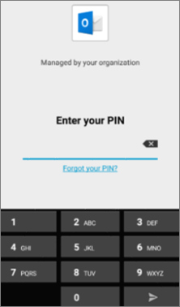
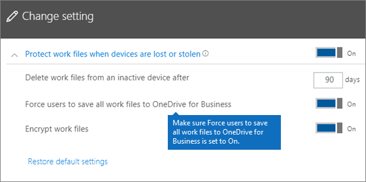

# Validar la configuración de protección de aplicaciones en dispositivos Android o iOS

Siga las instrucciones de las secciones siguientes para validar la configuración de protección de aplicaciones en dispositivos Android o iOS.
  
## Android
  
### Comprobar que la configuración de protección de aplicaciones funciona en dispositivos de usuario

Después de [establecer las configuraciones de la aplicación para dispositivos Android](app-protection-settings-for-android-and-ios.md) para proteger las aplicaciones, puede seguir estos pasos para validar que la configuración que ha elegido funciona. 
  
En primer lugar, asegúrate de que la directiva se aplica a la aplicación en la que vas a validarla.
  
1. En el Centro Microsoft 365 Empresa Premium [administración,](https://portal.office.com)vaya a **Directiva** \> **de edición de directivas.**
    
2. Elija **Directiva de aplicación** para Android para la configuración que creó en el programa de instalación u otra directiva que haya creado y compruebe que se aplica para Outlook, por ejemplo. 
    
    
  
### Validar la opción Requerir una huella digital o un PIN para obtener acceso a las aplicaciones de Office

En el panel **Editar directiva**, elija **Editar** junto a **Control de acceso a documentos de Office**, expanda **Administrar la forma en la que los usuarios obtienen acceso a los archivos de Office desde dispositivos móviles** y asegúrese de que **Requerir una huella digital o un PIN para obtener acceso a las aplicaciones de Office** esté establecido en **Activado**.
  

  
1. En el dispositivo Android del usuario, abra Outlook e inicie sesión con las credenciales de Microsoft 365 Empresa Premium usuario.
    
2. También se le pedirá que escriba un PIN o use una huella digital.
    
    
  
### Validar la opción Restablecer el PIN después del número de intentos fallidos indicado

En  el panel Editar  directiva, elija Editar junto **al control** de acceso Office documentos, expanda Administrar cómo los usuarios acceden Office los archivos **en** dispositivos móviles y asegúrese de que restablecer el **PIN** después del número de intentos fallidos esté establecido en algún número. Esto es 5 de forma predeterminada. 
  
1. En el dispositivo Android del usuario, abra Outlook e inicie sesión con las credenciales de Microsoft 365 Empresa Premium usuario.
    
2. Escriba un PIN incorrecto tantas veces como haya especificado en la directiva. Verá un mensaje que indica el límite **de intento de PIN alcanzado** para restablecer el PIN. 
    
    
  
3. Pulse **Restablecer PIN**. Se le pedirá que inicie sesión con las credenciales de Microsoft 365 Empresa Premium del usuario y, a continuación, se le pedirá que establezca un NUEVO PIN.
    
### Validar la opción Forzar el almacenamiento por parte de los usuarios de todos los archivos de trabajo en OneDrive para la Empresa

En el panel **Editar directiva**, elija **Editar** junto a **Protección ante la pérdida o el robo del dispositivo**, expanda **Proteger los archivos de trabajo cuando los dispositivos se extravían por pérdida o robo** y asegúrese de que **Forzar el almacenamiento por parte de los usuarios de todos los archivos de trabajo en OneDrive para la Empresa** esté establecido en **Activado**.
  

  
1. En el dispositivo Android del usuario, abra Outlook e inicie sesión con las credenciales de Microsoft 365 Empresa Premium del usuario y escriba un PIN si se solicita.
    
2. Abra un correo electrónico que contenga un archivo adjunto y pulse el icono de flecha abajo situado junto a la información del archivo adjunto.
    
    
  
    Verás No se **puede guardar en el dispositivo** en la parte inferior de la pantalla. 
    
    
  
    > [!NOTE]
    > Guardar en OneDrive para la Empresa no está habilitado para Android en este momento, por lo que solo puede ver que la opción de guardar de forma local está bloqueada. 
  
### Validar la opción Requerir que un usuario inicie sesión de nuevo si las aplicaciones de Office han estado inactivas durante un período de tiempo especificado

En  el panel Editar  directiva, elija Editar junto **al control** de acceso Office documentos, expanda Administrar cómo los usuarios **acceden Office archivos en** dispositivos móviles y asegúrese de que Requerir que los usuarios inicien sesión de nuevo después de **que** Office las aplicaciones hayan estado inactivas esté establecida en un número de minutos. Esto es 30 minutos de forma predeterminada. 
  
1. En el dispositivo Android del usuario, abra Outlook e inicie sesión con las credenciales de Microsoft 365 Empresa Premium del usuario y escriba un PIN si se solicita.
    
2. Ahora debería ver la Bandeja de entrada de Outlook. No toque el dispositivo Android durante al menos 30 minutos (o algún otro período de tiempo, más de lo que ha especificado en la directiva). Es probable que se atenúe el dispositivo.
    
3. Accede Outlook en el dispositivo Android de nuevo.
    
4. Se te pedirá que escribas el PIN antes de poder acceder a Outlook nuevo.
    
### Validar la opción Proteger los archivos de trabajo mediante cifrado

En el panel **Editar directiva**, elija **Editar** junto a **Protección ante la pérdida o el robo del dispositivo**, expanda **Proteger los archivos de trabajo cuando los dispositivos se extravían por pérdida o robo** y asegúrese de que **Proteger los archivos de trabajo mediante cifrado** esté establecido en **Activado** y **Forzar el almacenamiento por parte de los usuarios de todos los archivos de trabajo en OneDrive para la Empresa** esté establecido en **Desactivado**.
  
1. En el dispositivo Android del usuario, abra Outlook e inicie sesión con las credenciales de Microsoft 365 Empresa Premium del usuario y escriba un PIN si se solicita.
    
2. Abra un correo electrónico que contenga algunos datos adjuntos de archivo de imagen.
    
3. Pulse el icono de flecha abajo situado junto a la información del archivo adjunto para guardarlo.
    
    
  
4. Es posible que se le pida que permita a Outlook obtener acceso a fotos, multimedia y archivos del dispositivo. Pulse **Permitir**.
    
5. En la parte inferior de la pantalla, elija a **Guardar en el dispositivo** y abra la aplicación **Galería**. 
    
6. Debería ver una foto cifrada (o más, si guardó varias imágenes adjuntas) en la lista. Puede aparecer en la lista Imágenes como un cuadrado gris con un signo de exclamación blanco dentro de un círculo blanco en el centro del cuadrado gris.
    
    
  
## iOS
  
### Comprobar que la configuración de protección de aplicaciones funciona en dispositivos de usuario

Después de [establecer las configuraciones de la aplicación para dispositivos iOS](app-protection-settings-for-android-and-ios.md) para proteger aplicaciones, puede seguir estos pasos para validar que la configuración que ha elegido funciona. 
  
En primer lugar, asegúrate de que la directiva se aplica a la aplicación en la que vas a validarla.
  
1. En el Centro Microsoft 365 Empresa Premium [administración,](https://portal.office.com)vaya a **Directiva** \> **de edición de directivas.**
    
2. Elija **Directiva de aplicación para iOS** para la configuración que creó en el programa de instalación u otra directiva que haya creado y compruebe que se aplica para Outlook por ejemplo. 
    
    
  
### Validar la opción Requerir un PIN para obtener acceso a las aplicaciones de Office

En el panel **Editar directiva**, elija **Editar** junto a **Control de acceso a documentos de Office**, expanda **Administrar la forma en la que los usuarios obtienen acceso a los archivos de Office desde dispositivos móviles** y asegúrese de que **Requerir una huella digital o un PIN para obtener acceso a las aplicaciones de Office** esté establecido en **Activado**.
  

  
1. En el dispositivo iOS del usuario, abra Outlook e inicie sesión con las credenciales de Microsoft 365 Empresa Premium usuario.
    
2. También se le pedirá que escriba un PIN o use una huella digital.
    
    
  
### Validar la opción Restablecer el PIN después del número de intentos fallidos indicado

En  el panel Editar  directiva, elija Editar junto **al control** de acceso Office documentos, expanda Administrar cómo los usuarios acceden Office los archivos **en** dispositivos móviles y asegúrese de que restablecer el **PIN** después del número de intentos fallidos esté establecido en algún número. Esto es 5 de forma predeterminada. 
  
1. En el dispositivo iOS del usuario, abra Outlook e inicie sesión con las credenciales de Microsoft 365 Empresa Premium usuario.
    
2. Escriba un PIN incorrecto tantas veces como haya especificado en la directiva. Verá un mensaje que indica el límite **de intento de PIN alcanzado** para restablecer el PIN. 
    
    
  
3. Pulse **Aceptar**. Se le pedirá que inicie sesión con las credenciales de Microsoft 365 Empresa Premium del usuario y, a continuación, se le pedirá que establezca un NUEVO PIN.
    
### Validar la opción Forzar el almacenamiento por parte de los usuarios de todos los archivos de trabajo en OneDrive para la Empresa

En el panel **Editar directiva**, elija **Editar** junto a **Protección ante la pérdida o el robo del dispositivo**, expanda **Proteger los archivos de trabajo cuando los dispositivos se extravían por pérdida o robo** y asegúrese de que **Forzar el almacenamiento por parte de los usuarios de todos los archivos de trabajo en OneDrive para la Empresa** esté establecido en **Activado**.
  

  
1. En el dispositivo iOS del usuario, abra Outlook e inicie sesión con las credenciales de Microsoft 365 Empresa Premium del usuario y escriba un PIN si se solicita.
    
2. Abra un correo electrónico que contenga un archivo adjunto, abra ese archivo adjunto y elija **Guardar** en la parte inferior de la pantalla. 
    
    
  
3. Solo debería ver una opción para OneDrive para la Empresa. Si no es así, pulsa **Agregar cuenta** **y OneDrive para la Empresa** en la pantalla Agregar **Storage** cuenta. Proporcione la información del usuario Microsoft 365 Empresa Premium iniciar sesión cuando se le solicite. 
    
    Pulse **Guardar** y seleccione **OneDrive para la Empresa**.
    
### Validar la opción Requerir que un usuario inicie sesión de nuevo si las aplicaciones de Office han estado inactivas durante un período de tiempo especificado

En  el panel Editar  directiva, elija Editar junto **al control** de acceso Office documentos, expanda Administrar cómo los usuarios **acceden Office archivos en** dispositivos móviles y asegúrese de que Requerir que los usuarios inicien sesión de nuevo después de **que** Office las aplicaciones hayan estado inactivas esté establecida en un número de minutos. Esto es 30 minutos de forma predeterminada. 
  
1. En el dispositivo iOS del usuario, abra Outlook e inicie sesión con las credenciales de Microsoft 365 Empresa Premium del usuario y escriba un PIN si se solicita.
    
2. Ahora debería ver la Bandeja de entrada de Outlook. No toque el dispositivo iOS durante al menos 30 minutos (o algún otro período de tiempo, más de lo que ha especificado en la directiva). Es probable que se atenúe el dispositivo.
    
3. Vuelve Outlook acceso al dispositivo iOS.
    
4. Se te pedirá que escribas el PIN antes de poder acceder a Outlook nuevo.
    
### Validar la opción Proteger los archivos de trabajo mediante cifrado

En el panel **Editar directiva**, elija **Editar** junto a **Protección ante la pérdida o el robo del dispositivo**, expanda **Proteger los archivos de trabajo cuando los dispositivos se extravían por pérdida o robo** y asegúrese de que **Proteger los archivos de trabajo mediante cifrado** esté establecido en **Activado** y **Forzar el almacenamiento por parte de los usuarios de todos los archivos de trabajo en OneDrive para la Empresa** esté establecido en **Desactivado**.
  
1. En el dispositivo iOS del usuario, abra Outlook e inicie sesión con las credenciales de Microsoft 365 Empresa Premium del usuario y escriba un PIN si se solicita.
    
2. Abra un correo electrónico que contenga algunos datos adjuntos de archivo de imagen.
    
3. Pulse el archivo adjunto y, después, pulse la opción **Guardar** debajo de él. 
    
4. Abra la aplicación **Fotos** desde la pantalla principal. Debería ver una foto cifrada (o más, si guardó varias imágenes adjuntas) guardada, pero cifrada. 
    
---

