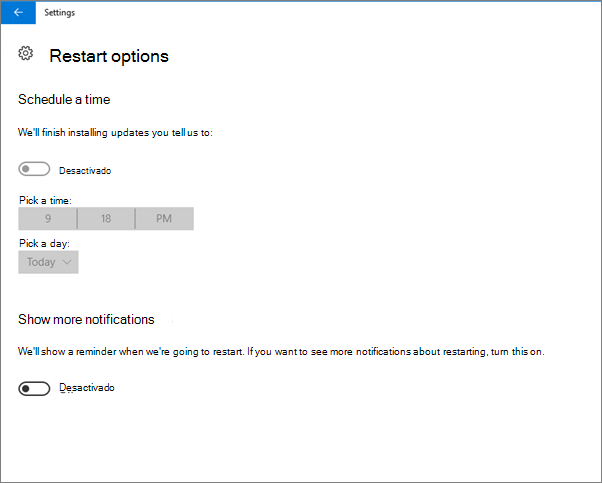
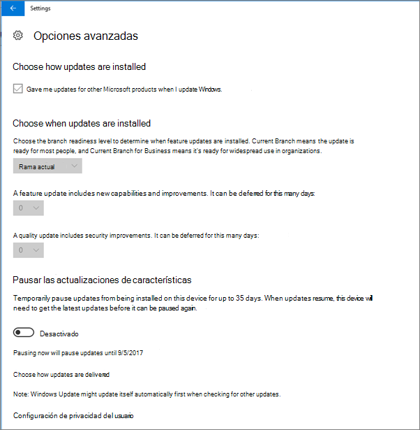
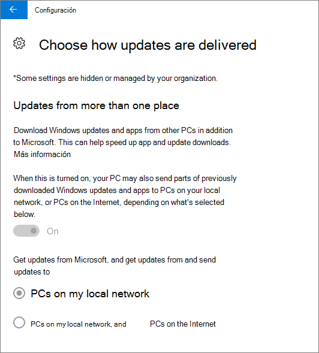
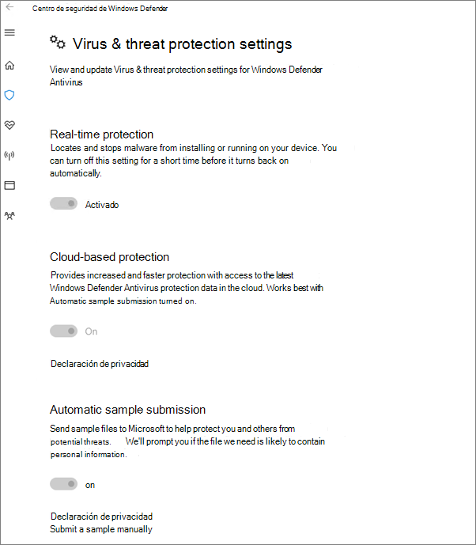

# Validar la configuración de protección de dispositivos en equipos con Windows 10

## Comprobar que las directivas de dispositivo de Windows 10 están establecidas

Después de [configurar las directivas de dispositivos,](protection-settings-for-windows-10-pcs.md)la directiva puede tardar hasta unas horas en tener efecto en los dispositivos de los usuarios. Para confirmar que las directivas se han hecho efectivas, mira varias pantallas de configuración de Windows en los dispositivos de los usuarios. Dado que los usuarios no podrán modificar la configuración de Windows Update y antivirus de Windows Defender en sus dispositivos Windows 10, muchas opciones aparecerán atenuadas.
  
1. Ve a Opciones **de** seguridad de Actualización de configuración de Reinicio de Windows \> **&amp;** \> **Update** y confirma que \>  todas las opciones están atenuadas. 
    
    
  
2. Ve a Opciones **avanzadas de** Windows Update de seguridad de La actualización de configuración y confirma que todas las opciones \> **&amp;** están \>  \>  atenuadas. 
    
    
  
3. Ve a Opciones **avanzadas** de Windows Update \> **&amp; de** seguridad de La actualización \>  \> **de configuración** \> **Elige cómo se entregan las actualizaciones.**
    
    Confirme que puede ver el mensaje (en rojo) en el que se indica que algunas opciones de configuración están ocultas o administradas por su organización y que todas las opciones están atenuadas.
    
    
  
4. Para abrir el Centro de seguridad  Windows Defender, vaya a Configuración de actualización de seguridad Windows Defender haga clic en Abrir \> **&amp;** \>  \> **Windows Defender** \> **Protección &amp;** \> **&amp;** antivirus del Centro de seguridad. 
    
5. Compruebe que todas las opciones están atenuadas. 
    
    
  
## Temas relacionados

[Documentación y recursos de Microsoft 365 para empresas](https://go.microsoft.com/fwlink/p/?linkid=853701)
  
[Introducción a Microsoft 365 para empresas](microsoft-365-business-overview.md)
  
[Administrar Microsoft 365 para empresas](manage.md)
  
[Establecer configuraciones de dispositivo para equipos PC con Windows 10](protection-settings-for-windows-10-pcs.md)
  

