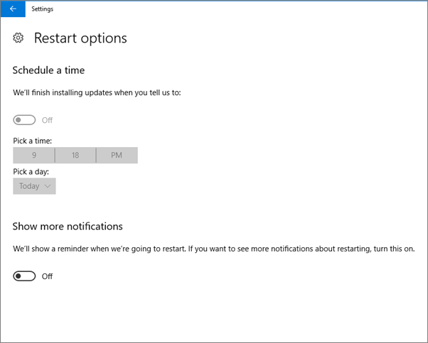

# Validar la configuración de la protección de dispositivo en equipos con Windows 10

## Comprobar que se establecen las directivas de dispositivo de Windows 10

Después de [configurar las directivas de dispositivos](protection-settings-for-windows-10-pcs.md), pueden tardar hasta unas cuantas horas para la directiva surta efecto en los dispositivos de los usuarios. Puede confirmar que las directivas entraron en vigor observando varias pantallas de configuración de Windows en los dispositivos de los usuarios. Debido a que los usuarios no podrán modificar la configuración de actualización de Windows y Windows Defender Antivirus en sus dispositivos de Windows 10, una gran cantidad de esas opciones estará desactivada.
  
1. Vaya a **configuración** \> **actualización &amp; seguridad** \> **Windows Update** \> **Opciones de reinicio** y confirme que no todas las opciones están habilitadas. 
    
    
  
2. Vaya a **configuración** \> **actualización &amp; seguridad** \> **Windows Update** \> **Opciones avanzadas** y confirme que no todas las opciones están habilitadas. 
    
    
  
3. Vaya a **configuración** \> **actualización &amp; seguridad** \> **Windows Update** \> **Opciones avanzadas** \> **Elegir cómo se entregan las actualizaciones**.
    
    Confirme que puede ver el mensaje (en rojo) que algunas opciones de configuración están ocultos o administrados por la organización, y todas las opciones no están habilitadas.
    
    
  
4. Para abrir el centro de seguridad de Windows Defender, vaya a **configuración de** \> **actualización &amp; seguridad** \> **Windows Defender** \> haga clic en **Centro de seguridad de abrir Windows Defender** \> **Virus &amp; subproceso protección** \> **Virus &amp; configuración de la protección de amenazas**. 
    
5. Compruebe que todas las opciones no están habilitadas. 
    
    
  
## Temas relacionados

[Documentación y recursos de Microsoft 365 Business](https://go.microsoft.com/fwlink/p/?linkid=853701)
  
[Introducción a Microsoft 365 Business](microsoft-365-business-overview.md)
  
[Administrar Microsoft 365 Business](manage.md)
  
[Establecer configuraciones de dispositivo para equipos PC con Windows 10](protection-settings-for-windows-10-pcs.md)
  

