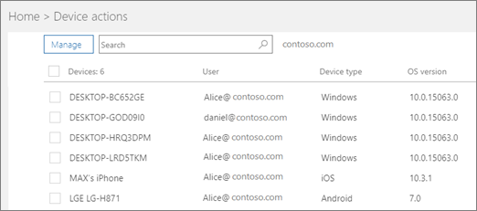

# Ver directivas y dispositivosView policies and devices

## Ver directivas de dispositivoView device policies

1. Inicie sesión en [Microsoft 365 Business](https://portal.office.com) con credenciales de administrador global.Sign in to [Microsoft 365 Business](https://portal.office.com) with global admin credentials. 
    
2. En el panel de navegación izquierdo, elija **Agregar** **directivas** \> de **dispositivos** \> .On the left nav, choose **Devices** \> **Policies** \> **Add**.
    
    En esta página, puede crear, editar, cambiar el grupo de destino o eliminar una directiva.On this page you can create, edit, change target group, or delete a policy.
    
    
  
## Ver acciones de dispositivoView device actions

1. Inicie sesión en [Microsoft 365 Business](https://portal.office.com) con credenciales de administrador global.Sign in to [Microsoft 365 Business](https://portal.office.com) with global admin credentials. 
    
2. En el centro de administración, en la tarjeta **Acciones de dispositivo**, elija **Acciones de dispositivo** para abrir la página **Acciones de dispositivo**.In the admin center, on the **Device actions** card, choose **Device actions** to open the **Device actions** page. 
    
    En esta página, puede seleccionar uno o varios dispositivos y eliminar los datos de la compañía. En el caso de los dispositivos con Windows 10 para los que tenga configuradas las opciones de protección, también puede elegir restablecer la configuración de fábrica.On this page you can select one or more devices and either remove company data. For Windows 10 devices that you have set device protections settings for, you can also choose to reset the device to factory settings.
    
    
  
  

