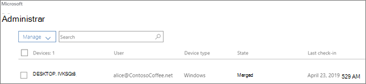

# Ver y administrar directivas y dispositivosView and manage policies and devices

Este artículo se aplica a Microsoft 365 Empresa Premium.This article applies to Microsoft 365 Business Premium.

## Ver y editar directivas de dispositivosView and edit device policies

1.  Vaya al Centro de administración en <a href="https://go.microsoft.com/fwlink/p/?linkid=837890" target="_blank">https://admin.microsoft.com</a>.Go to the admin center at <a href="https://go.microsoft.com/fwlink/p/?linkid=837890" target="_blank">https://admin.microsoft.com</a>.
2. En el panel de navegación izquierdo, elija **Directivas de** \> **dispositivos**.On the left nav, choose **Devices** \> **Policies**.

    En esta página, puede crear, editar, cambiar el grupo de destino o eliminar una directiva.On this page, you can create, edit, change target group, or delete a policy.

    
  
## Ver y administrar dispositivosView and manage devices

1. En la navegación izquierda, elija **Dispositivos** \> **administrar**.On the left nav, choose **Devices** \> **Manage**. 
    
    En esta página, puede seleccionar uno o varios dispositivos y quitar datos de la empresa.On this page, you can select one or more devices and remove company data. En el caso de los dispositivos con Windows 10 para los que tenga configuradas las opciones de protección, también puede elegir restablecer la configuración de fábrica.For Windows 10 devices that you have set device protections settings for, you can also choose to reset the device to factory settings.
  
   

