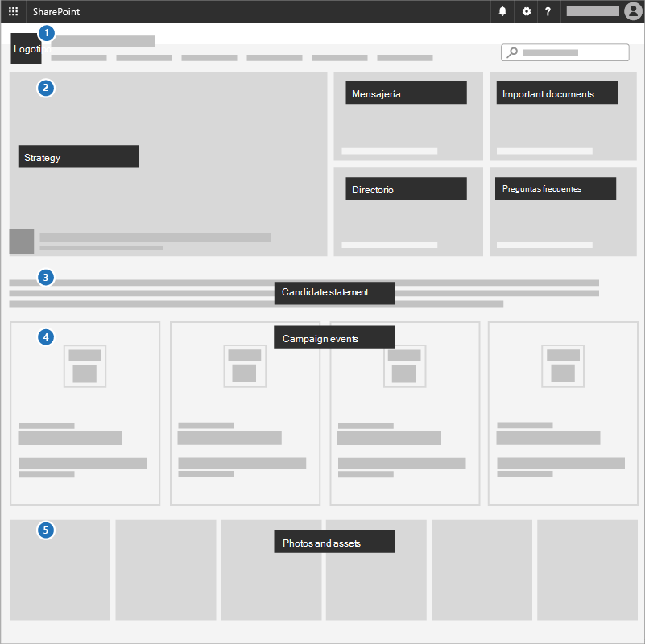
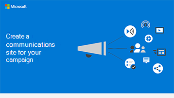

# Crear un sitio de comunicacionesCreate a communications site

Una forma excelente de comunicar prioridades, compartir documentos de estrategia y resaltar los próximos eventos es usar un sitio de comunicaciones en SharePoint.A great way to communicate priorities, share strategy documents, and highlight upcoming events is to use a communications site in SharePoint. Los sitios de comunicaciones son para compartir cosas de forma general en toda la empresa o campaña; es el sitio de estrategia interna.Communications sites are for sharing things broadly across your whole business or campaign; it's your internal strategy site.

## Procedimientos recomendadosBest practices

Incluya los siguientes elementos en el sitio de comunicaciones:Include the following elements in your Communications site:

1. Agrega el logotipo y los colores como una imagen de encabezado y un tema.Add your logo and colors as a header image and theme.
2. Guía con su estrategia, mensaje, documentos importantes, un directorio y preguntas más frecuentes en un **elemento web hero**.Lead with your strategy, message, important documents, a directory, and FAQ in a **Hero web part**.
3. Incluir una declaración de presidente ejecutivo o candidato para el equipo en un **elemento web de texto**.Include a CEO or candidate statement to the team in a **Text web part**.
4. Agregue eventos a un **elemento web de eventos** para que todos puedan ver lo que está sucediendo.Add events to an **Events web part** so everyone can see what's coming up.
5. Agregue fotos que los usuarios pueden usar o compartir en un elemento **web de la galería de imágenes.**Add photos that people can use or share to an **Image gallery web part**.

## Infografía: crear una infografía de sitio de comunicacionesInfographic: Create a Communications Site infographic

Los siguientes vínculos para PowerPoint y PDF se pueden descargar e imprimir en formato tabloide (también conocido como libro de contabilidad, 11 x 17 o A3).The following links for PowerPoint and PDF can be downloaded and printed in tabloid format (also known as ledger, 11 x 17, or A3).

[PDF](downloads/M365CampaignsCreateCommunicationSite.pdf)  |  [PowerPoint](downloads/M365CampaignsCreateCommunicationSite.pptx)[PDF](downloads/M365CampaignsCreateCommunicationSite.pdf) | [PowerPoint](downloads/M365CampaignsCreateCommunicationSite.pptx)

## ConfigúreloSet it up

1. Inicie sesión en https://Office.com.Sign in to https://Office.com.
2. En la esquina superior izquierda de la página, seleccione el icono del iniciador de aplicaciones y, a continuación, seleccione el icono **de SharePoint.**In the top-left corner of the page, select the app launcher icon and then select the **SharePoint** tile. Si no ve el icono de **SharePoint,** haga clic en el icono Sitios o en Todos **si** SharePoint no está visible. If you don't see the **SharePoint** tile, click the **Sites** tile or **All** if SharePoint isn't visible.
3. En la parte superior de la página principal de SharePoint, haga clic en + Crear **sitio** y elija la **opción Sitio de** comunicación.At the top of the SharePoint home page, click **+ Create site** and choose the **Communication site** option.

Obtenga información [sobre los sitios de comunicaciones](https://support.office.com/article/What-is-a-SharePoint-communication-site-94A33429-E580-45C3-A090-5512A8070732) y cómo crear un sitio de comunicación en [SharePoint Online.](https://support.microsoft.com/en-us/office/create-a-communication-site-in-sharepoint-online-7fb44b20-a72f-4d2c-9173-fc8f59ba50eb)Learn all [about Communications sites](https://support.office.com/article/What-is-a-SharePoint-communication-site-94A33429-E580-45C3-A090-5512A8070732) and how to [create a communication site in SharePoint Online](https://support.microsoft.com/en-us/office/create-a-communication-site-in-sharepoint-online-7fb44b20-a72f-4d2c-9173-fc8f59ba50eb).

## Configuración de administradorAdmin settings

Si no ve el vínculo **+** Crear sitio, es posible que la creación de sitios sin administrador no esté disponible en Microsoft 365.If you don't see the **+ Create** site link, self-service site creation might not be available in Microsoft 365. Para crear un sitio de grupo, póngase en contacto con la persona que administra Microsoft 365 en su organización.To create a team site, contact the person administering Microsoft 365 in your organization. Si es administrador de Microsoft 365, vea Administrar la creación de sitios en [SharePoint Online](https://docs.microsoft.com/sharepoint/manage-site-creation) para habilitar la creación de sitios sin administrador para su organización o Administrar sitios en el nuevo Centro de administración de [SharePoint](https://docs.microsoft.com/sharepoint/manage-sites-in-new-admin-center) para crear un sitio desde el Centro de administración de SharePoint Online.If you're a Microsoft 365 admin, see [Manage site creation in SharePoint Online](https://docs.microsoft.com/sharepoint/manage-site-creation) to enable self-service site creation for your organization or [Manage sites in the new SharePoint admin center](https://docs.microsoft.com/sharepoint/manage-sites-in-new-admin-center) to create a site from the SharePoint Online admin center.  
