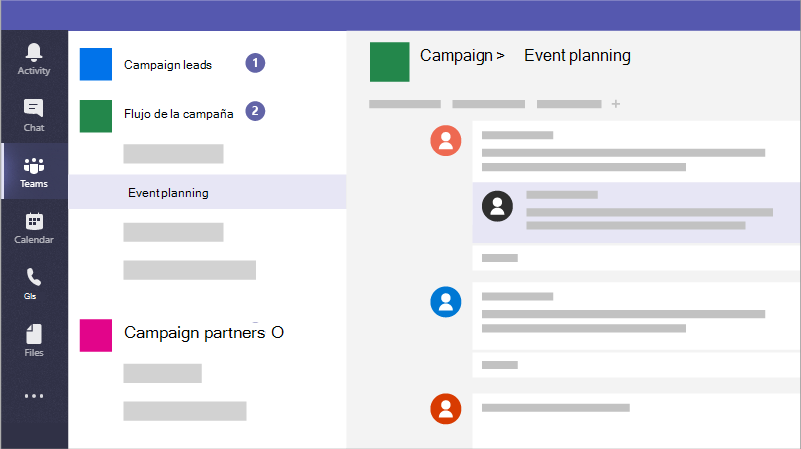

# Crear equipos para la colaboración en Microsoft TeamsCreate teams for collaboration in Microsoft Teams

Microsoft Teams es una aplicación de colaboración que ayuda a su personal a permanecer organizada y tener conversaciones, desde cualquier dispositivo.Microsoft Teams is a collaboration app that helps your staff stay organized and have conversations, from any device. Puede usar Microsoft Teams para mantener conversaciones instantáneas con los miembros de su personal o invitados externos a la organización.You can use Microsoft Teams to have instant conversations with members of your staff or guests outside your organization. También puede realizar llamadas telefónicas, organizar reuniones y compartir archivos.You can also make phone calls, host meetings, and share files.

## Procedimientos recomendadosBest practices

Por ejemplo, las campañas pueden crear los siguientes equipos para comunicarse y colaborar de forma segura:As an example, campaigns can create the following teams to communicate and collaborate securely:

1. **Un equipo líder en la campaña:** Configure esto como un equipo privado para que solo los miembros de la campaña clave puedan tener acceso a él y analice los problemas potencialmente confidenciales.**A Campaign Leads team:** Set this up as a private team so that only your key campaign members can access it and discuss potentially sensitive concerns.
2. **Un equipo de campaña general:** Esto es para que todos los usuarios usen las comunicaciones diarias y el trabajo.**A general Campaign team:** This is for everyone to use for day to day communications and work. Los individuos, grupos o comités pueden configurar canales en este equipo para que realicen su trabajo.Individuals, groups, or committees can set up channels in this team to do their work. Por ejemplo, los usuarios de planeación de eventos pueden configurar un canal para chatear y coordinar la logística de los eventos de la campaña.For example, the event planning people can set up a channel to chat and coordinate logistics for campaign events.
3. **Un equipo de asociados:** Este es un equipo en el que puede coordinarse con los proveedores, socios o voluntarios sin que se les permita nada confidencial.**A partners team:** This is a team where you can coordinate with your vendors, partners, or volunteers without allowing them into anything sensitive.

También puede crear equipos para proyectos específicos y aplicar la cantidad de protección adecuada en función de quién debe incluirse.You can also create teams for specific projects and apply the right amount of protection based on who should be included. 

Al crear un equipo, esto es lo que más se crea:When you create a team, here's what else gets created:

- Un nuevo [grupo de 365 de Microsoft](https://docs.microsoft.com/MicrosoftTeams/office-365-groups)A new [Microsoft 365 group](https://docs.microsoft.com/MicrosoftTeams/office-365-groups)
- Un sitio de [SharePoint Online](https://docs.microsoft.com/MicrosoftTeams/sharepoint-onedrive-interact) y una biblioteca de documentos para almacenar archivos de equipoA [SharePoint Online](https://docs.microsoft.com/MicrosoftTeams/sharepoint-onedrive-interact) site and document library to store team files
- Un buzón y un calendario compartidos de [Exchange Online](https://docs.microsoft.com/MicrosoftTeams/exchange-teams-interact)An [Exchange Online](https://docs.microsoft.com/MicrosoftTeams/exchange-teams-interact) shared mailbox and calendar
- Un bloc de notas de OneNoteA OneNote notebook
- Se vincula a otras aplicaciones de Office 365, como Planner y Power BI.Ties into other Office 365 apps such as Planner and Power BI

En Microsoft Teams, puede encontrar:Inside Microsoft Teams, you can find:
1. **Teams:** Busque los canales a los que pertenece o cree los suyos.**Teams:** Find channels to belong to or create your own. Dentro de los canales puede retener reuniones en el lugar, tener conversaciones y compartir archivos.Inside channels you can hold on-the-spot meetings, have conversations, and share files.

2. **Reuniones:** Ve todo lo que estás preparado para el día o la semana.**Meetings:** See everything you've got lined up for the day or week. O bien, programe una reunión.Or, schedule a meeting. Este calendario se sincroniza con el calendario de Outlook.This calendar syncs with your Outlook calendar.
 
3. **Llamadas:** En algunos casos, si su organización la tiene configurada, puede llamar a cualquier persona desde Microsoft Teams, incluso si no está usando Microsoft Teams.**Calls:** In some cases, if your organization has it set up, you can call anyone from Microsoft Teams, even if they're not using Microsoft Teams.

4. **Actividad:** Ponerse al día en todos los mensajes no leídos, @mentions, respuestas y mucho más.**Activity:** Catch up on all your unread messages, @mentions, replies, and more. 

Use el cuadro de comandos de la parte superior para buscar personas o elementos específicos, realizar acciones rápidas e iniciar aplicaciones.Use the command box at the top to search for specific items or people, take quick actions, and launch apps.

## ConfigúreloSet it up

Cree un equipo privado solo para el administrador de la campaña y el candidato como este.Create a private team for just the campaign manager and candidate like this. 

> [!VIDEO https://www.microsoft.com/videoplayer/embed/RWeqWA]

Cree un equipo de toda la organización que todos los usuarios de la campaña puedan usar para comunicarse y compartir archivos.Create an organization-wide team that everyone in the campaign can use to communicate and share files.

> [!VIDEO https://www.microsoft.com/videoplayer/embed/RE2GCG9]

Cree un equipo que comparta con los invitados fuera de la campaña, como publicidad de financiación.Create a team that you share with guests outside the campaign, such as advertising of financing.

> [!VIDEO https://www.microsoft.com/videoplayer/embed/RE1FQMp]

Obtenga más información sobre Microsoft Teams en la [documentación técnica de Microsoft Teams](https://docs.microsoft.com/microsoftteams/microsoft-teams)Learn more about Microsoft Teams at [Microsoft Teams technical documentation](https://docs.microsoft.com/microsoftteams/microsoft-teams)

## Configuración de administraciónAdmin settings

Debe ser administrador para crear un equipo para toda la organización.You must be an admin to create an organization-wide team. Para obtener más información, consulte [¿Qué es un administrador en Microsoft 365?](https://support.office.com/article/what-is-an-admin-e123627e-4892-4461-b9aa-1b6d57a5cfa4?ui=en-US&rs=en-US&ad=US).For more information, see [What is an Admin in Microsoft 365?](https://support.office.com/article/what-is-an-admin-e123627e-4892-4461-b9aa-1b6d57a5cfa4?ui=en-US&rs=en-US&ad=US).
  
