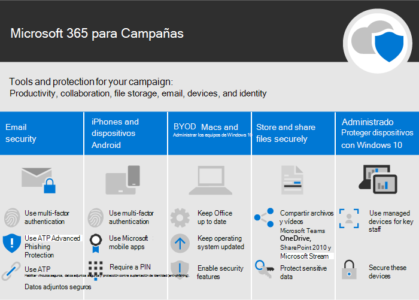
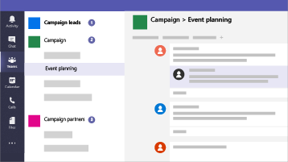
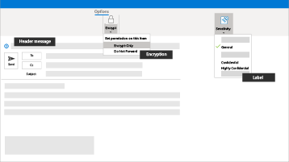

Microsoft 365 para pequeñas empresas y campañasMicrosoft 365 for smaller businesses and campaigns
===========================

En nuestro mundo actual, mantener la seguridad de los datos y las comunicaciones es prioritario, especialmente en el caso de campañas políticas, consultorios médicos y jurídicos y muchas otras pequeñas empresas.In our current world, keeping data and communications secure is a priority, particularly for medical and legal practices, political campaigns, and many other smaller businesses. Esta solución ofrece un conjunto de recomendaciones diseñadas para ayudarle a protegerse y a proteger sus datos.This solution provides a set of recommendations designed to help protect you and your data. Esta biblioteca incluye ayuda para configurar y usar este entorno recomendado, sea cual sea su tipo de empresa.This library includes help for setting up and using this recommended environment, no matter your business type.

Esta configuración incluye las siguientes instrucciones para la productividad, colaboración, almacenamiento de archivos, correo electrónico, dispositivos e identidad para proteger su negocio:This configuration includes the following guidance for productivity, collaboration, file storage, email, devices, and identity to protect your business:

| Protección paraProtection for | DescripciónDescription | VínculosLinks |
| ----- | ----- | ----- | ----- |
|Correo electrónicoEmail | Utilice la autenticación multifactor, la Protección avanzada contra suplantación (phishing) de ATP, Vínculos seguros y Archivos adjuntos seguros de ATP y correo electrónico cifrado para la información confidencial.Use multi-factor authentication, and ATP Advanced Phishing Protection, and ATP Safe Links and Safe Attachments, and use encrypted email for sensitive information.| [Establecer autenticación multifactor](m365-campaigns-multifactor-authenication.md), [Protección contra ataques de suplantación (phishing)](m365-campaigns-phishing-and-attacks.md), [Cifrar o etiquetar correo electrónico confidencial](send-encrypted-email.md)[Set up multi-factor authentication](m365-campaigns-multifactor-authenication.md), [Protect against phishing attacks](m365-campaigns-phishing-and-attacks.md), [Encrypt or label your sensitive email](send-encrypted-email.md) |
|Dispositivos Android y iPhonesiPhones and Android devices |Utilice la autenticación multifactor, configure aplicaciones móviles de Microsoft y utilice un PINUse multi-factor authentication, and set up Microsoft mobile apps, and require a PIN | [Configurar la autenticación multifactor](m365-campaigns-multifactor-authenication.md), [Configurar dispositivos móviles](../business/set-up-mobile-devices.md?toc=/microsoft-365/campaigns/toc.json)[Set up multi-factor authentication](m365-campaigns-multifactor-authenication.md), [Set up mobile devices](../business/set-up-mobile-devices.md?toc=/microsoft-365/campaigns/toc.json)|
|Traiga sus Propios Dispositivos (BYOD) Mac y Windows 10Bring-your-own-devices (BYOD) Macs and Windows 10 PCs |Mantenga Office actualizado, así como los sistemas operativos, y habilite características de seguridad.Keep Office up to date, keep operating systems updated, and enable security features. | [Proteger equipos Windows 10 y Mac no administradosProtect unmanaged Windows 10 PCs and Macs](m365-campaigns-protect-pcs-macs.md) |
|Almacenar y compartir archivos de manera seguraStoring and sharing files securely | Comparta archivos y vídeos de Microsoft Teams, OneDrive, SharePoint y Microsoft Stream, y proteja datos confidenciales.Share files and videos from Microsoft Teams, OneDrive, SharePoint, and Microsoft Stream, and protect sensitive data.| [Compartir archivos y vídeosShare files and videos](share-files-and-videos.md) |
|Dispositivos Windows 10 no administradosManaged Windows 10 devices |Utilice dispositivos administrados para los empleados clave y proteja dichos dispositivos.Use managed devices for key staff and secure these devices. | [Configurar dispositivos administradosSet up managed devices](../business/set-up-windows-devices.md?toc=/microsoft-365/campaigns/toc.json) |

Configuración de seguridad recomendada para Microsoft 365 Empresa PremiumA recommended security configuration for Microsoft 365 Business Premium
------------------------------------

Esta configuración de seguridad recomendada para Microsoft 365 Empresa Premium le permite:This recommended secure configuration for Microsoft 365 Business Premium lets you:

- Confiar en herramientas de colaboración y productividad empresarial de confianza, como Outlook, Word, Excel y otros productos de Office.Rely on trusted business productivity and collaboration tools, such as Outlook, Word, Excel, and other Office products.
- Proteger sus archivos de trabajo en todos sus dispositivos iOS, Android y Windows 10 con una seguridad de nivel empresarial que es fácil de administrar.Protect your work files on all of your iOS, Android, and Windows 10 devices with enterprise-grade security that is simple to manage.
- Aplicar protección adicional para cuentas de usuario e identidades.Apply extra protection for user accounts and identity.

> [!VIDEO https://www.microsoft.com/videoplayer/embed/RE3clbH]

Si bien las campañas para las elecciones federales y de algunos estados de los Estados Unidos pueden optar a [precios especiales](get-microsoft-365-campaigns.md) para la oferta de Microsoft 365 para Campañas de Microsoft 365 Empresa Premium, todas las organizaciones con el plan Empresa Premium pueden aprovechar esta guía para configurar una mayor seguridad y obtener información sobre cómo colaborar de forma segura.While federal and some state election campaigns in the United States qualify for [special pricing](get-microsoft-365-campaigns.md) for the Microsoft 365 for Campaigns offering of Microsoft 365 Business Premium, any organization with the Business Premium plan can take advantage of this guidance to configure increased security and learn how to collaborate securely.

Esta biblioteca incluye lo siguiente:This library includes the following:

- Instrucciones de configuración prescriptiva para agregar mayor seguridad.Prescriptive setup guidance for adding increased security.
- Ayuda a los usuarios para configurar dispositivos para un acceso seguro.Help for users to setup devices for secure access.
- Instrucciones sobre cómo colaborar y compartir de forma segura.Guidance on how to collaborate and share securely.

Para más información sobre lo que se incluye, consulte [Microsoft 365 Empresa Premium](https://www.microsoft.com/microsoft-365/business).For more information about what's included, see [Microsoft 365 Business Premium](https://www.microsoft.com/microsoft-365/business).

IntroducciónGet started
--------------------------

Para empezar, siga estos pasos:Follow these steps to get started:

- Para campañas: [Obtenga Microsoft 365 para Campañas](get-microsoft-365-campaigns.md)For campaigns: [Get Microsoft 365 campaigns](get-microsoft-365-campaigns.md)
- Para cualquier negocio: [Obtenga información acerca de cómo trabajarán los usuarios con Microsoft 365](m365-campaigns-users.md)For any business: [Learn how your users will work with Microsoft 365](m365-campaigns-users.md)
- Para cualquier negocio: [Configurar Microsoft 365](microsoft-365-campaigns-setup-overview.md)For any business: [Set up Microsoft 365](microsoft-365-campaigns-setup-overview.md)

Soluciones para su empresaSolutions for your business
--------------------------

Después de configurar el entorno seguro de Microsoft 365, puede usar las soluciones siguientes para ponerse en marcha:After you set up your secure Microsoft 365 environment, you can use the following solutions to get working:

| Crear equipos para colaboraciónCreate teams for collaboration | Configurar reuniones en líneaSet up online meetings |
| ------------- | ------------- |
|  |  |
| Colabore con equipos determinados para el personal clave, todos los miembros del personal y los socios o proveedores.Collaborate with teams for key staff, all staff, and partners or vendors. [Cree su equipoCreate your team](create-teams-for-collaboration.md) | Programe una reunión con audio, vídeo y uso compartido con Microsoft Teams.Schedule a meeting with audio, video, and sharing with Microsoft Teams. [Configurar una reuniónSet up a meeting](set-up-meetings.md) |

| Cifre o etiquete su correo electrónico confidencialEncrypt or label your sensitive email | Crear un sitio de comunicacionesCreate a communications site |
| ------------- | ------------- |
|  |  |
| Use etiquetas de confidencialidad y cifrado para proteger el correo electrónico que contiene información confidencial.Use encryption and sensitivity labels to protect email that contains confidential or sensitive information. [Enviar correo electrónico cifradoSend encrypted email](send-encrypted-email.md) | Comparta eventos, mensajes e imágenes, entre otras cosas, con su equipo en un sitio de comunicaciones interno creado con SharePoint.Share events, message, images, and more with your team in an internal communications site created with SharePoint. [Cree su sitioCreate your site](create-communications-site.md) |

| Compartir archivos y vídeosShare files and videos |
| ------------- |
|  |
| Guarde sus archivos y vídeos en la nube para que estén disponiblesSave your files and videos to the cloud so they're available  a todas las personas adecuadas.to all of the appropriate people. [Empezar a compartirStart sharing](share-files-and-videos.md) |
