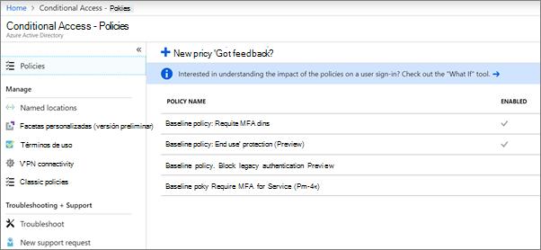

# Requerir la autenticación multifactor y configurar directivas de acceso condicional

Proteja el acceso a sus datos con la autenticación multifactor y las directivas de acceso condicional. Estos agregan una seguridad adicional importante. Microsoft proporciona un conjunto de directivas de acceso condicional de línea base que se recomiendan para todos los clientes. Las directivas de línea base son un conjunto de directivas predefinidas que ayudan a proteger a las organizaciones frente a muchos ataques comunes. Estos ataques comunes pueden incluir aerosol, reproducción y suplantación de identidad.

Estas directivas requieren que los administradores y los usuarios escriban una segunda forma de autenticación (denominada autenticación multifactor o MFA) cuando se cumplan ciertas condiciones. Por ejemplo, si un usuario de su organización intenta iniciar sesión en Microsoft 365 desde otro país o desde un dispositivo desconocido, es posible que el inicio de sesión se considere arriesgado. El usuario debe proporcionar una forma adicional de autenticación (como una huella digital o un código) para demostrar su identidad. 

Actualmente, las directivas de línea base son las siguientes:
- Se configura en el centro de administración de Microsoft 365:
    - **Requerir MFA para los administradores** : requiere multi-factor Authentication para los roles de administrador con más privilegios, incluido el administrador global.
    - **Protección del usuario final** : requiere la autenticación multifactor para los usuarios solo cuando un inicio de sesión es arriesgado. 
- Configure en el portal de Azure Active Directory:
    - **Bloquear la autenticación heredada** : las aplicaciones cliente antiguas y algunas nuevas aplicaciones no usan protocolos de autenticación más recientes, más seguros. Estas aplicaciones antiguas pueden omitir las directivas de acceso condicional y obtener acceso no autorizado a su entorno. Esta directiva bloquea el acceso de los clientes que no admiten el acceso condicional. 
    - **Requerir MFA para la administración de servicios** : requiere multi-factor Authentication para el acceso a las herramientas de administración, incluido Azure portal (donde se configuran las directivas de línea base). 

Microsoft recomienda habilitar todas estas directivas de línea base. Una vez habilitadas estas directivas, se pedirá a los administradores y usuarios que se registren para la autenticación multifactor de Azure.

Para obtener más información acerca de estas directivas, vea [¿Qué son las directivas de línea base](https://docs.microsoft.com/azure/active-directory/conditional-access/concept-baseline-protection)?

## Requerimiento de la MFA

Para requerir que todos los usuarios inicien sesión con un segundo formulario de identificador:

1. Vaya al centro de administración en <a href="https://go.microsoft.com/fwlink/p/?linkid=837890" target="_blank">https://admin.microsoft.com</a> y elija **configurar**.

2. En la página Configuración, elija **Ver** en la tarjeta para **crear un inicio de sesión más seguro** .

    
3. En la página hacer que **el inicio de**sesión sea más seguro, elija introducción.
 
4. En el panel reforzar la seguridad de inicio de sesión, active las casillas situadas junto a **requerir autenticación multifactor para administradores** y **requerir que los usuarios se registren para la autenticación multifactor y bloquear el acceso si se detecta un riesgo**.
    Asegúrese de excluir la cuenta de administrador de [emergencia](m365-campaigns-protect-admin-accounts.md#create-an-emergency-admin-account) o "ruptura de cristal" del requisito de MFA en el cuadro **Buscar usuarios** .
    
    

5. Elija **crear Directiva** en la parte inferior de la página.

## Configurar directivas de línea base

1. Vaya a [Azure portal](https://portal.azure.com)y navegue a **Azure Active Directory** \> **Conditional Access**.
    
    Las directivas de línea base se enumeran en la página y puede ver que **requieren MFA para los administradores** y la **protección del usuario final** ya están habilitados después de completar los pasos de [requerir MFA](#require-mfa).

    
2. Consulte las siguientes instrucciones específicas para cada directiva:

    - [Requerir MFA para los administradores](https://docs.microsoft.com/azure/active-directory/conditional-access/howto-baseline-protect-administrators)
    - [Requerir MFA para los usuarios](https://docs.microsoft.com/azure/active-directory/conditional-access/howto-baseline-protect-end-users)  
    - [Bloquear la autenticación heredada](https://docs.microsoft.com/azure/active-directory/conditional-access/howto-baseline-protect-legacy-auth)
    - [Requerir MFA para la administración de servicios](https://docs.microsoft.com/azure/active-directory/conditional-access/howto-baseline-protect-azure)

Puede configurar directivas adicionales, como requerir aplicaciones cliente aprobadas. Para obtener más información, consulte la [documentación de acceso condicional](https://docs.microsoft.com/azure/active-directory/conditional-access/).
