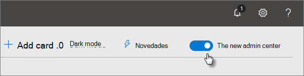
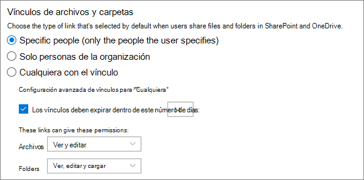
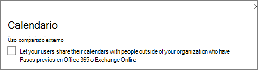

# Aumentar la protección contra amenazas para la suscripción a Microsoft 365

Este artículo le ayuda a aumentar la protección de su suscripción a Microsoft 365 para protegerse contra la suplantación de identidad (phishing), malware y otras amenazas. Estas recomendaciones son apropiadas para organizaciones con una mayor necesidad de seguridad, como campañas políticas, oficinas de abogados y clínicas de atención médica.

Antes de empezar, compruebe la puntuación segura de Microsoft. Puntuación segura de Microsoft analiza la seguridad de la organización en función de las actividades regulares y la configuración de seguridad y asigna una puntuación. Comience tomando nota de la puntuación actual. Tomar las acciones recomendadas en este artículo aumenta la puntuación. El objetivo no es lograr la puntuación máxima, sino tener en cuenta las oportunidades para proteger el entorno que no afectan negativamente a la productividad de los usuarios.

Para obtener más información, vea [Puntuación segura de Microsoft](../security/defender/microsoft-secure-score.md).

## Aumentar el nivel de protección contra malware en el correo

El entorno de Office 365 o Microsoft 365 incluye protección contra malware, pero puede aumentar esta protección bloqueando los datos adjuntos con tipos de archivo que se usan habitualmente para malware. Para proteger contra malware en el correo electrónico:

1. Ve a <https://protection.office.com> e inicia sesión con las credenciales de tu cuenta de administrador.

2. En el Centro de & cumplimiento, en el panel de navegación izquierdo, en **Administración** de amenazas, elija **Directiva** \> **antimalware**.

3. Haga doble clic en la directiva predeterminada para editar esta directiva en toda la empresa.

4. Haga clic en **Configuración**.

5. En **Filtro de tipos de datos adjuntos** comunes, seleccione **En**. Los tipos de archivo bloqueados se enumeran en la ventana directamente debajo de este control. Asegúrese de agregar estos tipos de archivo:

   `ade, adp, ani, bas, bat, chm, cmd, com, cpl, crt, hlp, ht, hta, inf, ins, isp, job, js, jse, lnk, mda, mdb, mde, mdz, msc, msi, msp, mst, pcd, reg, scr, sct, shs, url, vb, vbe, vbs, wsc, wsf, wsh, exe, pif`

   Puede agregar o eliminar tipos de archivo más adelante, si es necesario.

6. Haga clic en **Guardar**.

Para obtener más información, vea [Protección contra malware en EOP](../security/defender-365-security/anti-malware-protection.md).

## Protección contra ransomware

Ransomware restringe el acceso a los datos mediante el cifrado de archivos o el bloqueo de pantallas del equipo. A continuación, intenta extorsionar dinero a las víctimas pidiendo "rescate", normalmente en forma de criptodivisas como Bitcoin, a cambio de acceso a datos.

Puede proteger contra ransomware creando una o más reglas de flujo de correo para bloquear las extensiones de archivo que se usan habitualmente para ransomware (se agregaron en el aumento del nivel de protección contra [malware](#raise-the-level-of-protection-against-malware-in-mail) en el paso de correo) o para advertir a los usuarios que reciben estos datos adjuntos en el correo electrónico.

Además de los archivos bloqueados en el paso anterior, también es una buena práctica crear una regla para advertir a los usuarios antes de abrir los datos adjuntos de archivos de Office que incluyen macros. El ransomware se puede ocultar dentro de macros, por lo que advierte a los usuarios que no abran estos archivos de personas que no conocen.

Para crear una regla de transporte de correo:

1. Vaya al Centro de administración en <https://admin.microsoft.com> y elija Centros de administración  \> **exchange**.

2. En la categoría **flujo de** correo, haga clic en **reglas**.

3. Haga **+** clic en y, a **continuación, en Crear una nueva regla**.

4. Haga **clic en** Más opciones en la parte inferior del cuadro de diálogo para ver el conjunto completo de opciones.

5. Aplique la configuración de la tabla siguiente para la regla. Deje el resto de la configuración en el valor predeterminado, a menos que desee cambiarlos.

6. Haga clic en **Guardar**.

|Configuración|Advertir a los usuarios antes de abrir los datos adjuntos de los archivos de Office|
|---|---|
|Nombre|Regla anti ransomware: advertir a los usuarios|
|Aplique esta regla si . . .|Cualquier dato adjunto . . . extensión de archivo coincide con . . .|
|Especificar palabras o frases|Agregue estos tipos de archivo:   `dotm, docm, xlsm, sltm, xla, xlam, xll, pptm, potm, ppam, ppsm, sldm`|
|Haga lo siguiente. . .|Notificar al destinatario con un mensaje|
|Proporcionar texto del mensaje|No abra estos tipos de archivos de personas que no conoce porque pueden contener macros con código malintencionado.|

Para más información, vea:

- [Ransomware: cómo reducir el riesgo](https://www.microsoft.com/security/blog/2020/04/28/ransomware-groups-continue-to-target-healthcare-critical-services-heres-how-to-reduce-risk/)

- [Restaurar onedrive](https://support.microsoft.com//office/fa231298-759d-41cf-bcd0-25ac53eb8a15)

## Detener el reenvío automático para correo electrónico

Los hackers que obtienen acceso al buzón de un usuario pueden robar el correo estableciendo el buzón para reenviar automáticamente el correo electrónico. Esto puede ocurrir incluso sin el reconocimiento del usuario. Puede evitar que esto suceda configurando una regla de flujo de correo.

Para crear una regla de transporte de correo, vea [este breve vídeo](https://support.office.com/article/f9d693ba-5c78-47c0-b156-8e461e062aa7) o siga estos pasos:

1. En el Centro de administración de Microsoft 365, haga clic en **Centros de administración de** \> **Exchange**.

2. En la categoría **flujo de** correo, haga clic en **reglas**.

3. Haga **+** clic en y, a **continuación, en Crear una nueva regla**.

4. Haga **clic en** Más opciones en la parte inferior del cuadro de diálogo para ver el conjunto completo de opciones.

5. Aplique la configuración en la tabla siguiente. Deje el resto de la configuración en el valor predeterminado, a menos que desee cambiarlos.

6. Haga clic en **Guardar**.

|Configuración|Advertir a los usuarios antes de abrir los datos adjuntos de los archivos de Office|
|---|---|
|Nombre|Impedir el reenvío automático de correo electrónico a dominios externos|
|Aplicar esta regla si ...|El remitente . . . es externo/interno . . . Dentro de la organización|
|Agregar condición|Las propiedades del mensaje . . . incluir el tipo de mensaje . . . Reenvío automático|
|Haga lo siguiente...|Bloquear el mensaje . . . rechazar el mensaje e incluir una explicación.|
|Proporcionar texto del mensaje|El reenvío automático de correo electrónico fuera de esta organización se impide por motivos de seguridad.|

## Proteger el correo electrónico de ataques de suplantación de identidad

Si ha configurado uno o varios dominios personalizados para su entorno de Office 365 o Microsoft 365, puede configurar la protección contra suplantación de identidad de destino. La protección contra suplantación de identidad (phishing), que forma parte de Microsoft Defender para Office 365, puede ayudar a proteger su organización de ataques de suplantación de identidad malintencionados y otros ataques de suplantación de identidad. Si no ha configurado un dominio personalizado, no es necesario hacerlo.

Se recomienda empezar a usar esta protección mediante la creación de una directiva para proteger a los usuarios más importantes y al dominio personalizado.

Para crear una directiva contra suplantación de identidad en Defender para Office 365, vea este breve [vídeo](https://support.office.com/article/86c425e1-1686-430a-9151-f7176cce4f2c)de aprendizaje o siga estos pasos:

1. Vaya a <https://protection.office.com>.

2. En el Centro de & cumplimiento, en el panel de navegación izquierdo, en **Administración de amenazas,** elija **Directiva**.

3. En la **página Directiva,** elija **Anti-phishing**.

4. En la **página Anti-phishing,** seleccione **+ Crear**. Se inicia un asistente que le permite definir la directiva contra suplantación de identidad.

5. Especifique el nombre, la descripción y la configuración de la directiva como se recomienda en el siguiente gráfico. Para obtener más información, vea [Learn about anti-phishing policy in Microsoft Defender for Office 365 options](../security/defender-365-security/set-up-anti-phishing-policies.md).

6. Después de revisar la configuración, elija **Crear esta directiva** o **Guardar**, según corresponda.

|Configuración u opción|Valor recomendado|
|---|---|
|Nombre|Dominio y personal más valioso|
|Descripción|Asegúrese de que el personal más importante y nuestro dominio no se suplanten.|
|Agregar usuarios que proteger|Seleccione **+ Agregar una condición, El destinatario es**. Escriba nombres de usuario o escriba la dirección de correo electrónico de los propietarios, socios o candidatos, administradores y otros miembros importantes del personal. Puede agregar hasta 20 direcciones internas y externas que desea proteger de la suplantación.|
|Agregar dominios que proteger|Seleccione **+ Agregar una condición, El dominio de destinatario es**. Escriba el dominio personalizado asociado a su suscripción de Microsoft 365, si ha definido uno. Puede escribir más de un dominio.|
|Elegir acciones|Si un usuario suplantado envía correo electrónico: elija Redirigir mensaje a otra dirección de correo electrónico y, a continuación, escriba la dirección de correo electrónico del administrador de seguridad; por ejemplo, *Alice   @contoso.com*.   Si el correo electrónico lo envía un dominio suplantado: elija **Mensaje en cuarentena**.|
|Inteligencia de buzones|De forma predeterminada, se selecciona inteligencia de buzones al crear una directiva contra suplantación de identidad (anti-phishing). Deje esta configuración **activada** para obtener mejores resultados.|
|Agregar dominios y remitentes de confianza|Aquí puede agregar su propio dominio o cualquier otro dominio de confianza.|
|Aplicado a|Seleccione **El dominio del destinatario es**. En **Cualquiera de estos**, seleccione **Elegir**. Seleccione **+ Agregar**. Active la casilla situada junto al nombre del dominio, por ejemplo, *contoso.   com*, en la lista y, a continuación, **seleccione Agregar**. Seleccione **Listo**.|

Para obtener más información, vea [Set up anti-phishing policies in Defender for Office 365](../security/defender-365-security/set-up-anti-phishing-policies.md).

## Proteger contra datos adjuntos, archivos y vínculos malintencionados con Defender para Office 365

En primer lugar, asegúrese de que en el Centro de administración en el que tiene activada la nueva vista <https://admin.microsoft.com> previa del centro de administración. Activa la alternancia junto al texto **El nuevo centro de administración**.

   

Si aún no ve  la página Configuración con tarjetas en el espacio empresarial, consulte cómo completar estos pasos en el Centro de seguridad & cumplimiento. Vea [Configurar datos adjuntos](#set-up-safe-attachments-in-the-security--compliance-center) seguros en el Centro de seguridad & cumplimiento y Configurar vínculos seguros en el Centro de [seguridad & cumplimiento](#set-up-safe-links-in-the-security--compliance-center).

1. En el panel de navegación izquierdo, elija **Configurar**.
2. En la **página Configuración,** elija **Ver en** la tarjeta Aumentar la protección **contra amenazas** avanzadas.

   

3. En la **página Aumentar la protección contra amenazas avanzadas,** elija **Introducción.**
4. En el panel que se abre, active las casillas situadas junto a Vínculos y datos adjuntos en el correo **electrónico,** Examinar archivos en **SharePoint, OneDrive** y Teams y Examinar vínculos en el escritorio de Office y aplicaciones de **Office Online** en Examinar elementos para buscar contenido **malintencionado.**

   En **Vínculos y datos adjuntos en el correo** electrónico , Escriba todos los usuarios o los usuarios específicos cuyo correo electrónico desee examinar.

   

5. Elija **Crear directivas para** activar Datos adjuntos seguros y vínculos seguros.

### Configurar datos adjuntos seguros en el Centro de seguridad & cumplimiento

Las personas envían, reciben y comparten datos adjuntos con regularidad, como documentos, presentaciones, hojas de cálculo y mucho más. No siempre es fácil saber si los datos adjuntos son seguros o malintencionados con solo mirar un mensaje de correo electrónico. Microsoft Defender para Office 365 incluye protección de datos adjuntos seguros, pero esta protección no está activada de forma predeterminada. Se recomienda crear una nueva regla para empezar a usar esta protección. Esta protección se extiende a los archivos de SharePoint, OneDrive y Microsoft Teams.

Para crear una directiva de datos adjuntos seguros, vea [este breve vídeo](https://support.office.com/article/e7e68934-23dc-4b9c-b714-e82e27a8f8a5)o complete los pasos siguientes:

1. Ve a <https://protection.office.com> e inicia sesión con tu cuenta de administrador.

2. En el Centro de & cumplimiento, en el panel de navegación izquierdo, en **Administración de amenazas,** elija **Directiva**.

3. En la página Directiva, elija **Datos adjuntos seguros**.

4. En la página Datos adjuntos seguros, aplique esta protección ampliamente activando la casilla Activar **ATP para SharePoint, OneDrive** y Microsoft Teams.

5. Seleccione **+** esta opción para crear una nueva directiva.

6. Aplique la configuración en la tabla siguiente.

7. Después de revisar la configuración, elija **Crear esta directiva** o **Guardar**, según corresponda.

|Configuración u opción|Valor recomendado|
|---|---|
|Nombre|Bloquear los correos electrónicos actuales y futuros con malware detectado.|
|Descripción|Bloquear correos electrónicos y datos adjuntos actuales y futuros con malware detectado.|
|Guardar datos adjuntos respuesta de malware desconocido|Seleccione **Bloquear: bloquee los correos electrónicos y** los datos adjuntos actuales y futuros con malware detectado.|
|Redirigir datos adjuntos al detectar|Habilitar redirección (seleccione este cuadro)   Escriba la cuenta de administrador o una configuración de buzón para la cuarentena.   Aplica la selección anterior si el examen de malware para datos adjuntos se encuentra en tiempo de espera o si se produce un error (selecciona este cuadro).|
|Aplicado a|El dominio de destinatario es . . . seleccione el dominio.|

Para obtener más información, vea [Set up anti-phishing policies in Defender for Office 365](../security/defender-365-security/set-up-anti-phishing-policies.md).

### Configurar vínculos seguros en el Centro de & seguridad

Los hackers a veces ocultan sitios web malintencionados en vínculos de correo electrónico u otros archivos. Los vínculos seguros, que forman parte de Microsoft Defender para Office 365, pueden ayudar a proteger su organización proporcionando la comprobación con tiempo de clic de direcciones web (URL) en mensajes de correo electrónico y documentos de Office. La protección se define a través de directivas de vínculos seguros.

Se recomienda hacer lo siguiente:

- Modifique la directiva predeterminada para aumentar la protección.

- Agregue una nueva directiva dirigida a todos los destinatarios de su dominio.

Para configurar vínculos seguros, vea [este breve vídeo de aprendizaje](https://support.office.com/article/61492713-53c2-47da-a6e7-fa97479e97fa)o siga estos pasos:

1. Ve a <https://protection.office.com> e inicia sesión con tu cuenta de administrador.

2. En el Centro de & cumplimiento, en el panel de navegación izquierdo, en **Administración de amenazas,** elija **Directiva**.

3. En la página Directiva, elija **Vínculos seguros**.

Para modificar la directiva predeterminada:

1. En la página Vínculos seguros, en Directivas que se aplican a toda la **organización,** seleccione la **directiva** predeterminada.

2. En Configuración que se aplica al contenido excepto el **correo electrónico,** seleccione Aplicaciones de **Microsoft 365 para empresas, Office para iOS y Android**.

3. Haga clic en **Guardar**.

Para crear una nueva directiva dirigida a todos los destinatarios de su dominio:

1. En la página Vínculos seguros, en **Directivas que se aplican** a toda la organización, haga clic para crear una nueva **+** directiva.

2. Aplique la configuración que se muestra en la tabla siguiente.

3. Haga clic en **Guardar**.

|Configuración u opción|Valor recomendado|
|---|---|
|Nombre|Directiva de vínculos seguros para todos los destinatarios del dominio|
|Seleccionar la acción para direcciones URL potencialmente malintencionadas desconocidas en los mensajes|Seleccionar Activado: las direcciones URL se reescribirán y comprobarán en una lista de **vínculos malintencionados** conocidos cuando el usuario haga clic en el vínculo .|
|Usar datos adjuntos seguros para examinar contenido descargable|Seleccione este cuadro.|
|Aplicado a|El dominio de destinatario es . . . seleccione el dominio.|

Para obtener más información, vea [Vínculos seguros en Defender para Office 365](../security/defender-365-security/safe-links.md).

## Activar el registro de auditoría unificado

Después de activar la búsqueda del registro de auditoría en el Centro de seguridad & cumplimiento, puede conservar el administrador y otra actividad de usuario en el registro y buscarlo.

Debe tener asignado el rol Registros de auditoría en Exchange Online para activar o desactivar la búsqueda del registro de auditoría en su suscripción a Microsoft 365. De forma predeterminada, este rol se asigna a los grupos de roles Administración de cumplimiento y Administración de la organización en la página Permisos del Centro de administración de Exchange. Los administradores globales de Microsoft 365 son miembros de este grupo de forma predeterminada.

1. Para activar la búsqueda del registro de auditoría, vaya al Centro de administración en y, a continuación, elija Seguridad en Centros de <https://admin.microsoft.com> **administración** en la navegación izquierda. 
2. En la página Seguridad de Microsoft  **365,** elija Más recursos y, a continuación, Abra en la tarjeta centro de seguridad de Office **365 & cumplimiento.** 

    
3. En la página seguridad y cumplimiento, elija **Buscar** y, a continuación, **Auditar búsqueda de registro**.
4. En la parte superior de la página **Búsqueda del registro de auditoría,** elija Activar **auditoría.**

Una vez activada la característica, puede buscar archivos, carpetas y muchas actividades. Para obtener más información, [vea search the audit log](../compliance/search-the-audit-log-in-security-and-compliance.md).

## Configurar la configuración de uso compartido anónimo para archivos y carpetas de SharePoint y OneDrive

(Cambie la expiración predeterminada del vínculo anónimo a 14 días, cambie el tipo de uso compartido predeterminado a "Personas específicas") Para cambiar la configuración de uso compartido de OneDrive y SharePoint:

1. Vaya al Centro de administración en y, a <https://admin.microsoft.com> continuación, **elija SharePoint** en **Centros de administración** en la navegación izquierda.
2. En el Centro de administración de SharePoint, vaya a **Directivas** \> **compartidas**.
3. En  la página Uso compartido, en Vínculos de archivos y carpetas, seleccione Personas específicas y, en Configuración avanzada para vínculos **"Cualquiera",** seleccione Estos vínculos deben expirar en estos muchos días y escriba en 14 (u otro número de días a los que desee restringir la duración del vínculo). 

   

## Alertas de actividad

Puede usar alertas de actividad para realizar un seguimiento de las actividades de administrador y de usuario y detectar incidentes de prevención de pérdida de datos y malware en su organización. La suscripción incluye un conjunto de directivas predeterminadas, pero también puede crear directivas personalizadas. Para obtener más información, vea [directivas de alertas](../compliance/alert-policies.md). Por ejemplo, si almacena un archivo importante en SharePoint que no desea que nadie comparta externamente, puede crear una notificación que le avisa si alguien lo comparte.

En la siguiente figura se muestran las directivas predeterminadas que se incluyen con Microsoft 365.

## Deshabilitar o administrar el uso compartido de calendarios

Puede impedir que los usuarios de su organización compartan sus calendarios o también puede administrar lo que pueden compartir. Por ejemplo, puede restringir el uso compartido solo a horas de disponibilidad.

1. Vaya al Centro de administración en <https://admin.microsoft.com> y elija Configuración **configuración** de \> **la organización**.
2. En la **página** Servicios, elija **Calendario** y elija si los usuarios de su organización pueden compartir sus calendarios con personas externas que tengan Office 365 o Exchange, o con cualquier persona.

   Si elige la opción compartir con cualquiera, también puede decidir compartir solo la información de disponibilidad.

3. Elija **Guardar cambios** en la parte inferior de la página.

   En la siguiente figura se muestra el uso compartido de calendarios no permitido.

   

   En la siguiente figura se muestra la configuración cuando se permite el uso compartido de calendarios con un vínculo de correo electrónico con solo información de disponibilidad.

   

Si los usuarios pueden compartir sus  calendarios, consulte estas instrucciones sobre cómo compartir desde Outlook en la web.
