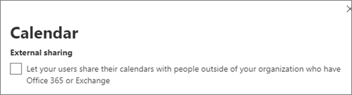

# Aumentar la protección contra amenazas para Microsoft 365 suscripciónIncrease threat protection for Microsoft 365 subscription

Este artículo le ayuda a aumentar la protección en su suscripción Microsoft 365 para proteger contra suplantación de identidad (phishing), malware y otras amenazas.This article helps you increase the protection in your Microsoft 365 subscription to protect against phishing, malware, and other threats. Estas recomendaciones son apropiadas para organizaciones con una mayor necesidad de seguridad, como campañas políticas, oficinas de abogados y clínicas de atención médica.These recommendations are appropriate for organizations with an increased need for security, like political campaigns, law offices, and health care clinics.

Antes de empezar, compruebe la puntuación segura de Microsoft.Before you begin, check your Microsoft Secure Score. Puntuación segura de Microsoft analiza la seguridad de la organización en función de las actividades regulares y la configuración de seguridad y asigna una puntuación.Microsoft Secure Score analyzes your organization's security based on your regular activities and security settings and assigns a score. Comience tomando nota de la puntuación actual.Begin by taking note of your current score. Tomar las acciones recomendadas en este artículo aumenta la puntuación.Taking the actions recommended in this article increases your score. El objetivo no es lograr la puntuación máxima, sino tener en cuenta las oportunidades para proteger el entorno que no afectan negativamente a la productividad de los usuarios.The goal isn't to achieve the max score, but to be aware of opportunities to protect your environment that don't negatively affect productivity for your users.

Para obtener más información, vea [Puntuación segura de Microsoft](../security/defender/microsoft-secure-score.md).For more information, see [Microsoft Secure Score](../security/defender/microsoft-secure-score.md).

## Aumentar el nivel de protección contra malware en el correoRaise the level of protection against malware in mail

El Office 365 o Microsoft 365 incluye protección contra malware, pero puede aumentar esta protección bloqueando los datos adjuntos con tipos de archivo que se usan habitualmente para malware.Your Office 365 or Microsoft 365 environment includes protection against malware, but you can increase this protection by blocking attachments with file types that are commonly used for malware. Para proteger contra malware en el correo electrónico:To bump up malware protection in email:

1. Ve a <https://protection.office.com> e inicia sesión con las credenciales de tu cuenta de administrador.Go to <https://protection.office.com> and sign in with your admin account credentials.

2. En el Centro de & cumplimiento, en el panel de navegación izquierdo, en **Administración** de amenazas, elija **Directiva** \> **antimalware**.In the Security & Compliance Center, in the left navigation pane, under **Threat management**, choose **Policy** \> **Anti-Malware**.

3. Haga doble clic en la directiva predeterminada para editar esta directiva en toda la empresa.Double-click the default policy to edit this company-wide policy.

4. Haga clic en **Configuración**.Click **Settings**.

5. En **Filtro de tipos de datos adjuntos** comunes, seleccione **En**.Under **Common Attachment Types Filter**, select **On**. Los tipos de archivo bloqueados se enumeran en la ventana directamente debajo de este control.The file types that are blocked are listed in the window directly below this control. Asegúrese de agregar estos tipos de archivo:Make sure you add these filetypes:

   `ade, adp, ani, bas, bat, chm, cmd, com, cpl, crt, hlp, ht, hta, inf, ins, isp, job, js, jse, lnk, mda, mdb, mde, mdz, msc, msi, msp, mst, pcd, reg, scr, sct, shs, url, vb, vbe, vbs, wsc, wsf, wsh, exe, pif`

   Puede agregar o eliminar tipos de archivo más adelante, si es necesario.You can add or delete file types later, if needed.

6. Haga clic en **Guardar**.Click **Save.**

Para obtener más información, vea [Protección contra malware en EOP](../security/office-365-security/anti-malware-protection.md).For more information, see [Anti-malware protection in EOP](../security/office-365-security/anti-malware-protection.md).

## Protección contra ransomwareProtect against ransomware

Ransomware restringe el acceso a los datos mediante el cifrado de archivos o el bloqueo de pantallas del equipo.Ransomware restricts access to data by encrypting files or locking computer screens. A continuación, intenta extorsionar dinero a las víctimas pidiendo "rescate", normalmente en forma de criptodivisas como Bitcoin, a cambio de acceso a datos.It then attempts to extort money from victims by asking for "ransom," usually in the form of cryptocurrencies like Bitcoin, in exchange for access to data.

Puede proteger contra ransomware creando una o más reglas de flujo de correo para bloquear las extensiones de archivo que se usan habitualmente para ransomware (se agregaron en el aumento del nivel de protección contra [malware](#raise-the-level-of-protection-against-malware-in-mail) en el paso de correo) o para advertir a los usuarios que reciben estos datos adjuntos en el correo electrónico.You can protect against ransomware by creating one or more mail flow rules to block file extensions that are commonly used for ransomware (these were added in the [raise the level of protection against malware in mail](#raise-the-level-of-protection-against-malware-in-mail) step), or to warn users who receive these attachments in email.

Además de los archivos bloqueados en el paso anterior, también es una buena práctica crear una regla para advertir a los usuarios antes de abrir Office archivos adjuntos que incluyen macros.In addition to the files that you blocked in the previous step, it's also good practice to create a rule to warn users before opening Office file attachments that include macros. El ransomware se puede ocultar dentro de macros, por lo que advierte a los usuarios que no abran estos archivos de personas que no conocen.Ransomware can be hidden inside macros, so warn users to not open these files from people they don't know.

Para crear una regla de transporte de correo:To create a mail transport rule:

1. Vaya al Centro de administración en <https://admin.microsoft.com> y elija Centros de administración  \> **Exchange**.Go to the admin center at <https://admin.microsoft.com> and choose **Admin centers** \> **Exchange**.

2. En la categoría **flujo de** correo, haga clic en **reglas**.In the **mail flow** category, click **rules**.

3. Haga **+** clic en y, a **continuación, en Crear una nueva regla**.Click **+**, and then click **Create a new rule**.

4. Haga **clic en** Más opciones en la parte inferior del cuadro de diálogo para ver el conjunto completo de opciones.Click **More options** at the bottom of the dialog box to see the full set of options.

5. Aplique la configuración de la tabla siguiente para la regla.Apply the settings in the following table for the rule. Deje el resto de la configuración en el valor predeterminado, a menos que desee cambiarlos.Leave the rest of the settings at the default, unless you want to change them.

6. Haga clic en **Guardar**.Click **Save**.

|ConfiguraciónSetting|Advertir a los usuarios antes de abrir datos adjuntos Office archivosWarn users before opening attachments of Office files|
|---|---|
|NombreName|Regla anti ransomware: advertir a los usuariosAnti-ransomware rule: warn users|
|Aplique esta regla si .Apply this rule if . .. ..|Cualquier dato adjunto .Any attachment . .. .. extensión de archivo coincide con .file extension matches . .. ..|
|Especificar palabras o frasesSpecify words or phrases|Agregue estos tipos de archivo:Add these file types:   `dotm, docm, xlsm, sltm, xla, xlam, xll, pptm, potm, ppam, ppsm, sldm`|
|Haga lo siguiente.Do the following . .. ..|Notificar al destinatario con un mensajeNotify the recipient with a message|
|Proporcionar texto del mensajeProvide message text|No abra estos tipos de archivos de personas que no conoce porque pueden contener macros con código malintencionado.Do not open these types of files from people you do not know because they might contain macros with malicious code.|

Para obtener más información, vea:For more information, see:

- [Ransomware: cómo reducir el riesgoRansomware: how to reduce risk](https://www.microsoft.com/security/blog/2020/04/28/ransomware-groups-continue-to-target-healthcare-critical-services-heres-how-to-reduce-risk/)

- [Restaure el OneDriveRestore your OneDrive](https://support.microsoft.com//office/fa231298-759d-41cf-bcd0-25ac53eb8a15)

## Detener el reenvío automático para correo electrónicoStop auto-forwarding for email

Los hackers que obtienen acceso al buzón de un usuario pueden robar el correo estableciendo el buzón para reenviar automáticamente el correo electrónico.Hackers who gain access to a user's mailbox can steal your mail by setting the mailbox to automatically forward email. Esto puede ocurrir incluso sin el reconocimiento del usuario.This can happen even without the user's awareness. Puede evitar que esto suceda configurando una regla de flujo de correo.You can prevent this from happening by configuring a mail flow rule.

Para crear una regla de transporte de correo, vea [este breve vídeo](https://support.office.com/article/f9d693ba-5c78-47c0-b156-8e461e062aa7) o siga estos pasos:To create a mail transport rule, either watch [this short video](https://support.office.com/article/f9d693ba-5c78-47c0-b156-8e461e062aa7) or follow these steps:

1. En el Centro Microsoft 365 administración, haga clic en **Centros de administración** \> **Exchange**.In the Microsoft 365 admin center, click **Admin centers** \> **Exchange**.

2. En la categoría **flujo de** correo, haga clic en **reglas**.In the **mail flow** category, click **rules**.

3. Haga **+** clic en y, a **continuación, en Crear una nueva regla**.Click **+**, and then click **Create a new rule**.

4. Haga **clic en** Más opciones en la parte inferior del cuadro de diálogo para ver el conjunto completo de opciones.Click **More options** at the bottom of the dialog box to see the full set of options.

5. Aplique la configuración en la tabla siguiente.Apply the settings in the following table. Deje el resto de la configuración en el valor predeterminado, a menos que desee cambiarlos.Leave the rest of the settings at the default, unless you want to change them.

6. Haga clic en **Guardar**.Click **Save**.

|ConfiguraciónSetting|Advertir a los usuarios antes de abrir datos adjuntos Office archivosWarn users before opening attachments of Office files|
|---|---|
|NombreName|Impedir el reenvío automático de correo electrónico a dominios externosPrevent auto forwarding of email to external domains|
|Aplicar esta regla si ...Apply this rule if ...|El remitente .The sender . .. .. es externo/interno .is external/internal . .. .. Dentro de la organizaciónInside the organization|
|Agregar condiciónAdd condition|Las propiedades del mensaje .The message properties . .. .. incluir el tipo de mensaje .include the message type . .. .. Reenvío automáticoAuto-forward|
|Haga lo siguiente...Do the following ...|Bloquear el mensaje .Block the message . .. .. rechazar el mensaje e incluir una explicación.reject the message and include an explanation.|
|Proporcionar texto del mensajeProvide message text|El reenvío automático de correo electrónico fuera de esta organización se impide por motivos de seguridad.Auto-forwarding email outside this organization is prevented for security reasons.|

## Proteger el correo electrónico de ataques de suplantación de identidadProtect your email from phishing attacks

Si ha configurado uno o varios dominios personalizados para su entorno Office 365 o Microsoft 365, puede configurar la protección contra suplantación de identidad dirigida.If you've configured one or more custom domains for your Office 365 or Microsoft 365 environment, you can configure targeted anti-phishing protection. La protección contra el phishing, que forma parte de Microsoft Defender para Office 365, puede ayudar a proteger su organización de ataques de suplantación de identidad malintencionados y otros ataques de suplantación de identidad.Anti-phishing protection, part of Microsoft Defender for Office 365, can help protect your organization from malicious impersonation-based phishing attacks and other phishing attacks. Si no ha configurado un dominio personalizado, no es necesario hacerlo.If you haven't configured a custom domain, you don't need to do this.

Se recomienda empezar a usar esta protección mediante la creación de una directiva para proteger a los usuarios más importantes y al dominio personalizado.We recommend that you get started with this protection by creating a policy to protect your most important users and your custom domain.

Para crear una directiva contra la suplantación de identidad en Defender para Office 365, vea este breve [vídeo](https://support.office.com/article/86c425e1-1686-430a-9151-f7176cce4f2c)de aprendizaje o siga estos pasos:To create an anti-phishing policy in Defender for Office 365, watch [this short training video](https://support.office.com/article/86c425e1-1686-430a-9151-f7176cce4f2c), or complete the following steps:

1. Vaya a <https://protection.office.com>.Go to <https://protection.office.com>.

2. En el Centro de & cumplimiento, en el panel de navegación izquierdo, en **Administración de amenazas,** elija **Directiva**.In the Security & Compliance Center, in the left navigation pane, under **Threat management**, choose **Policy**.

3. En la **página Directiva,** elija **Anti-phishing**.On the **Policy** page, choose **Anti-phishing**.

4. En la **página Anti-phishing,** seleccione **+ Crear**.On the **Anti-phishing** page, select **+ Create**. Se inicia un asistente que le permite definir la directiva contra suplantación de identidad.A wizard launches that steps you through defining your anti-phishing policy.

5. Especifique el nombre, la descripción y la configuración de la directiva como se recomienda en el siguiente gráfico.Specify the name, description, and settings for your policy as recommended in the chart below. Para obtener más información, vea [Learn about anti-phishing policy in Microsoft Defender for Office 365 options](../security/office-365-security/set-up-anti-phishing-policies.md).For more information, see [Learn about anti-phishing policy in Microsoft Defender for Office 365 options](../security/office-365-security/set-up-anti-phishing-policies.md).

6. Después de revisar la configuración, elija **Crear esta directiva** o **Guardar**, según corresponda.After you've reviewed your settings, choose **Create this policy** or **Save**, as appropriate.

|Configuración u opciónSetting or option|Valor recomendadoRecommended setting|
|---|---|
|NombreName|Dominio y personal más valiosoDomain and most valuable staff|
|DescripciónDescription|Asegúrese de que el personal más importante y nuestro dominio no se suplanten.Ensure most important staff and our domain are not being impersonated.|
|Agregar usuarios que protegerAdd users to protect|Seleccione **+ Agregar una condición, El destinatario es**.Select **+ Add a condition, The recipient is**. Escriba nombres de usuario o escriba la dirección de correo electrónico de los propietarios, socios o candidatos, administradores y otros miembros importantes del personal.Type user names or enter the email address of the business owners, partners, or candidate, managers, and other important staff members. Puede agregar hasta 20 direcciones internas y externas que desea proteger de la suplantación.You can add up to 20 internal and external addresses that you want to protect from impersonation.|
|Agregar dominios que protegerAdd domains to protect|Seleccione **+ Agregar una condición, El dominio de destinatario es**.Select **+ Add a condition, The recipient domain is**. Escriba el dominio personalizado asociado con su Microsoft 365 suscripción, si ha definido uno.Enter the custom domain associated with your Microsoft 365 subscription, if you defined one. Puede escribir más de un dominio.You can enter more than one domain.|
|Elegir accionesChoose actions|Si un usuario suplantado envía correo electrónico: elija Redirigir mensaje a otra dirección de correo electrónico y, a continuación, escriba la dirección de correo electrónico del administrador de seguridad; por ejemplo, *Alice   @contoso.com*.If email is sent by an impersonated user: Choose **Redirect message to another email address**, and then type the email address of the security administrator; for example, *Alice@contoso.com*.   Si el correo electrónico lo envía un dominio suplantado: elija **Mensaje en cuarentena**.If email is sent by an impersonated domain: Choose **Quarantine message**.|
|Inteligencia de buzonesMailbox intelligence|De forma predeterminada, se selecciona inteligencia de buzones al crear una directiva contra suplantación de identidad (anti-phishing).By default, mailbox intelligence is selected when you create a new anti-phishing policy. Deje esta configuración **activada** para obtener mejores resultados.Leave this setting **On** for best results.|
|Agregar dominios y remitentes de confianzaAdd trusted senders and domains|Aquí puede agregar su propio dominio o cualquier otro dominio de confianza.Here you can add your own domain, or any other trusted domains.|
|Aplicado aApplied to|Seleccione **El dominio del destinatario es**.Select **The recipient domain is**. En **Cualquiera de estos**, seleccione **Elegir**.Under **Any of these**, select **Choose**. Seleccione **+ Agregar**.Select **+ Add**. Active la casilla situada junto al nombre del dominio, por ejemplo, *contoso.   com*, en la lista y, a continuación, **seleccione Agregar**.Select the check box next to the name of the domain, for example, *contoso.com*, in the list, and then select **Add**. Seleccione **Listo**.Select **Done**.|

Para obtener más información, vea [Set up anti-phishing policies in Defender for Office 365](../security/office-365-security/set-up-anti-phishing-policies.md).For more information, see [Set up anti-phishing policies in Defender for Office 365](../security/office-365-security/set-up-anti-phishing-policies.md).

## Proteger contra datos adjuntos, archivos y vínculos malintencionados con Defender para Office 365Protect against malicious attachments, files, and links with Defender for Office 365

En primer lugar, asegúrese de que en el Centro de administración en el que tiene activada la nueva vista <https://admin.microsoft.com> previa del centro de administración.First, make sure, in the admin center at <https://admin.microsoft.com> that you have the new admin center preview turned on. Activa la alternancia junto al texto **El nuevo centro de administración**.Turn on the toggle next to the text **The new admin center**.

   

Si aún no ve  la página Configuración con tarjetas en el espacio empresarial, consulte cómo completar estos pasos en el Centro de seguridad & cumplimiento.If you don't see the **Setup** page with cards in your tenant yet, see how to complete these steps in Security & Compliance Center. Consulte [Configurar Caja fuerte datos](#set-up-safe-attachments-in-the-security--compliance-center) adjuntos en el Centro de seguridad & cumplimiento y Configurar vínculos de Caja fuerte en el Centro de seguridad & [cumplimiento](#set-up-safe-links-in-the-security--compliance-center).See [Set up Safe Attachments in the Security & Compliance Center](#set-up-safe-attachments-in-the-security--compliance-center) and [Set up Safe Links in the Security & Compliance Center](#set-up-safe-links-in-the-security--compliance-center).

1. En el panel de navegación izquierdo, elija **Configurar**.In the left nav, choose **Setup**.
2. En la **página Configuración,** elija **Ver en** la tarjeta Aumentar la protección **contra amenazas** avanzadas.On the **Setup** page, choose **View** on the **Increase protection from advanced threats** card.

   

3. En la **página Aumentar la protección contra amenazas avanzadas,** elija **Introducción.**On the **Increase protection from advanced threats** page, choose **Get started**.
4. En el panel que se abre, active las casillas situadas junto a Vínculos y datos adjuntos en el correo **electrónico,** Examinar archivos en **SharePoint, OneDrive** y Teams Office y Examinar vínculos en aplicaciones de escritorio y **Office Online** en Examinar elementos para buscar contenido **malintencionado.**On the pane that opens, select the check boxes next to **Links and attachments in email**, **Scan files in SharePoint, OneDrive, and Teams**, and **Scan links in Office desktop and Office Online apps** under **Scan items for malicious content**.

   En **Vínculos y datos adjuntos en el correo** electrónico , Escriba todos los usuarios o los usuarios específicos cuyo correo electrónico desee examinar.Under **Links and attachments in email**, Type in All Users, or the specific users whose email you want scanned.

   

5. Elija **Crear directivas** para activar Caja fuerte datos adjuntos y Caja fuerte vínculos.Choose **Create policies** to turn on Safe Attachments and Safe Links.

### Configurar datos Caja fuerte datos adjuntos en el Centro de seguridad & cumplimientoSet up Safe Attachments in the Security & Compliance Center

Las personas envían, reciben y comparten datos adjuntos con regularidad, como documentos, presentaciones, hojas de cálculo y mucho más.People regularly send, receive, and share attachments, such as documents, presentations, spreadsheets, and more. No siempre es fácil saber si los datos adjuntos son seguros o malintencionados con solo mirar un mensaje de correo electrónico.It's not always easy to tell whether an attachment is safe or malicious just by looking at an email message. Microsoft Defender para Office 365 incluye Caja fuerte de datos adjuntos, pero esta protección no está activada de forma predeterminada.Microsoft Defender for Office 365 includes Safe Attachment protection, but this protection is not turned on by default. Se recomienda crear una nueva regla para empezar a usar esta protección.We recommend that you create a new rule to begin using this protection. Esta protección se extiende a los archivos de SharePoint, OneDrive y Microsoft Teams.This protection extends to files in SharePoint, OneDrive, and Microsoft Teams.

Para crear una directiva Caja fuerte datos adjuntos, vea [este breve vídeo](https://support.office.com/article/e7e68934-23dc-4b9c-b714-e82e27a8f8a5)o complete los pasos siguientes:To create an Safe Attachment policy, either watch [this short video](https://support.office.com/article/e7e68934-23dc-4b9c-b714-e82e27a8f8a5), or complete the following steps:

1. Ve a <https://protection.office.com> e inicia sesión con tu cuenta de administrador.Go to <https://protection.office.com> and sign in with your admin account.

2. En el Centro de & cumplimiento, en el panel de navegación izquierdo, en **Administración de amenazas,** elija **Directiva**.In the Security & Compliance Center, in the left navigation pane, under **Threat management**, choose **Policy**.

3. En la página Directiva, elija **Caja fuerte datos adjuntos**.On the Policy page, choose **Safe Attachments**.

4. En la página Caja fuerte datos adjuntos, aplique esta protección de forma general activando la casilla Activar ATP para **SharePoint,** OneDrive y Microsoft Teams protección.On the Safe attachments page, apply this protection broadly by selecting the **Turn on ATP for SharePoint, OneDrive, and Microsoft Teams** check box.

5. Seleccione **+** esta opción para crear una nueva directiva.Select **+** to create a new policy.

6. Aplique la configuración en la tabla siguiente.Apply the settings in the following table.

7. Después de revisar la configuración, elija **Crear esta directiva** o **Guardar**, según corresponda.After you review your settings, choose **Create this policy** or **Save**, as appropriate.

|Configuración u opciónSetting or option|Valor recomendadoRecommended setting|
|---|---|
|NombreName|Bloquear los correos electrónicos actuales y futuros con malware detectado.Block current and future emails with detected malware.|
|DescripciónDescription|Bloquear correos electrónicos y datos adjuntos actuales y futuros con malware detectado.Block current and future emails and attachments with detected malware.|
|Guardar datos adjuntos respuesta de malware desconocidoSave attachments unknown malware response|Seleccione **Bloquear: bloquee los correos electrónicos y** los datos adjuntos actuales y futuros con malware detectado.Select **Block - Block the current and future emails and attachments with detected malware**.|
|Redirigir datos adjuntos al detectarRedirect attachment on detection|Habilitar redirección (seleccione este cuadro)Enable redirection (select this box)   Escriba la cuenta de administrador o una configuración de buzón para la cuarentena.Enter the admin account or a mailbox setup for quarantine.   Aplica la selección anterior si el examen de malware para datos adjuntos se encuentra en tiempo de espera o si se produce un error (selecciona este cuadro).Apply the above selection if malware scanning for attachments times out or error occurs (select this box).|
|Aplicado aApplied to|El dominio de destinatario es .The recipient domain is . .. .. seleccione el dominio.select your domain.|

Para obtener más información, vea [Set up anti-phishing policies in Defender for Office 365](../security/office-365-security/set-up-anti-phishing-policies.md).For more information, see [Set up anti-phishing policies in Defender for Office 365](../security/office-365-security/set-up-anti-phishing-policies.md).

### Configurar vínculos Caja fuerte en el Centro de seguridad & cumplimientoSet up Safe Links in the Security & Compliance Center

Los hackers a veces ocultan sitios web malintencionados en vínculos de correo electrónico u otros archivos.Hackers sometimes hide malicious websites in links in email or other files. Caja fuerte Los vínculos, que forman parte de Microsoft Defender para Office 365, pueden ayudar a proteger su organización proporcionando la comprobación con tiempo de clic de direcciones web (URL) en mensajes de correo electrónico y documentos Office usuario.Safe Links, part of Microsoft Defender for Office 365, can help protect your organization by providing time-of-click verification of web addresses (URLs) in email messages and Office documents. La protección se define a través de Caja fuerte de vínculos.Protection is defined through Safe Links policies.

Se recomienda hacer lo siguiente:We recommend that you do the following:

- Modifique la directiva predeterminada para aumentar la protección.Modify the default policy to increase protection.

- Agregue una nueva directiva dirigida a todos los destinatarios de su dominio.Add a new policy targeted to all recipients in your domain.

Para configurar vínculos Caja fuerte, vea [este breve vídeo](https://support.office.com/article/61492713-53c2-47da-a6e7-fa97479e97fa)de aprendizaje o siga estos pasos:To set up Safe Links, watch [this short training video](https://support.office.com/article/61492713-53c2-47da-a6e7-fa97479e97fa), or complete the following steps:

1. Ve a <https://protection.office.com> e inicia sesión con tu cuenta de administrador.Go to <https://protection.office.com> and sign in with your admin account.

2. En el Centro de & cumplimiento, en el panel de navegación izquierdo, en **Administración de amenazas,** elija **Directiva**.In the Security & Compliance Center, in the left navigation pane, under **Threat management**, choose **Policy**.

3. En la página Directiva, elija **Caja fuerte Vínculos**.On the Policy page, choose **Safe Links**.

Para modificar la directiva predeterminada:To modify the default policy:

1. En la página Caja fuerte, en Directivas que **se aplican a** toda la organización, seleccione la **directiva** predeterminada.On the Safe links page, under **Policies that apply to the entire organization**, select the **Default** policy.

2. En **Configuración que se aplican** al contenido excepto el correo electrónico, seleccione **Aplicaciones Microsoft 365 para empresas, Office para iOS y Android**.Under **Settings that apply to content except email**, select **Microsoft 365 Apps for enterprise, Office for iOS and Android**.

3. Haga clic en **Guardar**.Click **Save**.

Para crear una nueva directiva dirigida a todos los destinatarios de su dominio:To create a new policy targeted to all recipients in your domain:

1. En la página Caja fuerte, en Directivas que se **aplican** a toda la organización, haga clic para crear una **+** nueva directiva.On the Safe links page, under **Policies that apply to the entire organization**, click **+** to create a new policy.

2. Aplique la configuración que se muestra en la tabla siguiente.Apply the settings listed in the following table.

3. Haga clic en **Guardar**.Click **Save**.

|Configuración u opciónSetting or option|Valor recomendadoRecommended setting|
|---|---|
|NombreName|Caja fuerte de vínculos para todos los destinatarios del dominioSafe links policy for all recipients in the domain|
|Seleccionar la acción para direcciones URL potencialmente malintencionadas desconocidas en los mensajesSelect the action for unknown potentially malicious URLs in messages|Seleccionar Activado: las direcciones URL se reescribirán y comprobarán en una lista de **vínculos malintencionados** conocidos cuando el usuario haga clic en el vínculo .Select **On - URLs will be rewritten and checked against a list of known malicious links when user clicks on the link**.|
|Usar Caja fuerte datos adjuntos para examinar el contenido descargableUse Safe Attachments to scan downloadable content|Seleccione este cuadro.Select this box.|
|Aplicado aApplied to|El dominio de destinatario es .The recipient domain is . .. .. seleccione el dominio.select your domain.|

Para obtener más información, [vea Caja fuerte Links in Defender for Office 365](../security/office-365-security/safe-links.md).For more information, see [Safe Links in Defender for Office 365](../security/office-365-security/safe-links.md).

## Activar el registro de auditoría unificadoTurn on the Unified Audit Log

Después de activar la búsqueda del registro de auditoría en el Centro de seguridad & cumplimiento, puede conservar el administrador y otra actividad de usuario en el registro y buscarlo.After you turn on the audit log search in the Security & Compliance Center, you can retain the admin and other user activity in the log and search it.

Debe tener asignado el rol Registros de auditoría en Exchange Online activar o desactivar la búsqueda del registro de auditoría en su suscripción Microsoft 365 auditoría.You must be assigned the Audit Logs role in Exchange Online to turn audit log search on or off in your Microsoft 365 subscription. De forma predeterminada, este rol se asigna a los grupos de roles Administración de cumplimiento y Administración de la organización en la página Permisos del centro Exchange administración.By default, this role is assigned to the Compliance Management and Organization Management role groups on the Permissions page in the Exchange admin center. Los administradores globales de Microsoft 365 son miembros de este grupo de forma predeterminada.Global admins in Microsoft 365 are members of this group by default.

1. Para activar la búsqueda del registro de auditoría, vaya al Centro de administración en y, a continuación, elija Seguridad en Centros de <https://admin.microsoft.com> **administración** en la navegación izquierda. To turn on the audit log search, go to the admin center at <https://admin.microsoft.com> and then choose **Security** under **Admin centers** in the left nav.
2. En la **página Microsoft 365 Seguridad,** elija **Más** recursos y, a continuación, Abra en la tarjeta Office 365 seguridad & **centro de cumplimiento.** On the **Microsoft 365 Security** page, choose **More resources**, and then **Open** on the **Office 365 Security & Compliance Center** card.

    
3. En la página seguridad y cumplimiento, elija **Buscar** y, a continuación, **Auditar búsqueda de registro**.On the security and compliance page, choose **Search** and then **Audit log search**.
4. En la parte superior de la página **Búsqueda del registro de auditoría,** elija Activar **auditoría.**On the top of the **Audit log search** page, choose **Turn on auditing**.

Una vez activada la característica, puede buscar archivos, carpetas y muchas actividades.After the feature is turned on, you can search for files, folders, and many activities. Para obtener más información, [vea search the audit log](../compliance/search-the-audit-log-in-security-and-compliance.md).For more information, see [search the audit log](../compliance/search-the-audit-log-in-security-and-compliance.md).

## Configurar la configuración de uso compartido anónimo para SharePoint y OneDrive archivos y carpetasTune-up anonymous sharing settings for SharePoint and OneDrive files and folders

(Cambie la expiración predeterminada del vínculo anónimo a 14 días, cambie el tipo de uso compartido predeterminado a "Personas específicas") Para cambiar la configuración de uso compartido de OneDrive y SharePoint:(change default anonymous link expiration to 14 days, change default sharing type to "Specific People") To change the sharing settings for OneDrive and SharePoint:

1. Vaya al Centro de administración en y, a <https://admin.microsoft.com> continuación, elija **SharePoint** en Centros **de administración** en la navegación izquierda.Go to the admin center at <https://admin.microsoft.com> and then choose **SharePoint** under **Admin centers** in the left nav.
2. En el centro SharePoint administración, vaya a **Directivas** \> **compartidas**.In the SharePoint admin center, go to **Policies** \> **Sharing**.
3. En  la página Uso compartido, en Vínculos de archivos y carpetas, seleccione Personas específicas y, en Configuración avanzada para vínculos **"Cualquiera",** seleccione Estos vínculos deben expirar en estos muchos días y escriba en 14 (u otro número de días a los que desee restringir la duración del vínculo). On the **Sharing** page, under **File and folder links**, select **Specific people**, and under **Advanced settings for "Anyone" links**, select **These links must expire within this many days**, and type in 14 (or another number of days you want to restrict the link lifetime to).

   

## Alertas de actividadActivity alerts

Puede usar alertas de actividad para realizar un seguimiento de las actividades de administrador y de usuario y detectar incidentes de prevención de pérdida de datos y malware en su organización.You can use activity alerts to track admin and user activities and detect malware and data loss prevention incidents in your organization. La suscripción incluye un conjunto de directivas predeterminadas, pero también puede crear directivas personalizadas.Your subscription includes a set of default policies, but you can also create custom ones. Para obtener más información, vea [directivas de alertas](../compliance/alert-policies.md).For more information, see [alert policies](../compliance/alert-policies.md). Por ejemplo, si almacena un archivo importante en SharePoint que no desea que nadie comparta externamente, puede crear una notificación que le avisa si alguien lo comparte.For example, if you store an important file in SharePoint that you don't want anyone to share externally, you can create a notification that alerts you if someone does share it.

En la siguiente figura se muestran las directivas predeterminadas que se incluyen con Microsoft 365.The following figure shows the default policies that are included with Microsoft 365.

## Deshabilitar o administrar el uso compartido de calendariosDisable or manage calendar sharing

Puede impedir que los usuarios de su organización compartan sus calendarios o también puede administrar lo que pueden compartir.You can prevent people in your organization from sharing their calendars, or you can also manage what they can share. Por ejemplo, puede restringir el uso compartido solo a horas de disponibilidad.For example, you can restrict the sharing to free/busy times only.

1. Vaya al Centro de administración en <https://admin.microsoft.com> y **elija Configuración** \> **Org Configuración**.Go to the admin center at <https://admin.microsoft.com> and choose **Settings** \> **Org Settings**.
2. En **la** página Servicios, elija **Calendario** y elija si las personas de su organización pueden compartir sus calendarios con personas externas que tienen Office 365 o Exchange, o con alguien.On the **Services** page, choose **Calendar**, and choose whether people in your organization can share their calendars with people outside who have Office 365 or Exchange, or with anyone.

   Si elige la opción compartir con cualquiera, también puede decidir compartir solo la información de disponibilidad.If you choose the share with anyone option, you can decide to also only share free/busy information.

3. Elija **Guardar cambios** en la parte inferior de la página.Choose **Save changes** on the bottom of the page.

   En la siguiente figura se muestra el uso compartido de calendarios no permitido.The following figure shows calendar sharing not allowed.

   

   En la siguiente figura se muestra la configuración cuando se permite el uso compartido de calendarios con un vínculo de correo electrónico con solo información de disponibilidad.The following figure shows the settings when calendar sharing is allowed with an email link with only free/busy information.

   

Si los usuarios pueden compartir sus  calendarios, consulte estas instrucciones sobre cómo compartir desde Outlook en la web.If your users are allowed to share their calendars, see [these instructions](https://support.office.com/article/7ecef8ae-139c-40d9-bae2-a23977ee58d5) for how to share from Outlook on the web.
