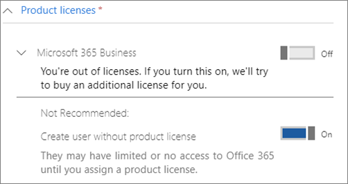

# Proteger las cuentas de administrador

Dado que las cuentas de administrador vienen con privilegios elevados, son objetivos valiosos para los hackers y los ciberdelincuentes. Este artículo describe:

- Cómo configurar una cuenta de administrador adicional para emergencias.
- Cómo proteger estas cuentas.

Cuando te registras en Microsoft 365 y escribes tu información, automáticamente te conviertes en el administrador global. Un administrador global tiene el control final de las cuentas de usuario y todas las demás configuraciones del Centro de administración de Microsoft, pero hay muchos tipos diferentes de cuentas de administrador con distintos grados de acceso. Consulta [sobre los roles de administrador](/office365/admin/add-users/about-admin-roles) para obtener información sobre los diferentes niveles de acceso para cada tipo de rol de administrador.

## Crear cuentas de administrador adicionales

Use cuentas de administrador solo para la administración. Los administradores deben tener una cuenta de usuario independiente para el uso regular de aplicaciones de Office y usar solo su cuenta administrativa cuando sea necesario para administrar cuentas y dispositivos, y mientras trabajan en otras funciones de administración. También es buena idea quitar la licencia de Microsoft 365 de las cuentas de administrador para que no tenga que pagar por ellas.

Querrá configurar al menos una cuenta de administrador global adicional para dar acceso de administrador a otro empleado de confianza. También puede crear cuentas de administrador independientes para la administración de usuarios (este rol se denomina **Administrador de administración de usuarios**). Para obtener más información, vea [acerca de los roles de administrador](/office365/admin/add-users/about-admin-roles).

Para crear cuentas de administrador adicionales:

 1. Vaya al Centro <a href="https://go.microsoft.com/fwlink/p/?linkid=837890" target="_blank">de administración y,</a> a continuación, **elija Usuarios** \> **usuarios activos** en la navegación izquierda.

    

 2. En la **página Usuarios activos,** seleccione Agregar **un** usuario en la parte superior de la página y, en el **panel** Nuevo usuario, escriba el nombre y otra información.
 3. Expanda la **sección Roles** y elija **Administrador global** para proporcionar a este usuario acceso de administrador global. También puede elegir Administrador **personalizado y** elegir cualquiera de los roles que se muestran.

    Escriba un correo electrónico alternativo en el **cuadro de texto Dirección de correo** electrónico alternativa. Puede usar esta dirección para recuperar la información de contraseña si se bloquea. Para los administradores globales, también se enviará una declaración de facturación a esta dirección.

    

 4. En la **sección Licencias de productos,** mueva el selector de **Microsoft 365 Empresa** a **Desactivado** y **crear** usuario sin licencia de producto a **On**.

    

## Crear una cuenta de administrador de emergencia

También debe crear una cuenta de copia de seguridad que no esté configurada con la autenticación multifactor (MFA) para que no se bloquee accidentalmente (por ejemplo, si pierde el teléfono que está usando como segunda forma de comprobación). Asegúrese de que la contraseña de esta cuenta es una frase o al menos 16 caracteres de longitud. Esto se conoce a menudo como una "cuenta de cristal de interrupción".

## Crear una cuenta de usuario por ti mismo

Use su cuenta de usuario para participar en la colaboración con su organización, incluida la comprobación del correo. Esto significa que sus credenciales de administrador pueden ser similares a  *Alice.Chávez  @Contoso.org* y su cuenta de usuario normal puede ser similar a *Alice  @Contoso.com*.

Para crear una nueva cuenta de usuario:

1. Vaya al Centro <a href="https://go.microsoft.com/fwlink/p/?linkid=837890" target="_blank">de administración y,</a> a continuación, **elija Usuarios** \> **usuarios activos** en la navegación izquierda.
2. En la **página Usuarios activos,** seleccione Agregar **un** usuario en la parte superior de la página y, en el **panel** Nuevo usuario, escriba el nombre y otra información.
3. Expanda la **sección Roles** y elija **Usuario (sin acceso administrativo).**
4. En la **sección Licencias de productos,** mueva el selector de **Microsoft 365 Empresa** a **On**.

## Registrar cada una de estas cuentas para la autenticación multifactor

Asegúrese de que estas cuentas usan la [autenticación multifactor](m365-campaigns-multifactor-authenication.md).

## Recomendaciones adicionales

- Asegúrese de que las cuentas de administrador también están configuradas para la autenticación multifactor. Le mostraremos cómo hacerlo en Configurar [directivas de acceso condicional.](m365-campaigns-conditional-access.md)
- Antes de usar cuentas de administrador, cierre todas las aplicaciones y sesiones de explorador no relacionadas, incluidas las cuentas de correo electrónico personales. También puedes usar en ventanas de explorador privadas o de incógnito.
- Después de completar las tareas de administración, asegúrese de cerrar la sesión del explorador.