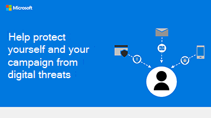

# Infografía: ayudar a protegerse a sí mismo y a su campaña contra amenazas digitalesInfographic: Help protect yourself and your campaign from digital threats

Los siguientes vínculos para PowerPoint y PDF se pueden descargar e imprimir en formato tabloide (también conocido como ledger, 11 x 17 o A3).The following links for PowerPoint and PDF can be downloaded and printed in tabloid format (also known as ledger, 11 x 17, or A3).

[PDF](downloads/M365CampaignsWhatCanUsersDoToSecure.pdf)  |  [PowerPoint](https://github.com/MicrosoftDocs/microsoft-365-docs-pr/raw/live/m365-democracy/microsoft-365/campaigns/downloads/M365CampaignsWhatCanUsersDoToSecure.pptx)[PDF](downloads/M365CampaignsWhatCanUsersDoToSecure.pdf) | [PowerPoint](https://github.com/MicrosoftDocs/microsoft-365-docs-pr/raw/live/m365-democracy/microsoft-365/campaigns/downloads/M365CampaignsWhatCanUsersDoToSecure.pptx)
