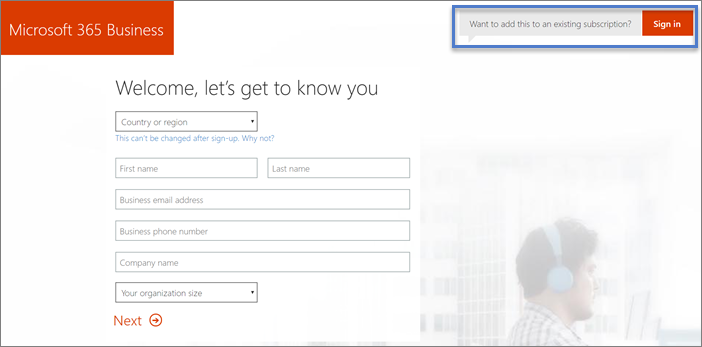

# Inscríbase en Microsoft 365 para las campañas 

Esta es la manera de completar el registro de Microsoft 365 para las campañas.

## Antes de empezar: 
- Obtenga su invitación a Microsoft 365 para las campañas completando los pasos descritos en [Get Microsoft 365 for Campaigns](get-microsoft-365-campaigns.md#get-microsoft-365-for-campaigns). 
- Abra su invitación por correo electrónico desde Microsoft. La invitación tiene un vínculo de suscripción único para la organización. Necesita esto para obtener precios especiales de las campañas.
- Prepare su tarjeta de crédito y un teléfono para su empresa. 

    > [!TIP]
    > El vínculo de registro es único en la campaña. Solo funciona una vez, por lo que debe asegurarse de que dispone de tiempo suficiente para completar el registro. Necesita aproximadamente diez minutos. 

## Pasos para registrarse

1. En su invitación a Microsoft 365 para el correo electrónico de las campañas, seleccione **inscribir su organización >**. Esto le llevará al registro de 365 de Microsoft.
    > [!NOTE]
    > Si ya tiene una suscripción a Microsoft 365 para empresas y desea agregar la oferta de Microsoft 365 para las campañas, vaya a [Agregar microsoft 365 para las campañas a una suscripción existente](#steps-to-add-microsoft-365-for-campaigns-to-an-existing-subscription).
1. **En la página Microsoft 365 Business**, escriba los detalles de su empresa. Para la **dirección de correo electrónico comercial**, use una dirección de correo electrónico actual. Solo necesitamos esta dirección para estar en contacto con usted durante el proceso de instalación. Seleccione **Siguiente**.
1. **En la página crear su identificador de usuario**:
    1. En **nombre de usuario**, escriba el nombre o alias que desee para la dirección de correo electrónico. Por ejemplo, es posible que quiera que se lo sepa simplemente Alicia o Rob. En una campaña más grande, es posible que AliceC o AliceChavez sea más lógico.
    2. En **la compañía**, escriba el nombre de la campaña para la que trabaja. Por ejemplo, ContosoCampaign. Si ya tiene un dominio, use ese nombre aquí. 
    3. En **seleccionar un dominio**, seleccione **. onmicrosoft.com** por ahora. Podemos configurarlo con un dominio más adelante o ayudarle a conectar Microsoft 365 a un dominio que ya posee.
    4. Cree una contraseña y seleccione **crear mi cuenta**. 
    > [!NOTE]
    > Si la campaña o la fiesta no tienen un dominio y ha decidido el dominio que desea, puede comprar uno ahora seleccionándolo.

4. **Prueba. Estás. No. A. robot. Página**:
    1. Haga que el teléfono esté preparado y seleccione **texto me** (o **llámeme** si lo prefiere). A continuación, escribe tu número de teléfono. 
    2. Cuando seleccione **texto me**, le enviaremos un código de verificación. O le llamaremos con un código si selecciona **llamar a me**.
    3. Escriba el código de su mensaje de texto (o llame) y seleccione **siguiente**. Espere una breve espera. 
5. ¿Dónde va a **usar esta página**? escriba los detalles y el número de teléfono de la ubicación de trabajo principal de la campaña. Seleccione **Siguiente**.
6. **Cómo se ve esta página**:
    1. Compruebe que el costo por usuario sea $5,00. 
    2. Si solo desea definir a sí mismo para ahora, seleccione **siguiente**. 
    3. Opcional: agregue ahora algunas licencias adicionales cambiando el número en el campo de **usuario** . [El personal con el que trabaje puede tener asignadas licencias a Microsoft 365](../business/add-users-m365b.md?toc=/microsoft-365/campaigns/toc.json) en cualquier momento.
7. **¿Cómo quiere pagar? página**: seleccione **nueva tarjeta de crédito**, escriba los detalles de la tarjeta de crédito de la empresa y seleccione **realizar pedido**. Si lo prefiere, también es posible usar una cuenta bancaria.
8. **Esto puede tardar una página**: encontrará detalles sobre dónde iniciar sesión y su identificador de usuario. También enviaremos esta información a la dirección de correo electrónico que escribió en el paso 2 anterior.

Se han completado los pasos de registro. Si desea continuar con los pasos siguientes, seleccione iniciar la **configuración**o vuelva más tarde para finalizar los pasos. Cuando esté listo, compruebe el correo electrónico (del paso 2) para buscar el nombre de usuario y la contraseña para que pueda iniciar sesión la próxima vez. Estos se denominan credenciales de administrador global o administrador.

## Pasos para agregar Microsoft 365 para campañas a una suscripción existente

Si ya tiene y la suscripción existente a Microsoft 365 para empresas, por ejemplo, Microsoft 365 Business Standard, puede usar la oferta de Microsoft 365 para campañas para agregar licencias.
> [!IMPORTANT]
> No puede Agregar la oferta de Microsoft 365 para campañas a una cuenta de Microsoft 365 existente.

1. En su invitación a Microsoft 365 para el correo electrónico de las campañas, seleccione **inscribir su organización >**. Esto le llevará al registro de 365 de Microsoft.
2. En la **pantalla de bienvenida, vamos a conocer** la página, haga clic o pulse en ¿ **quiere agregarla a una suscripción existente? Inicie sesión**.
    
    
3. En la página de inicio de sesión, escriba el alias de administración de la suscripción existente, por ejemplo *Alice@VoteContoso  . org*, elija **siguiente**, escriba la contraseña y, a continuación, elija **iniciar sesión**.
4. En el **¿qué aspecto tiene?** escriba el número de usuarios que tiene y elija **siguiente**. No es necesario escribir un código de promoción porque ya está incluido en la dirección URL de la invitación.
5. En la página **¿cómo quiere pagar?** , escriba el método de pago y seleccione **realizar pedido**.

Una vez que haya completado estos pasos, estará listo para [asignar las licencias nuevas](../admin/manage/assign-licenses-to-users.md) al personal de la campaña.

## ¿Cuál es el siguiente paso?
- [Configure microsoft 365](../business/set-up.md?toc=/microsoft-365/campaigns/toc.json) para completar la configuración de Microsoft 365 para las campañas. 
- [Agregue usuarios](../business/add-users-m365b.md?toc=/microsoft-365/campaigns/toc.json) al plan. Incluya al candidato de la campaña, al personal de la campaña Senior y a todos los usuarios que tendrán acceso a información confidencial de la entidad o de la entidad.
- [Protección frente a golpes en la campaña](m365-campaigns-security-overview.md)