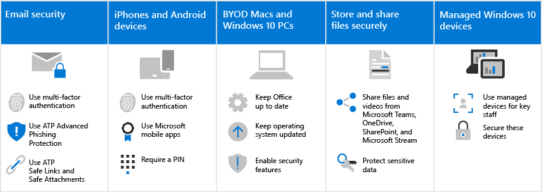

# Cómo afectan estas recomendaciones de seguridad a los usuarios

Las recomendaciones de seguridad para Microsoft 365 en esta solución hacen que sea mucho más difícil para los hackers obtener acceso a su entorno. El problema es que los usuarios tendrán que tener en cuenta cómo trabajar en este entorno más seguro. Sabemos que se necesita un poco más de paciencia, pero merece la pena mantener su organización protegida.

## Usar prácticas seguras de correo electrónico

Todos los usuarios deben conocer y usar estas prácticas de correo electrónico para ayudar a mantener su correo electrónico seguro:

- Configurar el correo electrónico para usar la autenticación multifactor con la aplicación autenticador.
- Compruebe los correos electrónicos legítimos y busque sugerencias de seguridad de suplantación de identidad avanzada en Defender para la Protección de Office 365.
- Abra solo vínculos seguros y datos adjuntos, tal como lo comprueban los vínculos seguros y los datos adjuntos seguros.

Obtenga más información [sobre la autenticación multifactor](m365-campaigns-multifactor-authenication.md) y [la suplantación de identidad y otros ataques.](m365-campaigns-phishing-and-attacks.md)

Descargue una [infografía](m365-campaigns-protect-campaign-infographic.md) con sugerencias para usted y los miembros de su equipo.

## Configurar dispositivos iPhone y Android

Todos los usuarios que agregue a su entorno tendrán que tardar unos minutos en configurar [dispositivos iPhone](../business/set-up-mobile-devices.md?toc=%2Fmicrosoft-365%2Fcampaigns%2Ftoc.json) y Android para que funcionen de forma segura:

- Configura dispositivos para usar la autenticación multifactor con la aplicación autenticador.
- Use aplicaciones móviles de Microsoft, como Outlook Mobile, Word, OneDrive y otras aplicaciones de Microsoft del almacén de aplicaciones. No se admiten las aplicaciones de correo nativas que se incluyen en dispositivos iPhone y Android. 
- Requerir un PIN para que los usuarios desbloqueen su dispositivo.

Después de configurar estos, se pedirá a los usuarios que usen la aplicación autenticador al acceder a los datos de su organización en estos dispositivos, incluido el correo.

## Mantener los equipos MAC BYOD y Windows 10 nuevos

También es importante que los usuarios mantengan actualizado su dispositivo de trabajo principal:

- Instale las versiones más recientes de las aplicaciones de escritorio de Office y mantén las actualizaciones actualizadas cuando se le solicite.
- Manténgase al tanto de las actualizaciones del sistema operativo, como las actualizaciones de Windows.

Para [dispositivos Windows 10 y Mac](m365-campaigns-protect-pcs-macs.md)no administrados, los usuarios tienen la responsabilidad de asegurarse de que las características de seguridad básicas están habilitadas.

**Habilitar las funcionalidades de seguridad básicas en dispositivos BYOD con Windows 10 y Mac**

| |**Windows 10**|**Mac**|
|:-----|:-----|:------|
|Capacidades de seguridad|Activar la protección de dispositivos BitLocker

 Asegurarse Windows Defender permanece en 
Activar Firewall de Windows| Usar FileVault para cifrar el disco Mac 

Usar un software antivirus confiable 
Activar la protección del firewall|

Para obtener más información sobre estas recomendaciones, vea Proteger su cuenta y dispositivos [de hackers y malware.](https://support.office.com/article/Protect-your-account-and-devices-from-hackers-and-malware-066d6216-a56b-4f90-9af3-b3a1e9a327d6#ID0EAABAAA=Windows_10)

## Colaborar con Microsoft Teams, OneDrive, SharePoint Online y otras herramientas

Es posible que los usuarios puedan tener la tentación de compartir y almacenar los archivos de su organización en lugares distintos de Microsoft 365. Microsoft 365 facilita la colaboración y el uso compartido de forma segura. Puede compartir [archivos y vídeos](share-files-and-videos.md) directamente desde Microsoft Teams, OneDrive, Stream e incluso desde dentro de un archivo. El uso compartido desde estas herramientas ayuda a evitar que los datos se filtre. Puede agregar protección adicional a los datos confidenciales para evitar el uso compartido fuera de la organización.

## Configurar dispositivos windows 10 administrados

Te recomendamos que los miembros del personal más importantes usen dispositivos Windows 10 adquiridos recientemente que administres. Te mostraremos cómo administrar y proteger [estos dispositivos.](../business/set-up-windows-devices.md?toc=/microsoft-365/campaigns/toc.json) Esto garantiza que los miembros del personal que son el objetivo de mayor valor para los hackers reciban la mayor protección.
