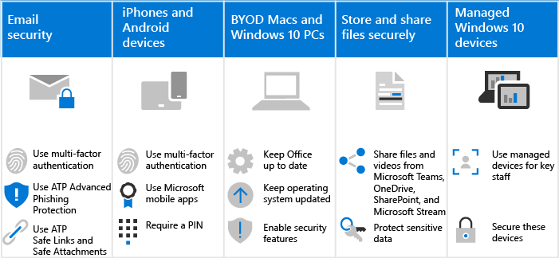

# Cómo Microsoft 365 para las campañas afecta a los usuarios

Microsoft 365 para las campañas dificulta que los hackers obtengan acceso a su entorno. El equilibrio es que los usuarios tendrán que saber cómo trabajar en este entorno más seguro. Sabemos que es necesario algo más de paciencia, pero merece la pena mantener la organización protegida.

## Usar prácticas de correo electrónico seguro
Todos los usuarios deben conocer y usar estos procedimientos de correo electrónico para ayudar a mantener seguro su correo electrónico:
- Configurar el correo electrónico para usar la autenticación multifactor con la aplicación autenticadora.
- Compruebe los mensajes de correo electrónico legítimos y busque sugerencias de seguridad de ATP avanzada protección contra phishing.
- Abra solo vínculos seguros y datos adjuntos, tal como lo ha comprobado los vínculos seguros de ATP y los datos adjuntos seguros de ATP.

Obtenga más información acerca de la [suplantación de identidad y otros ataques](m365-campaigns-phishing-and-attacks.md). 

Descargue una [infografía](m365-campaigns-protect-campaign-infographic.md) con sugerencias para usted y los miembros de su equipo de campaña.

## Configurar dispositivos iPhone y Android
Todos los usuarios que agregue a su entorno tardarán unos minutos en [configurar iPhones y dispositivos Android](../business/set-up-mobile-devices.md?toc=%2Fmicrosoft-365%2Fcampaigns%2Ftoc.json) para que funcionen correctamente:
- Configurar dispositivos para usar la autenticación multifactor con la aplicación autenticadora.
- Use aplicaciones móviles de Microsoft, como Outlook Mobile, Word, OneDrive y otras aplicaciones de Microsoft, desde la App Store. No se admiten las aplicaciones de correo nativo que se incluyen en iPhones y dispositivos Android. 
- Requerir un PIN para que los usuarios puedan desbloquear el dispositivo.

Una vez configuradas estas opciones, se les pedirá a los usuarios que usen la aplicación Authenticator cuando obtengan acceso a los datos de la organización en estos dispositivos, incluido el correo. 

## Mantener actualizados BYOD Mac y los equipos con Windows 10 
También es importante que los usuarios mantengan actualizado el dispositivo de trabajo principal:
- Instale las últimas versiones de las aplicaciones de escritorio de Office y manténgala actualizada con las actualizaciones, cuando se le solicite. 
- Manténgase al tanto de las actualizaciones del sistema operativo, como actualizaciones de Windows.

Para los [dispositivos Windows 10 y Mac no administrados](m365-campaigns-protect-pcs-macs.md), los usuarios tienen la responsabilidad de asegurarse de que las características de seguridad básicas están habilitadas.

**Habilitar las funciones de seguridad básicas en dispositivos Windows 10 y Mac de BYOD**

||||
|:-----|:-----|:------|
||**Windows 10**|**Mac**|
|Capacidades de seguridad|Activar la protección de dispositivos de BitLocker

 Asegurarse de que Windows Defender permanece en 
Activar Firewall de Windows| Usar FileVault para cifrar el disco Mac 

Usar un software antivirus fiable 
Activar la protección del firewall|

Para obtener más información sobre estas recomendaciones, consulte [proteger la cuenta y los dispositivos de hackers y malware](https://support.office.com/article/Protect-your-account-and-devices-from-hackers-and-malware-066d6216-a56b-4f90-9af3-b3a1e9a327d6#ID0EAABAAA=Windows_10).

## Colaborar con Microsoft Teams, OneDrive, SharePoint Online y otras herramientas de Office 365
Es posible que los usuarios estén tentados a compartir y almacenar los archivos de la organización en lugares distintos de Microsoft 365. Microsoft 365 hace que sea tan fácil como sea posible colaborar y compartir de forma segura. Puede [compartir archivos y vídeos](share-files-and-videos.md) directamente desde Microsoft Teams, OneDrive, stream e incluso desde dentro de un archivo. El uso compartido desde estas herramientas ayuda a evitar que los datos se encuentren en pérdidas. Puede agregar protección adicional a los datos confidenciales para evitar el uso compartido fuera de la organización. 

## Configurar dispositivos de Windows 10 administrados
Le recomendamos que los miembros del personal más importantes usen los dispositivos Windows 10 que haya adquirido recientemente y que administre. Le mostraremos cómo [administrar y proteger estos dispositivos](../business/set-up-windows-devices.md?toc=/microsoft-365/campaigns/toc.json). Esto garantiza que los miembros del personal que son el objetivo de valor más alto para los hackers reciban la mayor protección. 
