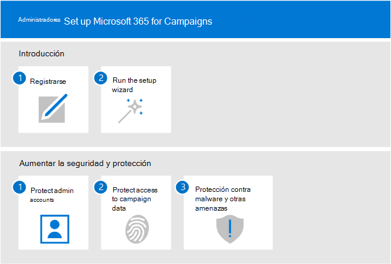
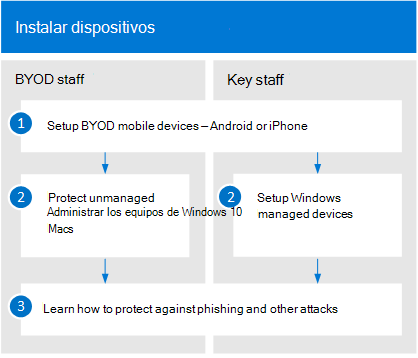

# Configurar Microsoft 365 para las campañas

En este artículo se describe el proceso de configuración de Microsoft 365 para las campañas. Cualquier persona con Microsoft 365 empresa puede usar esta guía para repasar la seguridad. 

## Administradores: configurar Microsoft 365 para campañas
El siguiente diagrama describe cómo los administradores configuran Microsoft 365 para las campañas.

Para las campañas que se cumplen para precios especiales, empiece [solicitando una invitación de Microsoft](https://m365forcampaigns.microsoft.com/)y, a continuación, Regístrese en [Microsoft 365 para las campañas](m365-campaigns-sign-up.md). Para completar la configuración, [ejecute el asistente](../business/set-up.md?toc=/microsoft-365/campaigns/toc.json) para la instalación y configure las opciones principales.

Para todas las demás organizaciones, una vez que se haya [registrado en Microsoft 365 Business](../business/sign-up.md), complete [la instalación ejecutando el Asistente de configuración](../business/set-up.md?toc=/microsoft-365/campaigns/toc.json) para configurar las opciones principales.

Para todas las organizaciones, desactive la protección de seguridad por: [protección de cuentas de administrador](m365-campaigns-protect-admin-accounts.md), protección del [acceso al correo y los datos](m365-campaigns-conditional-access.md)y aumento de la protección contra [amenazas](m365-campaigns-increase-protection.md).

 ## Todos: configurar los dispositivos 
 
Los usuarios tendrán que realizar unos minutos para configurar los dispositivos que funcionen con este entorno. Para los usuarios clave (los que son los objetivos de mayor valor para los hackers), puede configurar y preconfigurar nuevos dispositivos. Esto les ayuda a empezar a iniciar sesión con sus credenciales de 365 de Microsoft. 

  
Para configurar los dispositivos de usuario: 
1. Cada usuario [configura sus dispositivos móviles](../business/set-up-mobile-devices.md?toc=%2Fmicrosoft-365%2Fcampaigns%2Ftoc.json). 
2. Para los dispositivos no administrados, los usuarios configuran sus [PCS y Mac](m365-campaigns-protect-pcs-macs.md). Para el personal clave, le recomendamos que use los [dispositivos administrados](../business/set-up-windows-devices.md?toc=/microsoft-365/campaigns/toc.json) para una protección aún mejor. Para todos los dispositivos, querrá configurar la [autenticación multifactor](m365-campaigns-multifactor-authenication.md). 
3. Todos los usuarios deben saber cómo protegerse a sí mismos y a su campaña aprendiendo sobre [suplantaciones de identidad (phishing) y otros tipos de ataques](m365-campaigns-phishing-and-attacks.md). Este [infografía](m365-campaigns-protect-campaign-infographic.md) también puede ayudar a los usuarios a comprender cómo ayudar a proteger la campaña de las amenazas en línea.

## Contactar soporte

 **Si necesita ponerse en contacto con soporte técnico:**
  
Como administrador de Microsoft 365 Business, tiene acceso a nuestro equipo de atención al cliente, ** [póngase en contacto con el soporte técnico para productos empresariales: ayuda para administradores](https://support.office.com/article/32a17ca7-6fa0-4870-8a8d-e25ba4ccfd4b)**
    

