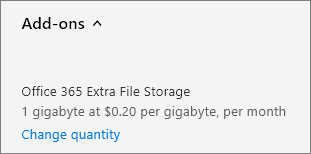

# Agregar espacio de almacenamiento para la suscripciónAdd storage space for your subscription

::: moniker range="o365-21vianet"

> [!NOTE]
> El Centro de administración está cambiando.The admin center is changing. Si su experiencia no coincide con los detalles presentados aquí, consulte [Acerca del nuevo Centro de administración de Microsoft 365](https://docs.microsoft.com/microsoft-365/admin/microsoft-365-admin-center-preview?view=o365-21vianet&preserve-view=true).If your experience doesn't match the details presented here, see [About the new Microsoft 365 admin center](https://docs.microsoft.com/microsoft-365/admin/microsoft-365-admin-center-preview?view=o365-21vianet&preserve-view=true).

::: moniker-end

Si empieza a quedarse sin espacio de almacenamiento en las colecciones de sitios de SharePoint Online, puede aumentar el almacenamiento de su suscripción si su plan cumple con los requisitos.If you start to run out of storage for your SharePoint Online site collections, you can add storage to your subscription if your plan is eligible. Si no ve el almacenamiento adicional de archivos de **Office 365** en la lista de complementos disponibles, significa que su plan no es apto.If you don't see the **Office 365 Extra File Storage** in the list of available add-ons, it means your plan is not eligible. Para obtener más información, vea [¿Mi plan es apto?](#is-my-plan-eligible-for-office-365-extra-file-storage)For more information, see [Is my plan eligible?](#is-my-plan-eligible-for-office-365-extra-file-storage)

> [!NOTE]
> Si compró la suscripción a través de licencias por volumen o un CSP, no puede comprar Office **365 Extra File Storage** para su organización directamente a Microsoft.If you bought your subscription through Volume Licensing or a CSP, you can't buy **Office 365 Extra File Storage** for your organization directly from Microsoft. Póngase en contacto con su representante o partner para obtener ayuda.Contact your representative or partner for help.

## Antes de empezarBefore you begin

Debe ser administrador global o de SharePoint para realizar las tareas de este artículo.You must be a Global or SharePoint admin to do the tasks in this article. Para obtener más información, vea [Sobre los roles de administrador](../admin/add-users/about-admin-roles.md).For more information, see [About admin roles](../admin/add-users/about-admin-roles.md).

## Ver el almacenamiento disponibleView available storage

::: moniker range="o365-worldwide"

1. En el Centro de administración  de SharePoint, vaya a la página Sitios activos e inicie sesión con una cuenta que tenga permisos de administrador [para](https://docs.microsoft.com/sharepoint/sharepoint-admin-role) su organización.In the SharePoint admin center, go to the <a href="https://admin.microsoft.com/sharepoint?page=siteManagement&modern=true" target="_blank">Active sites</a> page, and sign in with an account that has [admin permissions](https://docs.microsoft.com/sharepoint/sharepoint-admin-role) for your organization.

2. En la esquina superior derecha de la página, puede ver la cantidad de almacenamiento empleado en todos los sitios, así como el almacenamiento total de su suscripción.In the upper right of the page, see the amount of storage used across all sites, and the total storage for your subscription. Si su organización ha configurado Multi-Geo en Office 365, la barra también muestra la cantidad de almacenamiento que se usa en todas las ubicaciones geográficas.If your organization has configured Multi-Geo in Office 365, the bar also shows the amount of storage used across all geo locations.

   

   > [!NOTE]
   > El almacenamiento usado no incluye cambios realizados en las últimas 24-48 horas.The storage used doesn't include changes made within the last 24-48 hours.

::: moniker-end

::: moniker range="o365-germany"

1. Inicie sesión como administrador global o de SharePoint y, a continuación, seleccione el icono De administración https://portal.office.de para abrir el centro de administración.Sign in to https://portal.office.de as a global or SharePoint admin, and then select the Admin tile to open the admin center. Si ve un mensaje que indica que no tiene permiso para acceder a la página, significa que no tiene permisos de administrador de Microsoft 365 en su organización.If you see a message that you don't have permission to access the page, it means that you don't have Microsoft 365 administrator permissions in your organization.

2. En el panel izquierdo, en Centros **de administración,** **seleccione SharePoint**.In the left pane, under **Admin centers**, select **SharePoint**. Si se muestra el Centro de administración de SharePoint clásico, seleccione **Abrirlo ahora** en la parte superior de la página para abrir el nuevo Centro de administración de SharePoint.If the classic SharePoint admin center appears, select **Open it now** at the top of the page to open the new SharePoint admin center.

3. En el panel izquierdo del nuevo Centro de administración de SharePoint, seleccione **Sitios activos**.In the left pane of the new SharePoint admin center, select **Active sites**.

4. En la esquina superior derecha de la página, puede ver la cantidad de almacenamiento empleado en todos los sitios, así como el almacenamiento total de su suscripción.In the upper right of the page, see the amount of storage used across all sites, and the total storage for your subscription.

   

   > [!NOTE]
   > El almacenamiento usado no incluye cambios realizados en las últimas 24-48 horas.The storage used doesn't include changes made within the last 24-48 hours.

::: moniker-end

::: moniker range="o365-21vianet"

1. Inicie sesión como administrador global o de SharePoint y, a continuación, seleccione el icono De administración https://login.partner.microsoftonline.cn/ para abrir el centro de administración.Sign in to https://login.partner.microsoftonline.cn/ as a global or SharePoint admin, and then select the Admin tile to open the admin center. (Si ve un mensaje que indica que no tiene permiso para acceder a la página, significa que no tiene permisos de administrador de Microsoft 365 en su organización.(If you see a message that you don't have permission to access the page, it means that you don't have Microsoft 365 administrator permissions in your organization.

2. En el panel izquierdo, en Centros **de administración,** **seleccione SharePoint**.In the left pane, under **Admin centers**, select **SharePoint**. Si se muestra el Centro de administración de SharePoint clásico, seleccione **Abrirlo ahora** en la parte superior de la página para abrir el nuevo Centro de administración de SharePoint.If the classic SharePoint admin center appears, select **Open it now** at the top of the page to open the new SharePoint admin center.

3. En el panel izquierdo del nuevo Centro de administración de SharePoint, seleccione **Sitios activos**.In the left pane of the new SharePoint admin center, select **Active sites**.

4. En la esquina superior derecha de la página, puede ver la cantidad de almacenamiento empleado en todos los sitios, así como el almacenamiento total de su suscripción.In the upper right of the page, see the amount of storage used across all sites, and the total storage for your subscription.  

   

   > [!NOTE]
   > El almacenamiento usado no incluye cambios realizados en las últimas 24-48 horas.The storage used doesn't include changes made within the last 24-48 hours.

::: moniker-end

Una vez que haya determinado cuánto espacio de almacenamiento está usando, puede agregar o quitar espacio de almacenamiento para la suscripción.After you've determined how much storage you're using, you can add or remove storage space for your subscription. Para averiguar cuánto costará agregar espacio de almacenamiento, siga los pasos de este artículo y revise la información de precios antes de comprar.To find out how much it will cost to add storage space, follow the steps in this article, and review the pricing information before you purchase.
  
Para obtener información acerca de cómo establecer límites de almacenamiento de colecciones de sitios, vea Administrar límites de [almacenamiento de colecciones de sitios.](https://docs.microsoft.com/sharepoint/manage-site-collection-storage-limits)For information about setting site collection storage limits, see [Manage site collection storage limits](https://docs.microsoft.com/sharepoint/manage-site-collection-storage-limits).
  
## Agregar almacenamiento a la suscripciónAdd storage to your subscription

Si aún no ha comprado almacenamiento adicional para su suscripción, puede hacerlo.If you haven't yet purchased extra storage for your subscription, you can do that.

::: moniker range="o365-worldwide"

1. En el centro de administración, vaya a la página **Servicios de compra** de \> <a href="https://go.microsoft.com/fwlink/p/?linkid=868433" target="_blank">facturación.</a>In the admin center, go to the **Billing** \> <a href="https://go.microsoft.com/fwlink/p/?linkid=868433" target="_blank">Purchase services</a> page.
2. At the bottom of the **Purchase services** page, select **Add-ons**.At the bottom of the **Purchase services** page, select **Add-ons**.
3. Seleccione **Almacenamiento de archivos adicional de Office 365.**Select **Office 365 Extra File Storage**.
4. En la página Almacenamiento adicional de archivos de **Office 365,** si se muestra, elija la suscripción base y, a continuación, escriba el número de gigabytes de almacenamiento que desea agregar.On the **Office 365 Extra File Storage** page, if shown, choose the base subscription, then enter the number of gigabytes of storage you want to add.
5. Seleccione **Des check out now**.Select **Check out now**.
6. On the **How does this look?** page, verify the number of gigabytes of storage you selected, review the pricing information, and then select **Next**.On the **How does this look?** page, verify the number of gigabytes of storage you selected, review the pricing information, and then select **Next**.
7. En la **página Completar pedido,** compruebe el total.On the **Complete order** page, verify the total. Si necesita realizar cambios, seleccione **Editar orden.**If you need to make any changes, select **Edit order**. Si el pedido requiere una comprobación de crédito, active la casilla.If the order requires a credit check, select the check box. Cuando haya terminado, seleccione **Realizar pedido** Ir a la página principal \> **de administración.**When you're finished, select **Place order** \> **Go to Admin Home**.

::: moniker-end

::: moniker range="o365-germany"

1. En el centro de administración, vaya a la página **Suscripciones** \> <a href="https://go.microsoft.com/fwlink/p/?linkid=847745" target="_blank">de facturación.</a>  In the admin center, go to the **Billing** \>  <a href="https://go.microsoft.com/fwlink/p/?linkid=847745" target="_blank">Subscriptions</a> page.

2. En la **página** Suscripciones, elija la suscripción a la que desea agregar espacio de almacenamiento y, a continuación, **seleccione Complementos.**On the **Subscriptions** page, choose the subscription to which  you want to add storage space, then select **Add-ons**.

    
  
    > [!NOTE]
    > Si no ve complementos y la suscripción se compró a través de un partner, seleccione Centro de servicios de licencias por **volumen (VLSC).**If you don't see **Add-ons**, and your subscription was purchased through a partner, select **Volume Licensing Service Center (VLSC)**.
  
3. Seleccione **Comprar complementos.**Select **Buy add-ons**.

    
  
4. On the **Purchase services** page, mouse over or tap **Office 365 Extra File Storage**, then select Buy **now**.On the **Purchase services** page, mouse over or tap **Office 365 Extra File Storage**, then select **Buy now**.
  
5. Escriba el número de licencias de usuario que necesita y, si se muestra, elija una suscripción base.Enter the number of user licenses that you need and, if shown, choose a base subscription. Seleccione **Des check out now**.Select **Check out now**.
  
6. On the **How does this look?** page, verify the number of gigabytes of storage you selected, review the pricing information, and then select **Next**.On the **How does this look?** page, verify the number of gigabytes of storage you selected, review the pricing information, and then select **Next**.

7. En la **página Completar pedido,** seleccione **Realizar pedido.**On the **Complete order** page, select **Place order**.

::: moniker-end

::: moniker range="o365-21vianet"

1. En el Centro de administración, vaya a la página **Facturación** \> <a href="https://go.microsoft.com/fwlink/p/?linkid=850626" target="_blank">Suscripciones</a>.In the admin center, go to the **Billing** \> <a href="https://go.microsoft.com/fwlink/p/?linkid=850626" target="_blank">Subscriptions</a> page.

2. En la **página** Suscripciones, elija la suscripción a la que desea agregar espacio de almacenamiento y, a continuación, **seleccione Complementos.**On the **Subscriptions** page, choose the subscription to which  you want to add storage space, then select **Add-ons**.

    
  
    > [!NOTE]
    > Si no ve complementos y la suscripción se compró a través de un partner, seleccione Centro de servicios de licencias por **volumen (VLSC).**If you don't see **Add-ons**, and your subscription was purchased through a partner, select **Volume Licensing Service Center (VLSC)**.
  
3. Seleccione **Comprar complementos.**Select **Buy add-ons**.

    
  
4. On the **Purchase services** page, mouse over or tap **Office 365 Extra File Storage**, then select Buy **now**.On the **Purchase services** page, mouse over or tap **Office 365 Extra File Storage**, then select **Buy now**.
  
5. Escriba el número de licencias de usuario que necesita y, si se muestra, elija una suscripción base.Enter the number of user licenses that you need and, if shown, choose a base subscription. Seleccione **Des check out now**.Select **Check out now**.
  
6. On the **How does this look?** page, verify the number of gigabytes of storage you selected, review the pricing information, and then select **Next**.On the **How does this look?** page, verify the number of gigabytes of storage you selected, review the pricing information, and then select **Next**.

7. En la **página Completar pedido,** seleccione **Realizar pedido.**On the **Complete order** page, select **Place order**.

::: moniker-end

## Aumentar o disminuir el almacenamientoIncrease or decrease storage

Si ya ha adquirido almacenamiento adicional de archivos a través del complemento de almacenamiento de archivos adicional de **Office 365,** puede seguir estos pasos para aumentar o reducir el espacio de almacenamiento adicional para su suscripción.If you have already purchased extra file storage via the **Office 365 Extra File Storage** add-on, you can use these steps to increase or decrease the extra storage space for your subscription. Puede reducir el almacenamiento a un mínimo de 1 gigabyte.You can reduce the storage to as low as 1 gigabyte. Para quitar todo el espacio de almacenamiento adicional, [póngase en contacto con el soporte técnico.](../admin/contact-support-for-business-products.md)To remove all of the extra storage space, [contact support](../admin/contact-support-for-business-products.md).

::: moniker range="o365-worldwide"

1. En el Centro de administración, vaya a la página **Facturación** \> <a href="https://go.microsoft.com/fwlink/p/?linkid=842054" target="_blank">Sus productos</a>.In the admin center, go to the **Billing** \> <a href="https://go.microsoft.com/fwlink/p/?linkid=842054" target="_blank">Your products</a> page.
2. En la **pestaña** Productos, seleccione la suscripción que contiene el complemento De almacenamiento de archivos adicional de **Office 365.**On the **Products** tab, select the subscription that contains the **Office 365 Extra File Storage** add-on.
3. En la página detalles del producto, en la sección **Complementos,** seleccione Administrar **complementos.**On the product details page, in the **Add-ons** section, select **Manage add-ons**.
4. En el **panel Administrar complementos,** en la lista De **complementos,** elija Almacenamiento de **archivos adicional de Office 365.**In the **Manage add-ons** pane, from the **Add-on** list, choose **Office 365 Extra File Storage**.
5. En el **cuadro de texto** Cantidad, escriba el número de GBs de espacio de almacenamiento que desea para la suscripción.In the **Quantity** text box, enter the number of GBs of storage space that you want for the subscription.
6. Seleccione **Guardar**.Select **Save**.

::: moniker-end

::: moniker range="o365-germany"

1. En el Centro de administración, vaya a la página **Facturación** \> <a href="https://go.microsoft.com/fwlink/p/?linkid=847745" target="_blank">Suscripciones</a>.In the admin center, go to the **Billing** \> <a href="https://go.microsoft.com/fwlink/p/?linkid=847745" target="_blank">Subscriptions</a> page.

2. En la **página Suscripciones,** **seleccione Complementos.**On the **Subscriptions** page, select **Add-ons**.

    
  
    > [!NOTE]
    > Si no ve complementos y la suscripción se compró a través de un partner, seleccione Centro de servicios de licencias por **volumen (VLSC).**If you don't see **Add-ons**, and your subscription was purchased through a partner, select **Volume Licensing Service Center (VLSC)**.
  
3. En Almacenamiento adicional de archivos de **Office 365,** seleccione **Cambiar cantidad.**Under **Office 365 Extra File Storage**, select **Change quantity**.

    
  
4. En el panel derecho, escriba el número total de gigabytes que necesita y, a continuación, **seleccione Enviar**.In the right pane, enter the total number of gigabytes that you need, then select **Submit**.

    Por ejemplo, si actualmente tiene 200 gigabytes de almacenamiento adicional de archivos pero solo necesita 100 gigabytes, tendría que escribir **100** en el cuadro.For example, if you currently have 200 gigabytes of extra file storage but you only need 100 gigabytes, then you would enter **100** in the box.

5. Seleccione **Cerrar**.Select **Close**.

::: moniker-end

::: moniker range="o365-21vianet"

1. En el Centro de administración, vaya a la página **Facturación** \> <a href="https://go.microsoft.com/fwlink/p/?linkid=850626" target="_blank">Suscripciones</a>.In the admin center, go to the **Billing** \> <a href="https://go.microsoft.com/fwlink/p/?linkid=850626" target="_blank">Subscriptions</a> page.

2. En la **página Suscripciones,** **seleccione Complementos.**On the **Subscriptions** page, select **Add-ons**.

    
  
    > [!NOTE]
    > Si no ve complementos y la suscripción se compró a través de un partner, seleccione Centro de servicios de licencias por **volumen (VLSC).**If you don't see **Add-ons**, and your subscription was purchased through a partner, select **Volume Licensing Service Center (VLSC)**.
  
3. En Almacenamiento adicional de archivos de **Office 365,** seleccione **Cambiar cantidad.**Under **Office 365 Extra File Storage**, select **Change quantity**.

    
  
4. En el panel derecho, escriba el número total de gigabytes que necesita y, a continuación, **seleccione Enviar**.In the right pane, enter the total number of gigabytes that you need, then select **Submit**.

    Por ejemplo, si actualmente tiene 200 gigabytes de almacenamiento adicional de archivos pero solo necesita 100 gigabytes, tendría que escribir **100** en el cuadro.For example, if you currently have 200 gigabytes of extra file storage but you only need 100 gigabytes, then you would enter **100** in the box.

5. Seleccione **Cerrar**.Select **Close**.

::: moniker-end

## ¿Mi plan me permite optar a Office 365 Extra File Storage?Is my plan eligible for Office 365 Extra File Storage?

Office 365 Extra File Storage está disponible para las siguientes suscripciones:Office 365 Extra File Storage is available for the following subscriptions:
  
- Office 365 Enterprise E1Office 365 Enterprise E1

- Office 365 Enterprise E2Office 365 Enterprise E2

- Office 365 Enterprise E3Office 365 Enterprise E3

- Office 365 Enterprise E4Office 365 Enterprise E4

- Office 365 Enterprise E5Office 365 Enterprise E5

- Office para la web con SharePoint Plan 1Office for the web with SharePoint Plan 1

- Office para la web con SharePoint Plan 2Office for the web with SharePoint Plan 2

- SharePoint Online Plan 1SharePoint Online Plan 1

- SharePoint Online Plan 2SharePoint Online Plan 2

- Microsoft 365 Empresa BásicoMicrosoft 365 Business Basic

- Microsoft 365 Empresa EstándarMicrosoft 365 Business Standard

- Microsoft 365 Empresa PremiumMicrosoft 365 Business Premium

- Microsoft 365 E3Microsoft 365 E3

- Microsoft 365 E5Microsoft 365 E5

- Microsoft 365 F1Microsoft 365 F1

> [!NOTE]
> El almacenamiento adicional de archivos de Office 365 también está disponible para los planes GCC, GCC High y DOD.Office 365 Extra File Storage is also available for GCC, GCC High, and DOD plans.

## Contenido relacionadoRelated content

[Administrar los límites de almacenamiento del](ttps://docs.microsoft.com/sharepoint/manage-site-collection-storage-limits) sitio (artículo)[Manage site storage limits](ttps://docs.microsoft.com/sharepoint/manage-site-collection-storage-limits) (article)\
[Establecer el espacio de almacenamiento predeterminado para los usuarios de OneDrive](https://docs.microsoft.com/onedrive/set-default-storage-space)(artículo)[Set the default storage space for OneDrive users](https://docs.microsoft.com/onedrive/set-default-storage-space)(article)
