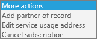

# Cambiar las direcciones de facturación de Office 365 para empresasChange your billing addresses for Office 365 for business

La factura contiene tres direcciones:Your bill or invoice contains three addresses:
  
- **Dirección del solicitante** Su nombre y dirección de la empresa, como se muestra en el perfil de la organización.**Sold-To Address** Your company name and address, as shown in your organization profile.

- **Dirección de facturación** Esta es la dirección de su departamento de facturación y suele ser la misma que la dirección del **solicitante**.**Bill-To address** The address of your billing department, usually the same as the **Sold-To** address.

- **Dirección de uso del servicio** La dirección donde se usa el servicio, normalmente es la misma que la dirección **del solicitante**. Si su organización tiene usuarios remotos o varias oficinas, use la dirección en la que se encuentran la mayoría de sus usuarios.**Service Usage Address** The address where the service is being used, usually the same as the **Sold-To** address. If your organization has remote users or multiple offices, use the address where the majority of your users are located.

En la mayoría de los casos, estas direcciones son las mismas. Si tiene que cambiar una o varias de estas direcciones, puede hacerlo. También puede proporcionar una dirección de correo electrónico alternativa para recibir las notificaciones de facturación y cambiar la dirección de correo electrónico alternativa de otros administradores.In most cases, these addresses are the same. If you need to change one or more of the addresses, you can do that. You can also provide an alternate email address to receive billing notifications, and change the alternate email address for other admins.
  
::: moniker range="o365-worldwide"

Para obtener más información sobre su factura, consulte [ver su](view-your-bill-or-invoice.md) factura y [comprender la factura](understand-your-invoice2.md).To learn more about your bill or invoice, see [View your bill or invoice](view-your-bill-or-invoice.md) and [Understand your invoice](understand-your-invoice2.md).

::: moniker-end

::: moniker range="o365-germany"

Para obtener más información sobre su factura, consulte [ver su](view-your-bill-or-invoice.md) factura y [comprender la factura](understand-your-invoice2.md).To learn more about your bill or invoice, see [View your bill or invoice](view-your-bill-or-invoice.md) and [Understand your invoice](understand-your-invoice2.md).

::: moniker-end

::: moniker range="o365-21vianet"

Si está usando Office 365 ofrecido por 21Vianet en China, consulte [ver su factura u obtener Fapiaos para Office 365 operado por 21Vianet](../../admin/services-in-china/view-your-bill-or-get-a-fapiao.md).If you're using Office 365 operated by 21Vianet in China, see [View your bill or get Fapiaos for Office 365 operated by 21Vianet](../../admin/services-in-china/view-your-bill-or-get-a-fapiao.md).

::: moniker-end

::: moniker range="o365-worldwide"

> [!NOTE]
> Si no usa el nuevo Centro de administración de Microsoft 365, puede activarlo seleccionando **Probar el nuevo centro de administración** ubicado en la parte superior de la página de inicio.If you're not using the new Microsoft 365 admin center, you can turn it on by selecting the **Try the new admin center** toggle located at the top of the Home page.

::: moniker-end

## Cambiar la dirección del solicitanteChange your Sold-To address

1. En el centro de administración, vaya a la página <a href="https://go.microsoft.com/fwlink/p/?linkid=2084771" target="_blank">cuentas de facturación</a> de **facturación** \> .In the admin center, go to the **Billing** \> <a href="https://go.microsoft.com/fwlink/p/?linkid=2084771" target="_blank">Billing accounts</a> page.

2. Seleccione **editar la información**de la cuenta de facturación.select **Edit billing account information**.

3. Actualice la información de la organización y seleccione **Guardar**.Update your organization information, then select **Save**.
  
## Cambiar la dirección de facturaciónChange your Bill-To address

::: moniker range="o365-worldwide"

1. En el centro de administración, vaya a la página <a href="https://go.microsoft.com/fwlink/p/?linkid=2018806" target="_blank">métodos de pago</a> de **facturación** \> .In the admin center, go to the **Billing** \> <a href="https://go.microsoft.com/fwlink/p/?linkid=2018806" target="_blank">Payment methods</a> page.

2. Seleccione la tarjeta de crédito o cuenta bancaria que desea cambiar.Select the credit card or bank account that you want to change.

3. En la página **detalles del método de pago** , seleccione **Editar**.On the **Payment method details** page, select **Edit**.

4. Actualice su dirección de facturación y, después, seleccione **Guardar** \> **listo**.Update your billing address, then select **Save** \> **Done**.

::: moniker-end

::: moniker range="o365-germany"

1. En el centro de administración, vaya a la página <a href="https://go.microsoft.com/fwlink/p/?linkid=847745" target="_blank">suscripciones</a> de **facturación** \> .In the admin center, go to the **Billing** \> <a href="https://go.microsoft.com/fwlink/p/?linkid=847745" target="_blank">Subscriptions</a> page.

2. Seleccione la suscripción que desea cambiar y, a continuación, seleccione **cambiar detalles de pago**.Select the subscription you want to change, then select **Change payment details**.

    
  
3. *Clientes de tarjetas de crédito y cuentas bancarias:*  En la página **cambiar detalles de pago** , seleccione la tarjeta de crédito o cuenta bancaria que desea actualizar, seleccione **editar detalles**, actualizar la dirección de facturación y, a continuación, seleccione **Enviar**.*Credit card and bank account customers:*  On the **Change payment details** page, select the credit card or bank account that you want to update, select **Edit details**, update your billing address, then select **Submit**.
  
    > [!NOTE]
    > La capacidad para pagar por cuenta bancaria no está disponible en algunos países o regiones.The ability to pay by bank account isn't available in some countries or regions.

     *Clientes de factura:*  En la página **cambiar detalles de pago** , actualice su dirección de facturación y, después, haga clic en **Enviar**.*Invoice customers:*  On the **Change payment details** page, update your billing address, then select **Submit**.
  
    > [!NOTE]
    > La capacidad de pagar una factura por cheque no está disponible en algunos países o regiones.The ability to pay an invoice by check isn't available in some countries or regions.

::: moniker-end

::: moniker range="o365-21vianet"

1. En el centro de administración, vaya a la página <a href="https://go.microsoft.com/fwlink/p/?linkid=850626" target="_blank">suscripciones</a> de **facturación** \> .In the admin center, go to the **Billing** \> <a href="https://go.microsoft.com/fwlink/p/?linkid=850626" target="_blank">Subscriptions</a> page.

2. Seleccione la suscripción que desea cambiar y, a continuación, seleccione **cambiar detalles de pago**.Select the subscription you want to change, then select **Change payment details**.

    
  
3. En la página **cambiar detalles de pago** , actualice su dirección de facturación y, después, haga clic en **Enviar**.On the **Change payment details** page, update your billing address, and then select **Submit**.

    Puede [Change your payment method for Office 365 operated by 21Vianet](change-payment-method.md) (Cambiar el método de pago para Office 365 ofrecido por 21Vianet) de factura a pago en línea, o viceversa, mediante Alipay o China UnionPay.You can [Change your payment method for Office 365 operated by 21Vianet](change-payment-method.md) from Invoice to Online payment using Alipay or China UnionPay, or vice versa.

::: moniker-end

## Cambiar la dirección de uso del servicioChange your service usage address

::: moniker range="o365-worldwide"

1. En el centro de administración, vaya a **Facturación** \> <a href="https://go.microsoft.com/fwlink/p/?linkid=842054" target="_blank">Productos y servicios</a>.In the admin center, go to the **Billing** \> <a href="https://go.microsoft.com/fwlink/p/?linkid=842054" target="_blank">Products & services</a> page.

2. Busque la suscripción que desea cambiar.Find the subscription you want to change. En la sección **configuración & acciones** , seleccione **Editar dirección de uso del servicio**.In the **Settings & Actions** section, select **Edit service usage address**.

3. En el panel **editar la dirección de uso del servicio** , actualice su dirección y, a continuación, seleccione **Guardar**.In the **Edit your service usage address** pane, update your address, then select **Save**.

::: moniker-end

::: moniker range="o365-germany"

1. En el centro de administración, vaya a la página <a href="https://go.microsoft.com/fwlink/p/?linkid=847745" target="_blank">suscripciones</a> de **facturación** \> .In the admin center, go to the **Billing** \> <a href="https://go.microsoft.com/fwlink/p/?linkid=847745" target="_blank">Subscriptions</a> page.

2. Seleccione la suscripción que desea cambiar, seleccione **más acciones**y, a continuación, elija **Editar dirección de uso del servicio**.Select the subscription you want to change, select **More actions**, then choose **Edit service usage address**.

    
  
3. En el panel **editar la dirección de uso del servicio** , actualice su dirección y, después, haga clic en **Enviar**.In the **Edit your service usage address** pane, update your address, then select **Submit**.

::: moniker-end

::: moniker range="o365-21vianet"

1. En el centro de administración, vaya a la página <a href="https://go.microsoft.com/fwlink/p/?linkid=850626" target="_blank">suscripciones</a> de **facturación** \> .In the admin center, go to the **Billing** \> <a href="https://go.microsoft.com/fwlink/p/?linkid=850626" target="_blank">Subscriptions</a> page.

2. Seleccione la suscripción que desea cambiar, seleccione **más acciones**y, a continuación, elija **Editar dirección de uso del servicio**.Select the subscription you want to change, select **More actions**, then choose **Edit service usage address**.

    
  
3. En el panel **editar la dirección de uso del servicio** , actualice su dirección y, después, haga clic en **Enviar**.In the **Edit your service usage address** pane, update your address, then select **Submit**.

::: moniker-end

## Cambiar la dirección de correo electrónico alternativa a la que se envían las notificaciones de facturaciónChange the alternate email address your billing notifications are sent to

De forma predeterminada, las notificaciones de facturación de la organización se envían a la dirección de correo electrónico de Office 365 y a la dirección de correo electrónico alternativa de todos los administradores globales y de facturación de la organización. Cada administrador puede cambiar su dirección de correo electrónico alternativa actualizando la información de su perfil.By default, your organization's billing notifications are sent to the Office 365 email address and the alternate email address of every global and billing admin in your organization. Each admin can change their alternate email address by updating their profile information.
  
1. Inicie sesión en Office 365 con su cuenta profesional o educativa como administrador global. [Descubra cómo iniciar sesión.](https://support.office.com/article/e9eb7d51-5430-4929-91ab-6157c5a050b4).Sign in to Office 365 with your work or school account as a global admin. [Learn how to sign in](https://support.office.com/article/e9eb7d51-5430-4929-91ab-6157c5a050b4).

2. Seleccione el **icono de usuario**y, a continuación, seleccione **mi cuenta**.Select the **User icon**, then select **My account**.
  
3. Seleccione **información personal**.Select **Personal info**.
  
4. En el cuadro **detalles de contacto** , seleccione **Editar**.In the **Contact details** box, select **Edit**.

5. En el cuadro **correo electrónico alternativo** , escriba la dirección de correo electrónico alternativa que quiera usar y, después, seleccione **Guardar**.In the **Alternate email** box, type the alternate email address you want to use, then select **Save**.
  
## Cambiar la dirección de correo electrónico alternativa de otro administradorChange the alternate email address for another admin

También puede cambiar la dirección de correo electrónico alternativa de otros administradores globales y de facturación de la organización.You can also change the alternate email address of other global and billing admins in your organization.
  
1. En el centro de administración, vaya a **la** \> página <a href="https://go.microsoft.com/fwlink/p/?linkid=853212" target="_blank">notificaciones de facturación</a> de facturación.In the admin center, go to the **Billing** \> <a href="https://go.microsoft.com/fwlink/p/?linkid=853212" target="_blank">Billing notifications</a> page.

    Si está usando Office 365 Germany, vaya a esta página de <a href="https://go.microsoft.com/fwlink/p/?linkid=853213" target="_blank">notificaciones de facturación</a> .If you're using Office 365 Germany, go to this <a href="https://go.microsoft.com/fwlink/p/?linkid=853213" target="_blank">Billing notifications</a> page.

    Si está usando Office 365 operado por 21Vianet, vaya a esta página de <a href="https://go.microsoft.com/fwlink/p/?linkid=853215" target="_blank">notificaciones de facturación</a> .If you're using Office 365 operated by 21Vianet, go to this  <a href="https://go.microsoft.com/fwlink/p/?linkid=853215" target="_blank">Billing Notifications</a> page.

2. En la página **notificaciones de facturación** , seleccione el administrador que desea cambiar.On the **Billing notifications** page, select the admin you want to change.

3. En el panel **Editar roles de usuario** , escriba la dirección de correo electrónico alternativa que quiera usar y, después, seleccione **Guardar**.In the **Edit user roles** pane, type the alternate email address you want to use, then select **Save**.

## Artículos relacionadosRelated articles

[Ver la facturaView your bill or invoice](view-your-bill-or-invoice.md)

[Entender la facturaUnderstand your invoice](understand-your-invoice2.md)

[Pagar por yoursubscriptionPay for yoursubscription](pay-for-your-subscription.md)

[Suscripciones y facturación-ayuda para administradoresSubscriptions and billing - Admin Help](../subscriptions-and-billing.md)

