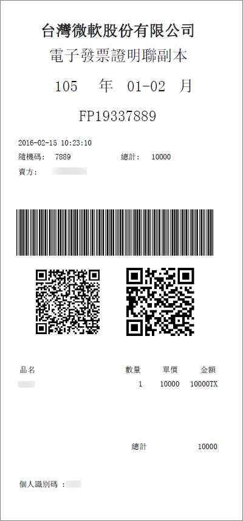

# Comprenda su factura electrónica para Microsoft 365 for Business (Taiwán)Understand your e-Invoice for Microsoft 365 for business (Taiwan)

e-Invoice es una factura electrónica emitida por el vendedor después de la compra de acuerdo con los requisitos de e-factura de Taiwán de la autoridad fiscal.e-Invoice is electronic invoice issued by seller after buyer purchases in accordance with Taiwan Tax Authority's e-Invoice requirements. La información se transmite a la nube de facturas electrónicas de la autoridad fiscal de Taiwán para la retención de registros.Information is transmitted to Taiwan Tax Authority's Electronic Invoice Cloud for record keeping. Para obtener información relacionada con la factura electrónica de Taiwán, consulte aquí: <a href="https://www.einvoice.nat.gov.tw/" target="_blank">財政部電子發票整合服務平台</a>For Taiwan e-Invoice related information, please refer here: <a href="https://www.einvoice.nat.gov.tw/" target="_blank">財政部電子發票整合服務平台</a>
  
Aquí se incluye una copia de ejemplo de factura electrónica:A sample copy of e-Invoice is included here:
  

  
## ¿Cuál es mi tasa de impuestos?What is my tax rate?

Para las compras comerciales, se aplican los impuestos además del precio presupuestado de nuestras suscripciones a una tasa prescrita por la autoridad fiscal de Taiwán.For commercial purchases, we apply taxes in addition to the quoted price of our subscriptions at a rate prescribed by Taiwan Tax Authority. Para cualquier pregunta o planeación relacionada con el impuesto, trabaje con su asesor fiscal.For any tax related questions or planning, please work with your tax advisor.
  
## ¿Cuándo se iniciará e-Invoice para mis servicios de Microsoft 365?When will e-Invoice start for my Microsoft 365 services?

Microsoft reemplazará la factura actual informatizada por e-facturada el **15 de septiembre**.Microsoft will replace current computerized invoice with e-Invoice on **September 15th**. Para la facturación antes del 15 de septiembre, las facturas de impuestos por copia de papel se reenvían directamente a los clientes.For billing prior to September 15th, paper copy tax invoices are mailed directly to customers. Después del 15 de septiembre, se ofrecerá e-Invoice en el centro de administración de Microsoft 365 para ver, descargar e imprimir, y ya no se le enviará directamente por usted.After September 15th, e-Invoice will be offered in your Microsoft 365 admin center for view, download, and print, and will no longer be mailed directly to you. 
  
## ¿Dónde puedo encontrar mi factura electrónica?Where can I find my e-Invoice?

Puede ver, descargar e imprimir la factura electrónica el día en que la factura está lista, a través del centro de administración, junto con su factura mensual.You can view, download, and print your e-Invoice the day after your bill is ready, through your admin center, together with your monthly bill. [Ver la factura](view-your-bill-or-invoice.md).[View your bill](view-your-bill-or-invoice.md).
  
## ¿Cómo actualizo mi NIF?How do I update my VAT ID?

Puede actualizar su ID de IVA en el momento de la incorporación o a través del centro de administración después de la incorporación.You can update your VAT ID at the time of onboarding, or through your admin center after you onboard.
  
En el momento de crear la cuenta, en el **paso 1**, vamos a conocerlo, **Página 2**, ¿dónde lo utilizará?, por debajo de la información de la **dirección del destinatario del servicio** , puede agregar su identificador de **IVA**de 8 dígitos.At the time of account creation, in **Step 1**, Welcome, Let's get to know you, **page 2**, Where will you be using this?, below **Service Recipient Address** information, you can add your 8 digit **VAT ID**. Si no dispone de un NIF, escriba "00000000".If you do not have a VAT ID, please enter "00000000".
  
Una vez que haya creado la cuenta, puede actualizar el NIF a través del centro de administración siguiendo estos pasos:After you have created your account, you may update your VAT ID through your admin center by following these steps:
  
1. En el centro de administración, vaya a la página **Facturación** \> <a href="https://go.microsoft.com/fwlink/p/?linkid=842054" target="_blank">Sus productos</a>.In the admin center, go to the **Billing** \> <a href="https://go.microsoft.com/fwlink/p/?linkid=842054" target="_blank">Your products</a> page.
    
2. Seleccione una suscripción y, a continuación, seleccione **más acciones**.Select a subscription, then select **More Actions**.
    
3. Seleccione **actualizar la dirección del destinatario del servicio**y actualizar la información del **identificador fiscal** .Select **Update Service Recipient Address**, and update **TAX ID** information. 
    
## ¿Cómo solicito una copia en papel de factura electrónica?How do I request an e-Invoice paper copy?

Si el recibo ganó un dibujo de suerte (solo disponible para los clientes sin el NIF), se enviará una copia impresa directamente a las direcciones del archivo por correo registrado.If your receipt won Lucky Draw (only available to customers without VAT ID), we will send a hard copy directly to the addresses on file by registered mail.
  
De lo contrario, si necesita la copia oficial en papel de la factura electrónica, [póngase en contacto con el soporte técnico](../../admin/contact-support-for-business-products.md).Otherwise, if you need the official paper copy of your e-Invoice, please [contact support](../../admin/contact-support-for-business-products.md). Después de recibir la solicitud, le enviaremos por correo la copia impresa de la factura electrónica a la dirección del archivo.After we receive your request, we will mail the paper copy of the e-Invoice to the address on file.
  
## ¿Tiene más preguntas?More questions?

[連絡客戶支援連絡客戶支援](../../admin/contact-support-for-business-products.md)