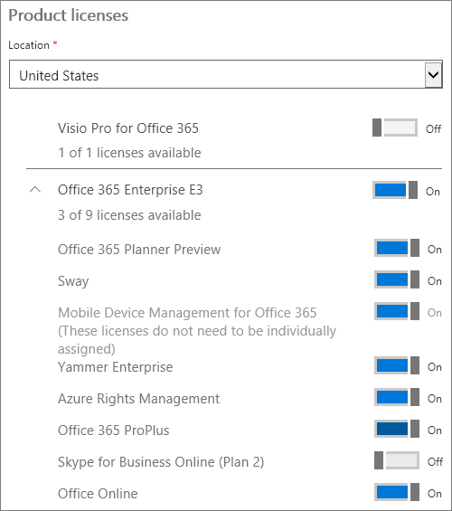

# Cambiar manualmente Office 365 para planes de empresasSwitch Office 365 for business plans manually

::: moniker range="o365-worldwide"

> [!NOTE]
> Este artículo se aplica al centro de administración antiguo.This article applies to the old admin center. Para ver el artículo sobre el nuevo centro de administración, vea el tema sobre los [planes de cambio de forma manual](change-plans-manually.md).To view the article about the new admin center, see [Change plans manually](change-plans-manually.md). El nuevo centro de administración está disponible para todos los administradores de Microsoft 365.The new admin center is available to all Microsoft 365 admins. Para obtener más información, consulte [Acerca del nuevo Centro de administración de Microsoft 365](../../admin/microsoft-365-admin-center-preview.md).For more information, see [About the new Microsoft 365 admin center](../../admin/microsoft-365-admin-center-preview.md).

::: moniker-end

## Paso 1: decidir cómo cambiar de planStep 1: Decide how to switch plans

La mejor forma de cambiar todos los usuarios de un plan a otro es usar [el botón cambiar](switch-to-a-different-plan.md#use-the-switch-plans-button)de plan.The best way to switch all your users from one plan to another is to use the [Use the Switch plans button](switch-to-a-different-plan.md#use-the-switch-plans-button). A veces esto no es posible.Sometimes this isn't possible. Realice un cambio manual en su lugar:Do a manual switch instead:
  
- Si no aparece el botón **cambiar de plan** .If the **Switch plans** button isn't there.

- Si selecciona el botón **cambiar** de plan, el plan que desea no aparece en la lista.If, when you select the **Switch plans** button, the plan you want isn't listed.

- Si no quiere cambiar todos los usuarios de la misma manera.If you don't want to switch all your users in the same way. Algunas empresas necesitan diferentes usuarios suscritos a diferentes planes.Some businesses need different users subscribed to different plans. Use un conmutador manual para esto.Use a manual switch for this.

Para continuar con un conmutador manual, lea el [paso 2: comprar una nueva suscripción](#step-2-buy-a-new-subscription) en este tema.To continue with a manual switch, read [Step 2: Buy a new subscription](#step-2-buy-a-new-subscription) in this topic.
  
## Paso 2: comprar una nueva suscripciónStep 2: Buy a new subscription

 **¿Ya ha comprado?****Already purchased?** Si ya tiene una suscripción a la que desea mover usuarios, omita este paso y vaya al [paso 3: Compruebe la nueva suscripción y las licencias](#step-3-check-your-new-subscription-and-licenses) en este tema.If you already have a subscription you want to move users to, skip this step and go to [Step 3: Check your new subscription and licenses](#step-3-check-your-new-subscription-and-licenses) in this topic.
  
- OOR -
  
 **Compre una suscripción y licencias nuevas:** Siga los pasos de [comprar otra suscripción de Office 365 para empresas](../buy-another-subscription.md) para comprar una nueva suscripción.**Purchase a new subscription and licenses:** Follow the steps in [Buy another Office 365 for business subscription](../buy-another-subscription.md) to buy a new subscription.
  
Asegúrese de comprar una suscripción para la misma organización en la que se encuentran ahora los usuarios.Make sure you purchase a subscription for the same organization that the users are in now. Por ejemplo, compruebe las direcciones de correo electrónico de los usuarios que desea mover.For example, check the email addresses for the users you want to move. Si sus direcciones de correo electrónico incluyen @contoso. com, debe comprar una nueva suscripción para contoso.com.If their email addresses include @contoso.com, you must purchase a new subscription for contoso.com. Incluya una licencia para cada usuario que quiera mover.Include a license for each user that you want to move.
  
 **Si necesita ayuda para elegir un plan**, consulte la página [de comparación de productos de Office 365 para empresas](https://go.microsoft.com/fwlink/p/?linkid=842056) o [llame a soporte técnico](../../admin/contact-support-for-business-products.md).**If you need help choosing a plan**, see the [Office 365 for business product comparison](https://go.microsoft.com/fwlink/p/?linkid=842056) page, or [call support](../../admin/contact-support-for-business-products.md).
  
## Paso 3: comprobar la nueva suscripción y las licenciasStep 3: Check your new subscription and licenses

::: moniker range="o365-worldwide"

1. En el centro de administración, vaya a la página **Facturación** \> <a href="https://go.microsoft.com/fwlink/p/?linkid=842054" target="_blank">Suscripciones</a>.In the admin center, go to the **Billing** \> <a href="https://go.microsoft.com/fwlink/p/?linkid=842054" target="_blank">Subscriptions</a> page.

::: moniker-end

::: moniker range="o365-germany"

1. En el centro de administración, vaya a la página **Facturación** > <a href="https://go.microsoft.com/fwlink/p/?linkid=847745" target="_blank">Suscripciones</a>.In the admin center, go to the **Billing** > <a href="https://go.microsoft.com/fwlink/p/?linkid=847745" target="_blank">Subscriptions</a> page.

::: moniker-end

::: moniker range="o365-21vianet"

1. En el centro de administración, vaya a la página **Facturación** > <a href="https://go.microsoft.com/fwlink/p/?linkid=850626" target="_blank">Suscripciones</a>.In the admin center, go to the **Billing** > <a href="https://go.microsoft.com/fwlink/p/?linkid=850626" target="_blank">Subscriptions</a> page.

::: moniker-end

2. **Comprobar que ambas suscripciones se muestran y están activas****Verify that both subscriptions are listed and active**

    La suscripción desde la que va a mover a los usuarios y la suscripción a la que está moviendo los usuarios deben aparecer juntas.The subscription that you're moving users from and the subscription that you're moving users to must be listed together. Si la nueva suscripción no está ahí cuando compruebe por primera vez, inténtelo de nuevo más tarde.If the new subscription isn't there when you first check, try again later. Compruebe que ambas suscripciones aparecen bajo **activo**.Check that both subscriptions are listed under **ACTIVE**. [La nueva suscripción no aparece o no está activa](#the-new-subscription-isnt-listed-or-isnt-active).[The new subscription isn't listed, or isn't active](#the-new-subscription-isnt-listed-or-isnt-active).

   **La nueva suscripción de Office 365 para empresas con licencias disponibles****The new Office 365 for business subscription with available licenses**

    
  
3. **Comprobar que tiene licencias suficientes para cada usuario****Check that you have enough licenses for each user**

    Cada usuario necesita una licencia que coincida con su suscripción.Each user needs a license that matches their subscription. Por lo tanto, si desea pasar diez usuarios a Office 365 Enterprise E5, tendrá que asegurarse de que dispone de diez licencias.So if you want to move ten users to Office 365 Enterprise E5, you'll need to make sure ten licenses are available. En la imagen, se han comprado diez licencias para Office 365 Enterprise E5 y se pueden asignar las diez licencias.In the picture here, ten licenses were purchased for Office 365 Enterprise E5, and all ten licenses are available for assignment.

4. **¿Necesita más licencias para la nueva suscripción?****Need more licenses for the new subscription?** Vaya a la página **suscripciones** y [compre las licencias de la suscripción de Office 365 para empresas](../licenses/buy-licenses.md).Go to the **Subscriptions** page and [Buy licenses for your Office 365 for business subscription](../licenses/buy-licenses.md).
  
    [¿Qué sucede con las licencias antiguas?What about the old licenses?](#what-about-the-old-licenses)

### La nueva suscripción no aparece o no está activaThe new subscription isn't listed, or isn't active

- **Si ha comprado una suscripción por factura** y es necesario realizar una comprobación de crédito, puede tardar hasta dos días laborables antes de que la suscripción esté disponible.**If you purchased a subscription by invoice** and a credit check is required, it can take up to two working days before the subscription is available.

- **Si ha comprado dos suscripciones y no se enumeran aquí**, es posible que se hayan adquirido para organizaciones diferentes (para diferentes dominios).**If you purchased two subscriptions and they are not both listed here**, they may have been purchased for different organizations (for different domains). Las suscripciones no pueden cruzar los límites de la organización.Subscriptions can't cross organization boundaries.

- **Si sabe que tiene una suscripción adicional**y no aparece aquí, o no está en la lista **activa**, [llame a soporte técnico](../../admin/contact-support-for-business-products.md).**If you know you have an additional subscription**, and it's not listed here, or not listed under **ACTIVE**, [call support](../../admin/contact-support-for-business-products.md).

### ¿Qué sucede con las licencias antiguas?What about the old licenses?

Las licencias de la suscripción actual se quitarán más adelante; solo pagará por las nuevas licencias de usuario desde entonces.The licenses for the current subscription will be removed later; you'll only pay for the new user licenses from then on.
  
## Paso 4: reasignar licenciasStep 4: Reassign licenses

### Reasignar una licencia para un usuarioReassign a license for one user

::: moniker range="o365-worldwide"

1. En el centro de administración, vaya a la página **Usuarios** \> <a href="https://go.microsoft.com/fwlink/p/?linkid=834822" target="_blank">Usuarios activos</a>.In the admin center, go to the **Users** \> <a href="https://go.microsoft.com/fwlink/p/?linkid=834822" target="_blank">Active users</a> page.

::: moniker-end

::: moniker range="o365-germany"

1. En el centro de administración, vaya a la página **Usuarios** > <a href="https://go.microsoft.com/fwlink/p/?linkid=847686" target="_blank">Usuarios activos</a>.In the admin center, go to the **Users** > <a href="https://go.microsoft.com/fwlink/p/?linkid=847686" target="_blank">Active users</a> page.

::: moniker-end

::: moniker range="o365-21vianet"

1. En el centro de administración, vaya a la página **Usuarios** > <a href="https://go.microsoft.com/fwlink/p/?linkid=850628" target="_blank">Usuarios activos</a>.In the admin center, go to the **Users** > <a href="https://go.microsoft.com/fwlink/p/?linkid=850628" target="_blank">Active users</a> page.

::: moniker-end

2. En la página **usuarios activos** , seleccione el cuadro situado junto al nombre del usuario al que desea asignar una licencia.On the **Active users** page, select the box next to the name of the user who you want to assign a license to.

3. En la parte derecha, en la fila **licencias de productos** , seleccione **Editar**.On the right, in the **Product licenses** row, select **Edit**.

4. En el panel **licencias de producto** , cambie el botón de alternancia a la posición **activado** para la licencia que desea asignar a este usuario.In the **Product licenses** pane, switch the toggle to the **On** position for the license you want to assign to this user. De manera predeterminada, todos los servicios asociados a esa licencia se asignan automáticamente al usuario.By default, all services associated with that license are automatically assigned to the user.

    > [!TIP]
    > Para limitar los servicios que están disponibles para el usuario, cambie el botón de alternancia a la posición **desactivado** para los servicios que desea quitar para ese usuario.To limit which services are available to the user, switch the toggles to the **Off** position for the services that you want to remove for that user. Por ejemplo, si desea que el usuario tenga acceso a todos los servicios disponibles excepto Skype empresarial online, puede cambiar el cambio del servicio Skype empresarial online a la posición **desactivado** .For example, if you want the user to have access to all available services except Skype for Business Online, you can switch the toggle for the Skype for Business Online service to the **Off** position.
  
    
  
5. Cambie el botón de alternancia a la posición **desactivado** para las licencias que este usuario ya no necesita.Switch the toggle to the **Off** position for licenses that this user no longer needs.

6. En la parte inferior del panel **licencias de producto** , seleccione **asignar** \> **cierre** \> de **cierre.**At the bottom of the **Product licenses** pane, select **Assign** \> **Close** \> **Close**.

### Reasignación de licencias para varios usuarios a la vezReassign licenses for multiple users at once

::: moniker range="o365-worldwide"

1. En el centro de administración, vaya a la página <a href="https://go.microsoft.com/fwlink/p/?linkid=834822" target="_blank">usuarios activos</a> **o seleccione** \> usuarios **activos**.In the Admin center, go to the <a href="https://go.microsoft.com/fwlink/p/?linkid=834822" target="_blank">Active users</a> page, or select **Users** \> **Active users**.

::: moniker-end

::: moniker range="o365-germany"

1. En el centro de administración, > vaya **a la página usuarios** <a href="https://go.microsoft.com/fwlink/p/?linkid=847686" target="_blank">activos</a> .In the admin center, go to **Users** > <a href="https://go.microsoft.com/fwlink/p/?linkid=847686" target="_blank">Active users</a> page.

::: moniker-end

::: moniker range="o365-21vianet"

1. En el centro de administración, vaya a la página **Usuarios** > <a href="https://go.microsoft.com/fwlink/p/?linkid=850628" target="_blank">Usuarios activos</a>.In the admin center, go to the **Users** > <a href="https://go.microsoft.com/fwlink/p/?linkid=850628" target="_blank">Active users</a> page.

::: moniker-end

2. Active las casillas junto a los nombres de los usuarios a los que quiere reemplazar las licencias existentes.Select the boxes next to the names of the users who you want to replace existing licenses for.

3. En el panel **Acciones en masa**, elija **Editar licencias de producto**.In the **Bulk actions** pane, choose **Edit product licenses**.

4. En el panel **Asignar productos**, seleccione **Reemplazar las asignaciones de licencias de producto existentes** \> **Siguiente**.In the **Assign products** pane, select **Replace existing product license assignments** \> **Next**.

5. Cambie el botón de alternancia a la posición **activado** para los productos que desea asignar a estos usuarios.Switch the toggle to the **On** position for the products you want to assign to these users.

    > [!TIP]
    > - Para limitar los servicios que están disponibles para el usuario, cambie a la posición **desactivado** para los servicios que desea quitar para ese usuario.To limit which services are available to the user, switch to toggles to the **Off** position for the services that you want to remove for that user. Por ejemplo, si desea que el usuario tenga acceso a todos los servicios disponibles excepto Skype empresarial online, puede cambiar el cambio del servicio Skype empresarial online a la posición **desactivado** .For example, if you want the user to have access to all available services except Skype for Business Online, you can switch the toggle for the Skype for Business Online service to the **Off** position.
    > - Cualquier asignación de licencia anterior para los usuarios seleccionados se quitará.Any previous license assignments for the selected users will be removed.
  
    
  
6. En la parte inferior del panel **Reemplazar productos existentes**, seleccione **Reemplazar** \> **Cerrar**.At the bottom of the **Replace existing products** pane, select **Replace** \> **Close**.

## Paso 5: cancelar las suscripciones o quitar las licencias que ya no necesita (opcional)Step 5: Cancel subscriptions or remove licenses that you no longer need (Optional)

If you moved all users from one subscription to another, and you no longer need the original subscription, you can [cancel the subscription](cancel-your-subscription.md).If you moved all users from one subscription to another, and you no longer need the original subscription, you can [cancel the subscription](cancel-your-subscription.md).
  
Si movió solo algunos usuarios a una suscripción diferente, [elimine las licencias](../licenses/remove-licenses-from-subscription.md) que ya no necesite.If you moved only some users to a different subscription, [remove licenses](../licenses/remove-licenses-from-subscription.md) that you no longer need.
  
## Llame al soporte técnico para ayudarle a cambiar de planCall support to help you switch plans

[Llame al servicio de soporte técnicoCall support](../../admin/contact-support-for-business-products.md)