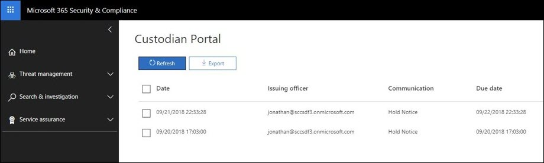

# Confirmar una notificación de retenciónAcknowledge a hold notification 
Al responder a una solicitud o investigación reguladora, es posible que deba informar a los custodios de su obligación de conservar la información almacenada electrónicamente (ESI), así como cualquier material que pueda ser relevante para un asunto legal activo o inminente.When responding to a regulatory request or investigation, you may be required to  inform custodians of their obligation to preserve electronically stored information (ESI) as well as any material that may be relevant to an active or imminent legal matter. Una vez enviado, los equipos jurídicos deben saber que cada custodio ha recibido, leído y comprendido, y ha aceptado cumplir con las instrucciones indicadas.Once sent, legal teams must know that each custodian has received, read, and understood, and agreed to comply with the given instructions.

Para ayudar a reducir el tiempo, el coste y el esfuerzo de seguir con sus custodios, la exhibición avanzada de documentos electrónicos le permite enviar y realizar un seguimiento de las notificaciones de retención legal a través del correo electrónico.To help reduce the time, cost, and effort of following up with your custodians,  Advanced eDiscovery allows you to send and follow-up on legal hold notifications through email. Además de los avisos de correo electrónico, cada custodio también tendrá acceso a un portal de cumplimiento individualizado, lo que permitirá que los custodios se mantengan informados de los cambios en el estado de su obligación.In addition to email notices, each custodian will also have access to an individualized Compliance Portal, allowing custodians to be kept informed of changes to their obligation status.

## Notificaciones por correo electrónicoEmail notifications
Una vez que se haya emitido una notificación de retención legal, cada custodio recibirá un correo electrónico único y personalizado que incluirá el aviso de suspensión legal definido y las instrucciones agregadas.Once a Legal Hold Notification has been issued, each custodian will receive a unique and personalized email containing your defined legal hold notice and added instructions. 

> [!Tip] 
> Consulte Cómo puede usar el [Editor de comunicaciones](using-communications-editor.md) integrado para permitir que los custodios reconozcan su aviso u obtengan acceso a su portal de cumplimiento directamente desde su correo electrónico.See how you can use the built-in  [Communication Editor](using-communications-editor.md) to allow your custodians to acknowledge their notice or access their Compliance Portal directly from their email.

En función de la configuración de la notificación de suspensión legal, es posible que los custodios reciban los siguientes avisos:Based on the configuration of your legal hold notification, your custodians may receive the following notices: 

- **Aviso de emisión** : es el primer aviso que se envía a su custodio.**Issuance notice** - This is the first notice sent to your custodian. Esto contendrá las instrucciones de emisión y la notificación de suspensión anexada al final del mensaje.This will contain your issuance instructions as well as the hold notice appended to the end of your message.

- Aviso de **recordatorio** : si se habilita, se enviará una notificación de recordatorio a los custodios en función de la frecuencia y el intervalo especificados.**Reminder notice** - If enabled, a reminder notice will be sent to your custodians based on the specified frequency and interval. Los avisos seguirán enviándose hasta que el custodio haya reconocido su aviso o hasta que se haya agotado el número de avisos.The reminders will continue to be sent either until the custodian has acknowledged their notice or until the number of reminders have been exhausted.

- **Aviso de remisión** : si se habilita, se enviará un aviso de remisión a su custodio y a su jefe una vez que se hayan agotado los avisos de recordatorio.**Escalation notice** - If enabled, an escalation notice will be sent to your custodian and their manager after the reminder notices have been exhausted. El sistema enviará automáticamente avisos de reasignación hasta que se hayan completado las escalaciones asignadas o hasta que el custodio confirme la notificación de suspensión.The system will automatically send escalation notices until the alloted escalations have been completed or until the custodian acknowledges their hold notification.

- **Notificación de reemisión** : durante el transcurso de una investigación, si se actualiza el contenido del aviso de retención, el aviso actualizado se enviará automáticamente al custodio.**Re-issue notice** - During the course of an investigation, if the contents of the hold notice are updated, then the updated notice will automatically be sent to the custodian.

- **Aviso de lanzamiento** : cuando se publica un custodio desde el caso, se le enviará el aviso de publicación.**Release notice** - When a custodian is released from the case, they will be sent the release notice. 

## Portal de cumplimientoCompliance Portal
Además de las notificaciones de correo electrónico, cada custodio también tendrá acceso a un portal de cumplimiento único.In addition to the email notifications, each custodian will also have access to a unique Compliance Portal. A través del portal, cada custodio podrá ver, acceder y reconocer sus notificaciones de retención activas.Through the portal, each custodian will be able to view, access, and acknowledge their active hold notifications.

