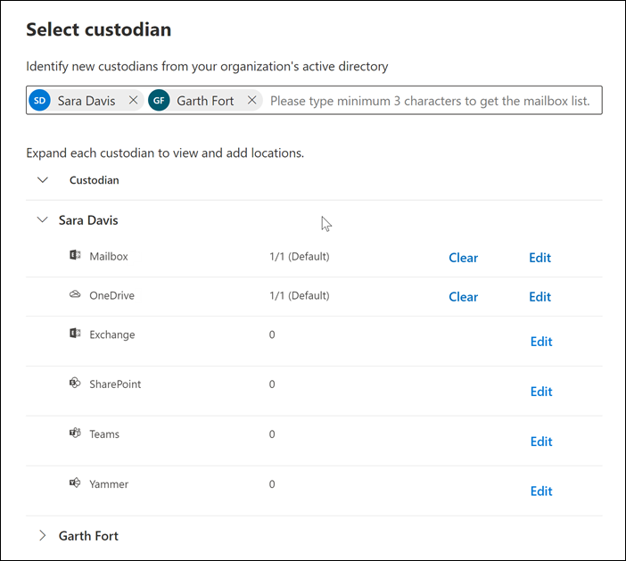

# Agregar custodios a un caso de eDiscovery avanzadoAdd custodians to an Advanced eDiscovery case

Use la herramienta de administración de custodios integrada en eDiscovery avanzado para coordinar sus flujos de trabajo en la administración de custodios y para identificar los orígenes de datos relevantes y relevantes asociados a un caso.Use the built-in custodian management tool in Advanced eDiscovery to coordinate your workflows around managing custodians and identifying relevant, custodial data sources associated with a case. Cuando se agrega un custodio, el sistema puede identificar y retener automáticamente el buzón de Exchange y la cuenta de OneDrive para la empresa.When you add a custodian, the system can automatically identify and place a hold on their Exchange mailbox and OneDrive for Business account. Durante el proceso de detección de la investigación, también puede identificar otros orígenes de datos (como buzones, sitios o equipos) a los que un custodio ha tenido acceso o ha contribuido.During the discovery process of your investigation, you might also identify other data sources (such as mailboxes, sites, or Teams) that a custodian accessed or contributed to. En esta situación, puede usar la herramienta de administración de custodios para asociar esos orígenes de datos a un custodio específico.In this situation, you can use the custodian management tool to associate those data sources will a specific custodian. Después de agregar custodios a un caso y asociar otro origen de datos con ellos, puede conservar rápidamente los datos y buscar en los datos de las privaciones.After you add custodians to a case and associate other data source with them, you can quickly preserve data and search the custodial data.

Puede Agregar y administrar custodios en casos de eDiscovery avanzados en cuatro pasos:You can add and manage custodians in Advanced eDiscovery cases in four steps:

1. Identificar a los custodios.Identify the custodians.

2. Elija ubicaciones de datos de custodios.Choose custodian data locations.

3. Configurar opciones de retención.Configure hold settings.

4. Revise los custodios y complete el proceso.Review the custodians and complete the process.

   [ de exhibición avanzada de documentos electrónicos](../media/AeD-Sources-Tab.png#lightbox)

## Asegúrese de que tiene los permisos necesariosMake sure you have the necessary permissions

Para agregar custodios a un caso, debe ser miembro del grupo de roles eDiscovery Manager.To add custodians to a case, you must be a member of the eDiscovery Manager role group. Esto le proporcionará los permisos necesarios para agregar custodios a un caso y realizar una retención en los orígenes de datos de Private.This provides you with the necessary permissions to add custodians to a case and place a hold on the custodial data sources. Para obtener más información, consulte [Asignar permisos de exhibición de documentos electrónicos](get-started-with-advanced-ediscovery.md#step-2-assign-ediscovery-permissions).For more information, see [Assign eDiscovery permissions](get-started-with-advanced-ediscovery.md#step-2-assign-ediscovery-permissions).

## Paso 1: identificar los custodiosStep 1: Identify custodians

1. Vaya a [https://compliance.microsoft.com](https://compliance.microsoft.com) e inicie sesión con una cuenta de usuario a la que se le hayan asignado los permisos de eDiscovery apropiados.Go to [https://compliance.microsoft.com](https://compliance.microsoft.com) and sign in with a user account that has been assigned the appropriate eDiscovery permissions.

2. En el panel de navegación izquierdo del centro de cumplimiento de Microsoft 365, haga clic en **Mostrar todo** y, a continuación, en **eDiscovery > avanzadas**.In the left navigation pane of the Microsoft 365 compliance center, click **Show all**, and then click **eDiscovery > Advanced**.

3. En la página **exhibición avanzada** de documentos electrónicos, haga clic en la pestaña **casos** y, a continuación, seleccione el caso al que desea agregar custodios.On the **Advanced eDiscovery** page, click the **Cases** tab, and then select the case that you want to add custodians to.

4. Haga clic en la pestaña **orígenes** de datos y, a continuación, haga clic en **Agregar origen de datos**  >  **agregar nuevos custodios**.Click the **Data sources** tab and then click **Add data source** > **Add new custodians**.

5. Agregue uno o más usuarios de la organización como custodios al caso; para ello, escriba la primera parte del alias o el nombre de una persona.Add one or more users in your organization as custodians to the case by typing the first part of a person's name or alias. Una vez que haya encontrado la persona correcta, seleccione su nombre para agregarla a la lista.After you find the correct person, select their name to add them to the list.

## Paso 2: elegir ubicaciones de datos de custodiosStep 2: Choose custodian data locations

Después de seleccionar custodios, el sistema intenta identificar y verificar estos usuarios y sus orígenes de datos de forma automática.After you select custodians, the system automatically attempts to identify and verify these users and their data sources. Después de agregar custodios a la lista, la herramienta incluye automáticamente el buzón principal y la cuenta de OneDrive para cada custodio.After adding custodians to the list, the tool automatically includes the primary mailbox and OneDrive account for each custodian. Puede elegir no incluir estos orígenes de datos al agregar custodios al caso.You can choose not to include these data sources when adding custodians to the case.

Además del buzón de un custodio y de la cuenta de OneDrive, también puede asociar otras ubicaciones de datos a un custodio, como un sitio de SharePoint o un equipo de Microsoft en el que el custodio es miembro.In addition to a custodian's mailbox and OneDrive account, you can also associate other data locations to a custodian, such as SharePoint site or a Microsoft Team the custodian is a member of. Esto le permite preservar, recopilar, analizar y revisar el contenido de otros orígenes de datos asociados con los custodios del caso.This allows you to preserve, collect, analyze, and review content in other data sources associated with the custodians of the case.

Para anular la selección del buzón de correo principal y la cuenta de OneDrive para un custodio:To deselect the primary mailbox and OneDrive account for a custodian:

1. Expanda el custodio para ver las ubicaciones de datos principales que se han asociado automáticamente a cada custodio.Expand the custodian to view the primary data locations that have been automatically associated to each custodian.

2. Seleccione **Borrar** junto a **buzón** o **onedrive** para quitar que el buzón o la cuenta de onedrive de un custodio se asocie como una ubicación de datos para este custodio.Select **Clear** next to **Mailbox** or **OneDrive** to remove a custodian's mailbox or OneDrive account from being associated as a data location for this custodian.

   

Para asociar otros buzones de correo, sitios, equipos o grupos de Yammer a un custodio específico:To associate other mailboxes, sites, Teams, or Yammer groups to a specific custodian:

1. Expanda un custodio para mostrar los siguientes servicios para asociar las ubicaciones de datos con el custodio.Expand a custodian to display the following services to associate data locations with the custodian. Haga clic en **Editar** junto a un servicio para agregar una ubicación de datos.Click **Edit** next to a service to add a data location.

   - **Exchange**: se usa para asociar otros buzones al custodio.**Exchange**: Use to associate other mailboxes to the custodian. Escriba en el cuadro de búsqueda el nombre o el alias (un mínimo de tres caracteres) de los buzones de usuario o los grupos de distribución.Type into the search box the name or alias (a minimum of three characters) of user mailboxes or distribution groups. Seleccione los buzones que desea asignar al custodio y, a continuación, haga clic en **Agregar**.Select the mailboxes to assign to the custodian and then click **Add**.

   - **SharePoint**: Use para asociar sitios de SharePoint con el custodio.**SharePoint**: Use to associate SharePoint sites to the custodian. Seleccione un sitio de la lista o busque un sitio escribiendo una dirección URL en el cuadro de búsqueda.Select a site in the list or search for a site by typing a URL in the search box. Seleccione los sitios que desea asignar al custodio y, a continuación, haga clic en **Agregar**.Select the sites to assign to the custodian and then click **Add**.

   - **Teams**: usar para asignar a Microsoft Teams el custodio es actualmente miembro de.**Teams**: Use to assign the Microsoft Teams the custodian is currently a member of. Seleccione los equipos que desee asignar a custodio y, a continuación, haga clic en **Agregar**.Select the teams to assign to the custodian and then click **Add**. Después de agregar un equipo, el sistema identifica y localiza automáticamente el sitio de SharePoint y el buzón de grupo asociados a dicho equipo y los asigna al custodio.After you add a team, the system automatically identifies and locates the SharePoint site and group mailbox associated to that team and assigns them to the custodian.

   - **Yammer**: Use para asignar los grupos de Yammer en los que el custodio es actualmente miembro.**Yammer**:  Use to assign the Yammer groups the custodian is currently a member of. Seleccione los grupos que desee asignar a custodio y, a continuación, haga clic en **Agregar**.Select the groups to assign to the custodian and then click **Add**. Después de agregar un equipo, el sistema identifica y localiza automáticamente el sitio de SharePoint y el buzón de grupo asociados a ese grupo y los asigna al custodio.After you add a team, the system automatically identifies and locates the SharePoint site and group mailbox associated to that group and assigns them to the custodian.

   > [!NOTE]
   > Puede usar los selectores de ubicación de **Exchange** y **SharePoint** para asociar otros equipos o grupos de Yammer (que un custodio no es miembro de) a un custodio.You can use the **Exchange** and **SharePoint** location pickers to associate other teams or Yammer groups (that a custodian is not a member of) to a custodian. Para ello, tiene que agregar el buzón de correo y el sitio asociados con cada grupo de equipo o de Yammer.To do this, you have to add both the mailbox and site associated with each team or Yammer group.

2. Puede ver el número total de buzones de correo, sitios, equipos y grupos de Yammer asignados a cada custodio expandiendo cada custodio en la tabla.You can view the total number of mailboxes, sites, Teams, and Yammer groups assigned to each custodian by expanding each custodian in the table. Una vez finalizadas las ubicaciones de datos asignadas para cada custodio, estas asociaciones se mantendrán y se usarán durante las fases de recopilación, procesamiento y revisión del flujo de trabajo avanzado de eDiscovery.When you've finalized the assigned data locations for each custodian, these associations will be maintained and used during the collection, processing, and review stages in the Advanced eDiscovery workflow.

3. Después de agregar custodios y configurar sus ubicaciones de datos, haga clic en **siguiente** para ir a la página **configuración de retención** .After adding custodians and configuring their data locations, click **Next** to go to the **Hold settings** page.  

## Paso 3: configurar opciones de retenciónStep 3: Configure hold settings

 Una vez que haya finalizado los custodios y sus ubicaciones de datos, puede poner algunos o todos los custodios en retención.After you've finalized the custodians and their data locations, you can place some or all of the custodians on hold. Cuando se pone un custodio en espera, todo el contenido de todas las ubicaciones de contenido que están asociados con el custodio se conserva hasta que se quita la retención o se libera el custodio de la retención.When you place a custodian on hold, all content in all content locations that are associated with the custodian is preserved until you remove the hold or release the custodian from the hold. En algunos casos, es posible que quiera agregar custodios a un caso sin ponerlos en retención.In some cases, you may want to add custodians to a case without placing them on hold.

Para poner los custodios y los orígenes de datos en espera:To place the custodians and data sources on hold:

1. En la página **configuración de suspensión** , puede aplicar una retención a los custodios individuales activando la casilla en la columna **retención** .On the **Hold settings** page, you can apply a hold to individual custodians by selecting the checkbox under the **Hold** column.

   Como alternativa, puede retener todos los custodios seleccionando la casilla " **suspender** " en la parte superior de la columna.Alternatively, you can place all custodians on hold by selecting the **Hold** checkbox at the top of the column.

2. Compruebe las selecciones de retención de custodios y haga clic en **siguiente**.Verify the custodian hold selections and then click **Next**.

   > [!NOTE]
   > Si no pone una retención en un custodio, el custodio y sus orígenes de datos asociados se agregarán al caso, pero el contenido de dichos orígenes de datos no se mantendrá en la retención asociada con el caso.If you don't place a hold on a custodian, the custodian and their associated data sources will be added to the case but the content in those data sources won't preserved by the hold that associated with the case.

## Paso 4: revisar los custodios y completar el procesoStep 4: Review the custodians and complete the process

Antes de agregar realmente los custodios al caso, puede revisar la lista de custodios, las ubicaciones de datos que tienen asignadas y la configuración de retención.Before you actually add the custodians to the case, you can review the list of custodians, the data locations assigned to them, and the hold settings.

1. Compruebe y Revise todos los recuentos de los orígenes de datos y la configuración de retención asociada a cada custodio de la tabla.Verify and review all the data sources count and the hold setting associated with each custodian in the table. Si es necesario, vuelva a la página identificar la **configuración** de **custodios** o de suspensión para realizar cambios.If necessary, go back to the **Identify custodian** or **Hold settings** pages to make any changes.

2. Haga clic en **Enviar** para agregar custodios y sus ubicaciones de datos al caso y aplicar toda la configuración de retención.Click **Submit** to add custodians and their data locations to the case and apply all custodial hold settings.

   Los nuevos custodios se agregan al caso y se muestran en la pestaña **orígenes de datos** .The new custodians are added to the case and displayed on the **Data sources** tab.

   [ orígenes de datos](../media/DataSourcesTab.png#lightbox)
